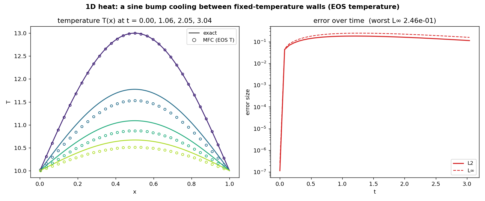

# Thermal Conduction — 1D Dirichlet sine decay

Verifies MFC's bulk Fourier heat-conduction operator
(`src/simulation/m_thermal_conduction.fpp`) against the exact 1D heat-equation
solution: a sine-shaped temperature bump cooling between fixed-temperature walls.

$$\frac{\partial T}{\partial t} = \alpha\,\frac{\partial^2 T}{\partial x^2},\qquad
T(0,t)=T(L,t)=T_w,\qquad T(x,0)=T_w + A\sin(\pi x/L)$$

$$\Rightarrow\quad T(x,t) = T_w + A\sin(\pi x/L)\,e^{-\alpha(\pi/L)^2 t}.$$

## How temperature is set and recovered

Temperature is **not a stored field**; it is recovered at every output from the
stiffened-gas EOS, $T = (p + p_\infty)/((\gamma-1)\rho c_v)$. The initial profile is
imposed through the **density at uniform pressure**,
$\rho(x) = (p_0 + p_\infty)/((\gamma-1)c_v T(x))$, $p \equiv p_0$, so the operator
runs in its full **production setting** — temperature coupled to the compressible
flow. Two consequences set a **few-percent physics floor** (real physics, not a
discretization defect): the local diffusivity $\alpha = k/(\rho c_p)$ varies in
space ($\rho \propto 1/T$) while the closed form assumes constant $\alpha$, and
conduction does $p\,\mathrm dV$ work, launching weak acoustics ($u\neq0$,
$\mathrm{Ma}\sim10^{-3}$). The formal operator order (2nd space / 3rd time) is
isolated in the companion `1D_Thermal_Conduction_Convergence` example.

## Run

```bash
./mfc.sh run examples/1D_Thermal_Conduction/case.py -n 4
python3 examples/1D_Thermal_Conduction/validate.py
```

`validate.py` reads the `restart_data/` this case writes in place, recovers $T$ from
the EOS, compares to the exact solution, and writes `figures/heat_1d.png` +
`summary.json`. Error norms: $L_1$ = average, $L_2$ = rms, $L_\infty$ = worst cell.

## Result

| Grid | Error vs exact | `max\|u\|` | Notes |
|------|----------------|-----------|-------|
| 256 | peak $L_\infty$ **0.25**, $L_2$ 0.11 | 0.054 | $\approx 3.7\%$ of the amplitude $A=3$ |

Matches the analytic solution to within the few-percent physics floor.



