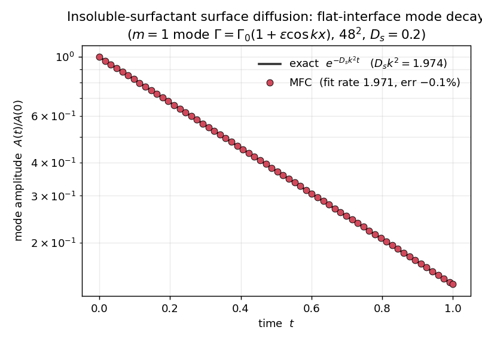
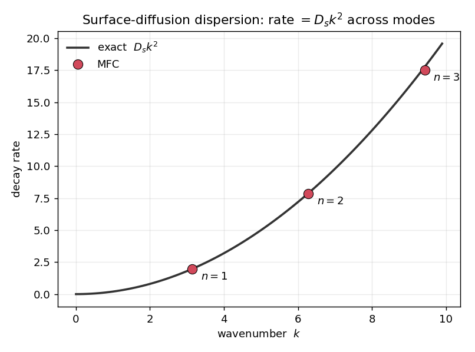
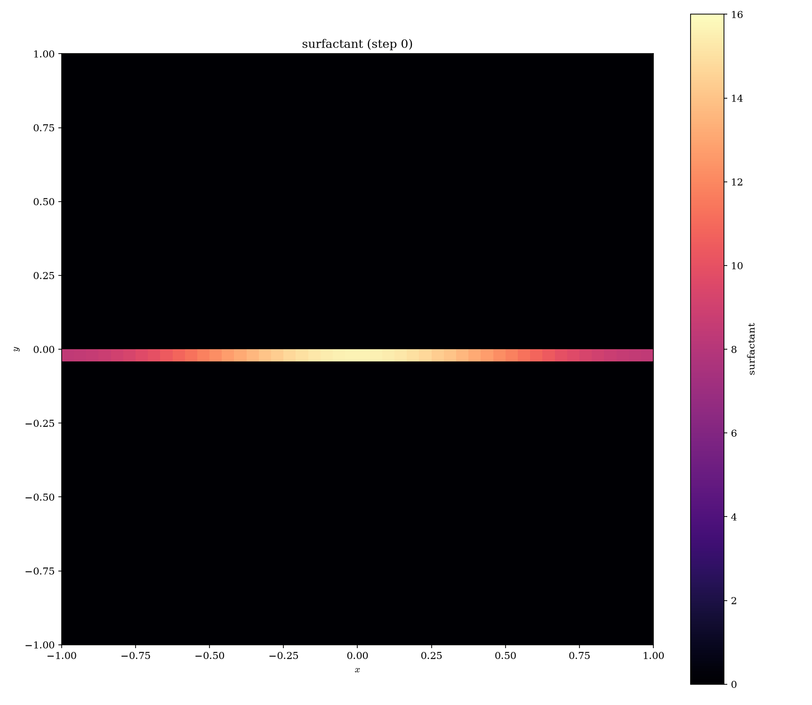
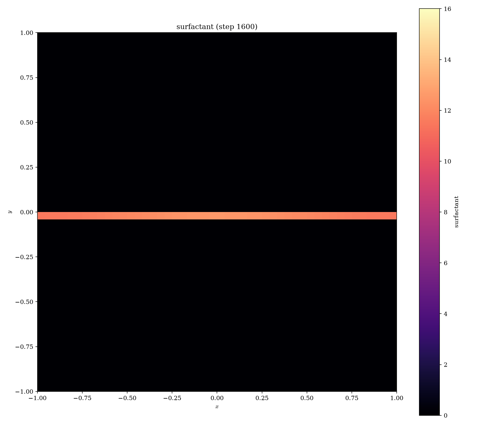

# 1D solutocapillary surface diffusion — mode-decay validation

Validates MFC's tangential (interfacial) surfactant diffusion operator against an exact analytic
solution: the decay of a surface-concentration mode under pure surface diffusion.

**Scope (what this does and does not test).** The interface here is flat and grid-aligned, so the
surface diffusion is effectively 1D (along `x`) and the surface Laplacian reduces to `∂²/∂x²`. This
validates the operator's flux/divergence **scaling** (that the measured rate equals `D_s k²`), and it
is exact to −0.1% below. It does **not** exercise the tangential projection `(I − n⊗n)`: with the
normal `n = (0,1)` along a grid axis, the projection's cross-derivative terms are multiplied by
`n_x = 0` and contribute nothing. Validating the projection needs an interface whose tangent is not
grid-aligned (a tilted flat interface, or a resolved curved interface — see the note at the end).

## Problem

An insoluble surfactant on an interface is transported along it and diffuses along it with surface
diffusivity `D_s`. On a **flat** interface the surface-transport equation reduces, for a passive
surfactant on a static interface, to 1-D diffusion along the interface,

```
∂Γ/∂t = D_s ∂²Γ/∂s²    (s = arclength along the interface)
```

so a Fourier mode `Γ = Γ₀(1 + ε cos k x)` decays exactly as

```
Γ(x,t) = Γ₀(1 + ε e^{−D_s k² t} cos k x)   ⇒   amplitude A(t) = A(0) e^{−D_s k² t}.
```

The measured decay rate must equal `D_s k²`.

## Setup (`case.py`)

- Flat, grid-aligned interface at `y = 0` between two identical fluids (`48²`, periodic in `x`).
- Passive surfactant (`sigma_dGamma` unset ⇒ `σ` constant, no Marangoni, interface stays flat and
  static), seeded with the `m = 1` mode `Γ = Γ₀(1 + ε cos k x)`, `k = 2π/Lx`, `ε = 0.3`.
- `surf_diff = 0.2`. Time step is the min of the acoustic and explicit surface-diffusion CFL limits.

The surfactant is stored as the smeared area-density `Γ̃ = Γ·|∇c|`, so it is concentrated on the
interface; the diffusion operator's tangential projection `(I − n⊗n)∇Γ̃` confines diffusion to the
interface, and the total `∫Γ̃` is conserved.

## Result

```
./mfc.sh run case.py -n 1 -t pre_process simulation
python3 measure.py
```



| quantity | value |
|---|---|
| exact rate `D_s k²` | 1.9739 |
| MFC measured rate | 1.9711 |
| relative error | **−0.1 %** |
| total surfactant drift | 0.000 % |

The amplitude tracks the exact exponential to within 0.1 % on this grid, and the total surfactant is
conserved to round-off — the surface-diffusion operator reproduces the analytic Laplace–Beltrami rate.

## Dispersion — the full eigenvalue spectrum

The canonical surface-diffusion benchmark is not a single mode but the whole spectrum: every mode `k`
must decay at its Laplace–Beltrami eigenvalue rate `D_s k²` (Xu, Li, Lowengrub & Zhao, *J. Comput.
Phys.* 2006; the surface-FEM literature, Dziuk & Elliott). Because the operator is linear, seeding a
superposition of modes and letting them decay independently recovers the entire `rate(k)` curve in one
run:

```
./mfc.sh run sweep.py -n 1 -t pre_process simulation
python3 measure.py sweep
```



| mode | `k` | measured rate | exact `D_s k²` | error |
|---|---|---|---|---|
| `n=1` | 3.14 | 1.971 | 1.974 | −0.14 % |
| `n=2` | 6.28 | 7.851 | 7.896 | −0.57 % |
| `n=3` | 9.42 | 17.538 | 17.765 | −1.28 % |

The measured rates lie on `D_s k²` across all three modes; the error grows mildly with `k` because the
higher modes have fewer cells per wavelength (`48/n`), the expected spatial-resolution trend. This is
the operator matching the canonical mode-decay benchmark, not just one eigenvalue.

## Interface field

The surfactant density `Γ̃` on the interface, rendered with the built-in viewer:

```
./mfc.sh run case.py -n 1 -t pre_process simulation post_process
./mfc.sh viz . --var surfactant --step 0 --png --vmin 0 --vmax 16 --cmap magma
./mfc.sh viz . --var surfactant --step 1600 --png --vmin 0 --vmax 16 --cmap magma
```

| initial (`t = 0`) | final (`t ≈ 2τ`) |
|---|---|
|  |  |

The surfactant stays concentrated on the interface at `y = 0` (dark bulk everywhere else — the
tangential projection leaks no surfactant off the interface), while the along-interface `cos kx`
modulation — bright at the crest, dim at the troughs at `t = 0` — homogenizes into a uniform band as
it diffuses. Same colour scale in both frames.

## Note on curved / non-aligned interfaces

Because this flat interface is grid-aligned, the projection `(I − n⊗n)` contributes nothing here, so
the 1D test alone cannot tell whether a curved-interface error is finite band thickness (converges) or
a projection bug. The **[3D sphere convergence study](../3D_solutocapillary_diffusion)** speaks to that:
the `l = 1` mode should decay at the sphere eigenvalue `l(l+1)D_s/R² = 2D_s/R²` (note: the *sphere*
value, not the flat/circle `D_s k²`), and the measured rate rises toward it as the interface is
resolved (`rate/exact ≈ 0.53 → 0.79 → 0.88` for `R/Δx = 5.3 → 10.7 → 16`), with surfactant conserved to
round-off. That is consistent with a resolution effect rather than a bug — **but** those numbers come
from a whole-field moment that is only an approximate estimator (a 2D-circle cross-check reads the same
moment as either 0.6× or 1.8× exact depending on masking, bracketing the true value), so the *rate* of
convergence is bracketed, not pinned. Read the caveat in the 3D README.

Still open, and needed to make the curved-interface convergence quantitative: a proper interfacial
measurement (recover `Γ = Γ̃/|∇c|` on the band and project onto the mode); a **tilted flat interface**
(tangent at 45°, exact `D_s k²`) to isolate the projection from curvature; and the coupled
surfactant-laden-drop benchmarks (e.g. Stone & Leal), which also need a resolved interface plus an
imposed strain — all future work.

## References

The surfactant machinery validated here (this example and the [2D-circle](../2D_solutocapillary_diffusion)
and [3D-sphere](../3D_solutocapillary_diffusion) companions) follows established interfacial-surfactant
modeling. Each piece traces to prior work:

*Interfacial surfactant transport (the physics).*
- Stone, H. A. (1990). A simple derivation of the time-dependent convective–diffusion equation for
  surfactant transport along a deforming interface. *Phys. Fluids A* **2**(1), 111–112.
  doi:10.1063/1.857686 — the canonical derivation of the surface transport equation this operator solves.

*Diffuse-interface representation (smeared area-density `Γ̃ = Γ|∇c|`, conserved then recovered).*
- Teigen, K. E., Li, X., Lowengrub, J., Wang, F. & Voigt, A. (2009). A diffuse-interface approach for
  modelling transport, diffusion and adsorption/desorption of material quantities on a deformable
  interface. *Commun. Math. Sci.* **7**(4), 1009–1037.
- Teigen, K. E., Song, P., Lowengrub, J. & Voigt, A. (2011). A diffuse-interface method for two-phase
  flows with soluble surfactants. *J. Comput. Phys.* **230**(2), 375–393. doi:10.1016/j.jcp.2010.09.020
  — closest precedent: smeared surfactant density on a diffuse interface, conservative transport, `σ(Γ)`.
- James, A. J. & Lowengrub, J. (2004). A surfactant-conserving volume-of-fluid method for interfacial
  flows with insoluble surfactant. *J. Comput. Phys.* **201**(2), 685–722. doi:10.1016/j.jcp.2004.06.013
  — Eulerian conserve-then-recover ancestor with a `σ(Γ)` CSF force.

  Note: the exact recipe used here (advect `Γ̃ = Γ|∇c|` conservatively, then divide by `|∇c|` on the
  band) is a consolidation of Teigen 2011 and James & Lowengrub 2004, not lifted verbatim — Teigen 2011
  uses a double-well surface delta inside the transport PDE and reserves `|∇c|` for the CSF term.

*Surface (Laplace–Beltrami) diffusion operator on a diffuse interface.*
- Rätz, A. & Voigt, A. (2006). PDE's on surfaces — a diffuse interface approach. *Commun. Math. Sci.*
  **4**(3), 575–590. — surface diffusion embedded in the interface band with `|∇φ|` weighting.

*Surface tension → Marangoni stress via CSF, and the `σ(Γ)` closure.*
- Brackbill, J. U., Kothe, D. B. & Zemach, C. (1992). A continuum method for modeling surface tension.
  *J. Comput. Phys.* **100**(2), 335–354. doi:10.1016/0021-9991(92)90240-Y — the CSF force pathway
  (already in MFC; a spatially varying `σ` makes the Marangoni stress automatic).
- Pawar, Y. & Stebe, K. J. (1996). Marangoni effects on drop deformation in an extensional flow… I.
  Insoluble surfactants. *Phys. Fluids* **8**(7), 1738–1751. doi:10.1063/1.868958 — the linear and
  Langmuir/Frumkin `σ(Γ)` equations of state.

*Validation methodology.*
- Dziuk, G. & Elliott, C. M. (2013). Finite element methods for surface PDEs. *Acta Numerica* **22**,
  289–396. doi:10.1017/S0962492913000056; and Macdonald, C. B., Brandman, J. & Ruuth, S. J. (2011).
  Solving eigenvalue problems on curved surfaces using the Closest Point Method. *J. Comput. Phys.*
  **230**(22), 7944–7956. — the Laplace–Beltrami eigenmode-decay test used here is standard surface-PDE
  practice (spherical harmonics are eigenfunctions of the surface Laplacian, eigenvalue `l(l+1)/R²`).
- Xu, J.-J., Li, Z., Lowengrub, J. & Zhao, H. (2006). A level-set method for interfacial flows with
  surfactant. *J. Comput. Phys.* **212**(2), 590–616. doi:10.1016/j.jcp.2005.07.016 — surfactant-transport
  convergence and the mode-decay check.
- Stone, H. A. & Leal, L. G. (1990). The effects of surfactants on drop deformation and breakup.
  *J. Fluid Mech.* **220**, 161–186. doi:10.1017/S0022112090003226 — the canonical coupled
  surfactant-drop-in-extensional-flow benchmark (a target for future Marangoni-coupling validation, not
  yet done here). Related coupling physics: Milliken, Stone & Leal (1993), *Phys. Fluids A* **5**(1),
  69–79, doi:10.1063/1.858790; Eggleton, Tsai & Stebe (2001), *Phys. Rev. Lett.* **87**, 048302,
  doi:10.1103/PhysRevLett.87.048302.
