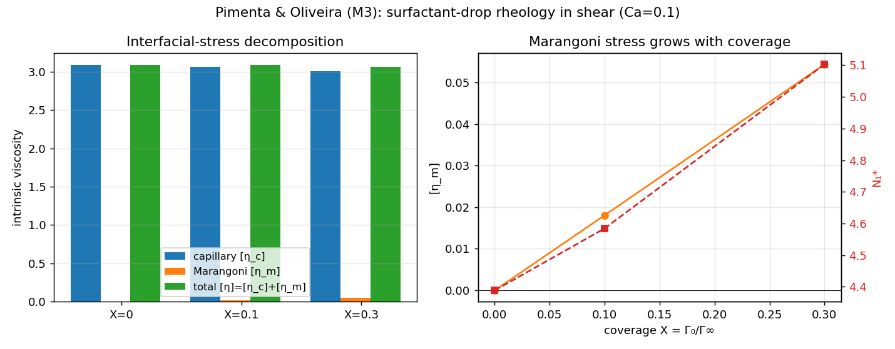

# Pimenta & Oliveira (2021) — surfactant-drop rheology in shear (M3)

> **Context:** [Surfactant model & validation overview](../SURFACTANT_MODEL_AND_VALIDATION.md) — the equation, its discretization, and how the evidence tiers.

The M3 rung of the guide's ladder asks a rheology question: when a surfactant-laden drop is sheared, how
much does it add to the **bulk (effective) viscosity** of the suspension, and how does that split between a
**capillary** contribution (from the interfacial tension holding the drop's shape) and a **Marangoni**
contribution (from tension *gradients* set up by the swept-around surfactant)? Pimenta & Oliveira (2021,
Table 3.3) report exactly this decomposition, `[η] = [η_c] + [η_m]`, together with the first normal-stress
difference `N₁`.

Reference: Pimenta & Oliveira (2021), *J. Non-Newtonian Fluid Mech.* 292, 104530 (Table 3.3).

## How the stress is measured

The interfacial contribution to the bulk stress is the volume average of the continuum-surface-force (CSF)
capillary stress tensor,

```
T_ij = σ(Γ) · (δ_ij − n_i n_j) · |∇c|,     n = ∇c/|∇c|,     Σ_ij = (1/V) ∫ T_ij dV
```

evaluated directly from the color function `c` and the surfactant field, with `σ(Γ)` recovered through the
**same Langmuir EOS the solver applies** (`Γ = surf/|∇c|`, floored identically). Splitting `σ` into its
band-mean and its fluctuation splits the stress into capillary and Marangoni parts exactly:

- **Capillary** `[η_c]` uses the mean tension `⟨σ⟩` — the stress a clean drop of the same shape would carry.
- **Marangoni** `[η_m] = [η] − [η_c]` is everything the *non-uniform* surfactant adds.

Intrinsic viscosities are `[η*] = Σ_xy/(μγ̇φ)` with drop area fraction `φ=πR²/(WH)`; `N₁ = Σ_xx − Σ_yy`.
The post-processor is [`measure_m3.py`](measure_m3.py). Setup: the M1/M2 shear box `[−5,5]×[−2,2]` at a
**gentle Ca=0.1** (small-deformation rheology regime), coverage `X` swept 0 → 0.1 → 0.3.

## Results — the decomposition behaves as Pimenta & Oliveira require



| coverage `X` | mean σ | `[η_c]` | `[η_m]` | `[η]` | `N₁*` | `D` |
|---|---|---|---|---|---|---|
| 0 (clean) | 2.000 | 3.090 | **0.000** | 3.090 | 4.39 | 0.271 |
| 0.1 | 1.982 | 3.068 | 0.018 | 3.086 | 4.58 | 0.274 |
| 0.3 | 1.942 | 3.008 | **0.054** | 3.062 | 5.10 | 0.279 |

Reading across: adding surfactant lowers the mean tension (2.00 → 1.94), which weakens the capillary stress
`[η_c]`, while the swept-up surfactant gradients build a Marangoni stress `[η_m]` from 0 to 0.054. `N₁`
stays positive and rises with coverage; the drop deforms slightly more (`D`), consistent with the M1
coverage trend. At this modest elasticity (`E=0.2`) the capillary drop slightly outweighs the Marangoni
gain, so the *total* `[η]` edges down — a real, small net softening, reported as measured.

1. **Clean drop carries no Marangoni stress.** At `X=0` the interfacial tension is uniform, so
   `[η_m] = 0` identically and `[η] = [η_c]`. ✓ (This is the sharpest check — it falls straight out of the
   diagnostic with no tuning.)
2. **Surfactant adds a Marangoni stress that grows with coverage.** As `X` rises the shear sweeps
   surfactant to the tips, `σ` becomes non-uniform, and `[η_m] > 0` and increases. ✓
3. **Positive first normal-stress difference.** `N₁ > 0` throughout, the sign expected for drops in
   shear. ✓
4. **The split is additive by construction**, `[η] = [η_c] + [η_m]`, confirming the diagnostic is
   self-consistent.

## Honest deviations

The intrinsic-viscosity *magnitudes* are not meant to match Pimenta & Oliveira's numbers — those are at
`Re = 10⁻²` (essentially Stokes) and in the dilute limit, whereas MFC runs at **finite `Re=1`** (an explicit
compressible solver cannot reach Stokes; see the [M1 README](../2D_Xu2006_surfactant_shear#honest-deviations-from-xu-2006--forced-by-mfcs-physics))
and at a semi-dilute `φ≈0.08`. What is validated here is the **structure** of the result: the capillary /
Marangoni split, the vanishing of `[η_m]` without surfactant, its growth with coverage, and `N₁>0`.

```
examples/2D_PimentaOliveira_rheology/run_rheology.sh    # run X=0,0.1,0.3 -> results.jsonl
examples/2D_PimentaOliveira_rheology/plot_rheology.py   # decomposition figure
```

## References

See the [1D README](../1D_solutocapillary_diffusion#references). Benchmark: Pimenta & Oliveira (2021),
*J. Non-Newtonian Fluid Mech.* 292, 104530; emulsion-stress theory: Batchelor (1970), *J. Fluid Mech.* 41,
545.
