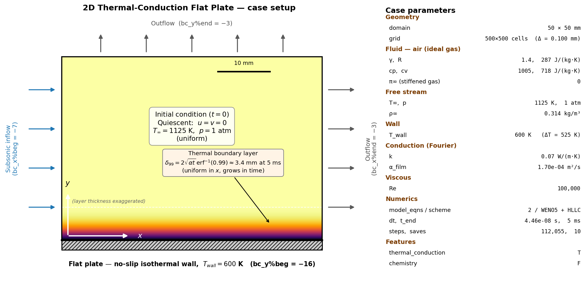

# Thermal Conduction — 2D flat-plate thermal boundary layer

Verifies MFC's bulk Fourier heat-conduction operator
(`src/simulation/m_thermal_conduction.fpp`) against the semi-infinite
error-function solution: hot quiescent air suddenly in contact with a cold
isothermal wall at $y=0$ grows a self-similar thermal boundary layer,

$$\frac{T(y,t)-T_w}{T_\infty-T_w} = \operatorname{erf}\!\left(\frac{y}{2\sqrt{\alpha t}}\right),
\qquad \alpha = \frac{k}{\rho c_p},$$

with $\alpha$ evaluated at the **film temperature** $T_f = (T_\infty + T_w)/2$
(density collapses near the cold wall, so the free-stream $\alpha$ does not match).

This is the thermal_conduction counterpart of `2D_Thermal_Flatplate`
(chemistry-based diffusion, 700²); domain, boundary conditions, viscous setup,
and initial state match, on a 500² grid.

## Setup

Ideal-gas air ($\gamma = 1.4$, $\pi_\infty = 0$), quiescent and uniform at
$T_\infty = 1125$ K, 1 atm. The bottom boundary is a no-slip isothermal wall at
$T_w = 600$ K (`bc_y%beg = -16` with `bc_y%isothermal_in`); left is subsonic
inflow, right and top are outflow. $k = 0.07$ W/(m·K), Re = 100 000.
Temperature is **not a stored field**; it is recovered from the EOS,
$T = (p + p_\infty)/((\gamma-1)\rho c_v)$.



(`case_schematic.py` draws this; it imports `case.py` so the numbers cannot drift.)

## Run

```bash
./mfc.sh run examples/2D_Thermal_Conduction_Flatplate/case.py -n 16
python3 examples/2D_Thermal_Conduction_Flatplate/validate.py
```

The 500x500 grid runs ~112k acoustic-limited steps (a few hours on 16 ranks;
the grid legally decomposes up to `-n 64`).

`validate.py` reads the in-place `restart_data/`, recovers $T$, overlays the
erf solution (film-temperature $\alpha$), checks the self-similar collapse in
$\eta = y/(2\sqrt{\alpha_{film} t})$, and writes `validation_field.png`,
`validation_profiles.png` + `summary.json`.

## Result

At 5 ms the mean rms deviation from the erf profile with film-temperature
$\alpha$ is 1.27 K — 0.24% of $\Delta T = 525$ K (`summary.json`; regenerate
via `validate.py` after a run).
