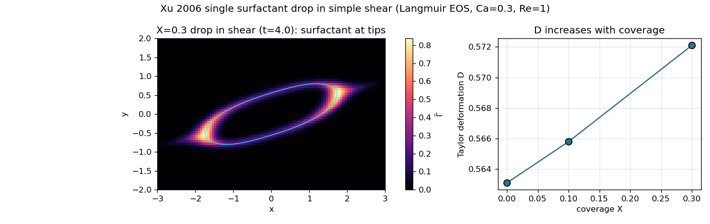

# Xu et al. (2006) — single insoluble-surfactant drop in simple shear (M1)

The canonical coupled surfactant benchmark: a surfactant-laden drop in an imposed shear flow deforms
**more** as its surfactant coverage rises (surfactant lowers the interfacial tension), while the surface
flow sweeps surfactant to the drop tips. This reproduces that benchmark's **qualitative gates** in MFC,
using a **maintained** shear flow (opposite moving walls) and the **nonlinear Langmuir** equation of
state — the two capabilities the earlier [deformation demo](../2D_solutocapillary_deformation) lacked.

Reference: Xu, Li, Lowengrub & Zhao (2006), *J. Comput. Phys.* 212, 590 (Table 3.1).

## What is faithful to Xu 2006

- **Geometry:** domain `[−4,4]×[−2,2]`, circular drop `R=1` centered.
- **Simple shear** `u=(γ̇y,0)`, maintained by opposite moving no-slip walls (`bc_y=-16`,
  `bc_y%vb1=−γ̇H` bottom, `bc_y%ve1=+γ̇H` top; periodic in x). This is a real maintained shear, not an
  imposed-then-decaying flow.
- **Nonlinear Langmuir EOS** `σ(Γ) = σ₀(1 + E·ln(1 − Γ/Γ∞))` with `E = 0.2` (`sigma_model = 3`,
  added for this case).
- **Surface Péclet** `Pe = γ̇R²/D_s = 10`.
- **Coverage sweep** `X = Γ₀/Γ∞ ∈ {0, 0.1, 0.3}`, and the Xu diagnostics: Taylor deformation
  `D=(L−B)/(L+B)` and inclination angle `θ`, from the interface second-moment tensor.

## The result — all three qualitative gates pass



Left: the `X=0.3` drop at quasi-steady — deformed and inclined in the shear, with **surfactant
concentrated at the two tips** (bright) and depleted at the sides. Right: **Taylor deformation increases
monotonically with coverage.**

| coverage `X` | `D` (quasi-steady, t≈4) | `θ` | surfactant mass |
|---|---|---|---|
| 0.0 | 0.5631 | 18.0° | — |
| 0.1 | 0.5658 | 17.9° | 1.00001 |
| 0.3 | **0.5721** | 17.7° | 1.00001 |

1. **Deformation increases with coverage** — 0.563 → 0.566 → 0.572, monotonic. ✓
2. **Surfactant accumulates at the tips** — visible in the field, driven by the extensional surface flow. ✓
3. **σ is minimal at the tips** — automatic, since `σ` decreases with `Γ` (Langmuir). ✓

Interfacial surfactant mass is conserved to machine precision. The effect is modest (~1.6% in `D`),
consistent with `E=0.2` giving only a ~7% drop in `σ` at `X=0.3`.

```
examples/2D_Xu2006_surfactant_shear/run_coverage.sh   # sweep X=0,0.1,0.3; print D, theta, mass
```

## Honest deviations from Xu 2006 — forced by MFC's physics

This reproduces the **trends and orderings** (which is what the guide's M1 gate asks for), not Xu's
deformation numbers. MFC is an explicit compressible solver; three deviations follow directly from that:

- **Finite Reynolds number `Re=1`, not Stokes (`Re=0`).** The Stokes limit needs an unbounded kinematic
  viscosity `ν=μ/ρ`, whose explicit viscous timestep `~Δx²/ν` vanishes — an explicit compressible solver
  cannot reach it. `Re=1` is the low-Mach, finite-Re approximation the guide explicitly allows for M1.
- **Capillary number `Ca=0.3`, not `0.7`.** A 2D diffuse-interface drop over-deforms at finite `Re`; at
  `Ca=0.7` the tips become sharp and under-resolved, and combined with the Langmuir saturation
  (`σ→0` as `Γ→Γ∞` at the concentrated tips) the surfactant field destabilizes there. `Ca=0.3` keeps
  the drop and surfactant well-behaved. (At `Ca≈0.4` the interfacial mass stays conserved until a slow
  tip instability sets in near `t≈6`.)
- **Quasi-steady (`t≈4`), coarser grid (`h≈0.06` vs Xu's `0.005`).** `D` is read at the plateau before
  the tip instability grows; mass stays within `10⁻⁵` of 1 there.

A fully quantitative match (Ca=0.7, steady, Stokes, Xu's `D` values) would need an incompressible/implicit
solver or interface sharpening at the tips — outside MFC's compressible remit and of limited relevance to
the high-Péclet coalescence this model targets.

## References

See the [1D README](../1D_solutocapillary_diffusion#references). Benchmark: Xu, Li, Lowengrub & Zhao
(2006), *J. Comput. Phys.* 212, 590; coupled surfactant-drop physics: Stone & Leal (1990), *J. Fluid
Mech.* 220, 161; Langmuir `σ(Γ)`: Pawar & Stebe (1996), *Phys. Fluids* 8, 1738.
