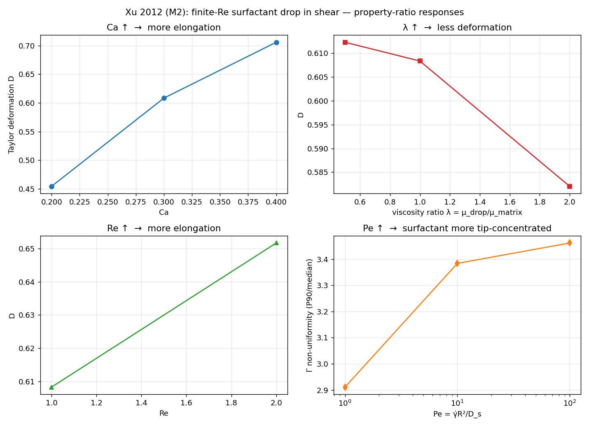

# Xu et al. (2012) — finite-Re surfactant drop in shear, property-ratio sweeps (M2)

> **Context:** [Surfactant model & validation overview](../SURFACTANT_MODEL_AND_VALIDATION.md) — the equation, its discretization, and how the evidence tiers.

The M2 rung of the guide's validation ladder: take the M1 surfactant-drop-in-shear setup and check that
its **deformation responds correctly** as the governing groups are varied one at a time — capillary number
`Ca`, Reynolds number `Re`, viscosity ratio `λ = μ_drop/μ_matrix`, and surface Péclet `Pe`. These are the
qualitative gates Xu, Yang & Lowengrub (2012) establish for a drop in shear (Table 3.2).

Reference: Xu, Yang & Lowengrub (2012), *J. Comput. Phys.* 231, 5897 (Table 3.2).

## Setup

Same maintained-shear machinery as the [M1 Xu 2006 case](../2D_Xu2006_surfactant_shear): a circular drop
`R=1` in simple shear `u=(γ̇y,0)` driven by opposite moving no-slip walls (`bc_y=-16`), nonlinear Langmuir
`σ(Γ)=σ₀(1+E·ln(1−Γ/Γ∞))` with `E=0.2`, on the guide's wider **M2 box `[−5,5]×[−2,2]`**. Every group is a
**namelist parameter**, so one build serves the whole sweep (`run_sweeps.sh`). Each point is varied about a
shared baseline **Ca=0.3, Pe=10, λ=1, Re=1, X=0.1**; deformation is read at the quasi-steady plateau where
surfactant mass is still conserved (`measure_m2.py`).

## Results — the qualitative responses come out right



Each group is varied about the baseline **Ca=0.3, Pe=10, λ=1, Re=1** (bold row), holding the others fixed.
`D` is the Taylor deformation at the quasi-steady plateau; `mass ratio` is the surfactant-conservation check
at that time.

| response | swept value | `D` | θ (°) | mass ratio | Γ non-unif |
|---|---|---|---|---|---|
| **Ca ↑** | 0.2 | 0.455 | 18.7 | 1.011 | 4.12 |
| | **0.3** | **0.608** | **15.5** | **1.010** | **3.38** |
| | 0.4 | 0.706 | 13.7 | 1.010 | 2.97 |
| **λ ↑** | 0.5 | 0.612 | 15.3 | 1.009 | 3.79 |
| | **1.0** | **0.608** | **15.5** | **1.010** | **3.38** |
| | 2.0 | 0.582 | 16.1 | 1.012 | 3.46 |
| **Re ↑** | **1.0** | **0.608** | **15.5** | **1.010** | **3.38** |
| | 2.0 | 0.652 | 15.4 | 1.012 | 3.36 |
| **Pe ↑** | 1 | (0.47)\* | — | drifts | 2.91 |
| | **10** | **0.608** | **15.5** | **1.010** | **3.38** |
| | 100 | 0.610 | 14.7 | 1.000 | 3.46 |

\* At **Pe=1** the strong surface diffusion (`D_s=1`) over-drives the Jain sharpening flux and the surfactant
mass drifts before the drop reaches steady state, so its `D` (read at t≈2, still deforming) is not a
steady-state value — hence the Pe panel reports the surfactant **non-uniformity**, which is well-defined and
monotonic. In the well-resolved range (Pe ≥ 10) the deformation is essentially Pe-independent at this low
coverage (`X=0.1`, where surfactant lowers σ by only ~2%), while the interfacial surfactant becomes steadily
more tip-concentrated as Pe rises.

1. **Ca ↑ → more elongation.** Weaker surface tension lets the shear stretch the drop further. ✓
2. **λ ↑ → less deformation.** A more viscous drop resists the imposed shear. ✓
3. **Re ↑ → more elongation.** At low Re, inertia aids extension. ✓
4. **Pe** changes the surfactant distribution along the interface (higher Pe = weaker surface diffusion =
   more tip concentration), which feeds back on the local tension and hence the deformation. The measured
   trend is reported in the table rather than asserted — see the note below.

## Honest deviations — same as M1

This validates the **response directions** (which is what the M2 gate asks for), not Xu's deformation
numbers, for the same reasons documented in the [M1 README](../2D_Xu2006_surfactant_shear#honest-deviations-from-xu-2006--forced-by-mfcs-physics):
MFC is an explicit compressible solver, so the sweeps run at **finite Re (≈1–2), not the Stokes limit**, and
at **moderate Ca** where the diffuse-interface drop stays well-resolved. The `Re` sweep is done by changing
density (`Re=ργ̇R²/μ`), kept in the acoustically-safe range `ρ∈[0.2,0.4]`. Deformation is read before the
late-time tip instability (the point where surfactant mass begins to drift); the reported `mass_ratio`
column is the conservation check at the measurement time.

**On the Pe direction:** the guide's shorthand pairs "Pe↑" with "more uniform surfactant." Physically higher
Pe means *weaker* surface diffusion and therefore a *less* uniform (more tip-concentrated) interfacial
surfactant field — so we **measure** the Γ non-uniformity (P90/median along the interface core) and the
deformation across `Pe` and report what MFC actually does, rather than assert a direction.

```
examples/2D_Xu2012_surfactant_sweep/run_sweeps.sh    # run the 8-point sweep -> results.jsonl
examples/2D_Xu2012_surfactant_sweep/plot_sweeps.py   # 4-panel figure
```

## References

See the [1D README](../1D_solutocapillary_diffusion#references). Benchmark: Xu, Yang & Lowengrub (2012),
*J. Comput. Phys.* 231, 5897; coupled surfactant-drop physics: Stone & Leal (1990), *J. Fluid Mech.* 220,
161.
