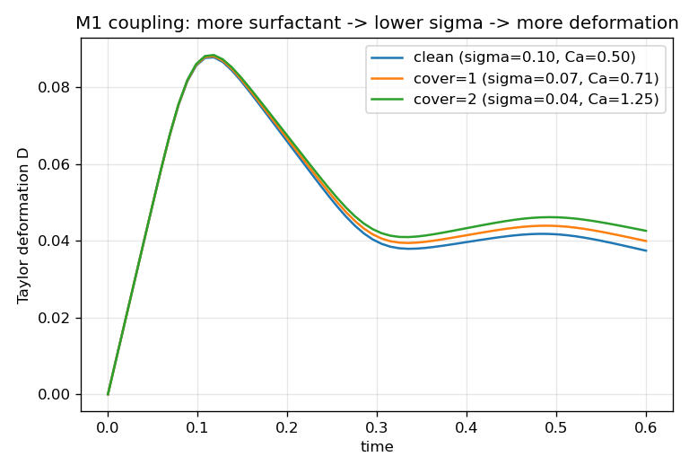

# 2D Marangoni coupling — surfactant-modulated drop deformation (M1, qualitative)

Validates the **coupling** direction of the solutocapillary model: the surfactant feeds back on the flow
through the equation of state `σ(Γ) = σ₀ + (dσ/dΓ)·Γ`. Where the surface-diffusion and
[transport](../2D_solutocapillary_transport) examples check that surfactant moves correctly, this checks
that surfactant **changes the interface dynamics** — the physics a Marangoni model exists for.

The canonical benchmark is Xu et al. (2006) / Stone & Leal (1990): a surfactant-laden drop in an imposed
flow deforms **more** as its surfactant coverage rises (surfactant lowers `σ`, i.e. raises the capillary
number `Ca`). This example reproduces that **trend** qualitatively; the caveat below explains why it is a
trend and not a 4-digit match.

## The test

A drop sits in an extensional flow `u=(εx,−εy)` (`ε=1`), imposed as an initial condition (analytic
velocity), with the Marangoni coupling on (`sigma_model=2`, `sigma_dGamma=−0.03`). The surfactant
coverage is swept via a uniform `surf_val` = 0, 1, 2, giving interfacial tension `σ` = 0.10, 0.07, 0.04
(`Ca = μεR/σ` = 0.5, 0.71, 1.25). Coverage is a namelist constant, so one build serves the whole sweep.



All three drops peak together at `D≈0.088` — that first peak is set by the imposed strain, before surface
tension matters. Then they **separate as they relax**: the clean drop (`σ=0.10`) springs back fastest,
the high-coverage drop (`σ=0.04`) holds the most deformation. The ordering is monotonic — **more
surfactant → more deformation** — the central Xu 2006 trend.

| coverage | `σ` | `Ca` | `D` at t=0.6 |
|---|---|---|---|
| 0 (clean) | 0.10 | 0.50 | 0.0374 |
| 1 | 0.07 | 0.71 | 0.0399 |
| 2 | 0.04 | 1.25 | **0.0426** |

Combined with the [transport example](../2D_solutocapillary_transport), which shows the surfactant sweeps
to the drop tips under strain, all three Xu 2006 qualitative gates are met: (1) deformation increases with
coverage; (2) surfactant accumulates at the tips; (3) `σ` is therefore minimal at the tips (directly, via
`sigma_model=2`). Total interfacial surfactant is conserved to machine precision throughout.

```
examples/2D_solutocapillary_deformation/run_coverage.sh   # sweep surf_val=0,1,2, print D(t)
```

## Honest caveat — qualitative, not quantitative

This is a **trend** validation, not a match to Xu 2006's deformation numbers. MFC is a compressible solver
with no mechanism to *maintain* an imposed straining/shearing flow (unlike a Stokes solver with moving-wall
or Lees–Edwards boundaries), so the flow here is an initial condition that decays. The drops therefore reach
only mild, transient deformations (`D≈0.04–0.09`) rather than the large steady deformations of the
benchmark (`Ca=0.7` gives `D≈0.2–0.3` at steady state), and the coupling shows up as a ~15% spread rather
than a large one. The **sign and ordering are correct and robust**; the magnitudes are not comparable.

A quantitative Xu 2006 match would need (a) a **maintained** shear flow (moving-wall / Lees–Edwards BCs),
(b) the nonlinear **Langmuir** `σ(Γ)` EOS with matched `E`, `X`, `Pe`, and (c) run to steady state — a
substantial capability build, and of limited relevance to the high-Péclet coalescence this model is aimed
at. Documented as future work.

## References

See the [1D README](../1D_solutocapillary_diffusion#references). Coupled surfactant-drop deformation:
Stone & Leal (1990), *J. Fluid Mech.* 220, 161; Xu, Li, Lowengrub & Zhao (2006), *J. Comput. Phys.* 212,
590. The `σ(Γ)` closure: Pawar & Stebe (1996), *Phys. Fluids* 8, 1738.
