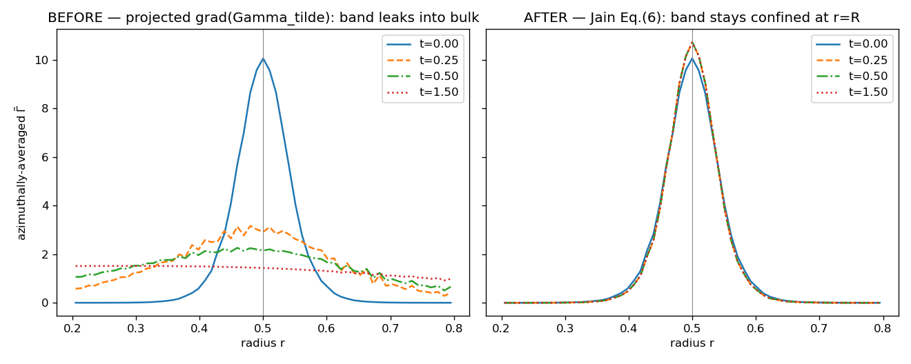

# 2D circle surface diffusion — curved-interface validation (diagnosis + fix)

The cheap 2D companion to the [3D sphere study](../3D_solutocapillary_diffusion). A circle is curved
(so it stresses the surface-diffusion operator the way a real droplet does) but 2D, so the interface
can be resolved far more finely than an affordable 3D sphere. That resolution — plus a controlled
experiment — first **uncovered a defect** in the original operator (it leaked surfactant off curved
interfaces), and then **validated the fix**. With the fix, MFC matches the exact surface-diffusion rate
to ~1.4% on the circle.

## In plain terms

Coat a circular drop unevenly with surfactant and let it spread along the interface; theory gives the
exact fade rate `D_s/R²` for the `m=1` (`cosθ`) pattern. On a **flat** interface MFC always nailed this
(the [1D case](../1D_solutocapillary_diffusion), −0.1%). On the **circle** the original operator did
not — because the surfactant did not actually stay on the interface. That is now fixed.

## The fix and the result

The interface stays put and the rate is right:



This is the surfactant density `Γ̃`, averaged around the circle, vs radius (interface at `r = 0.5`).
**Left (original operator):** the band starts as a thin ring but spreads radially into the bulk — the
surfactant leaks off the interface. **Right (fixed operator):** the band stays a sharp ring at `r = R`
for the whole run (curves overlap; it is even slightly *sharpened* by the confinement flux).

With the leak gone, the measured decay rate matches the exact Laplace–Beltrami value:

| `R/Δx` | rate ÷ exact | fit residual | mass drift |
|---|---|---|---|
| 21 | **0.986** | 0.0000 | 0.000% |
| 32 | **0.982** | 0.0000 | 0.000% |

All three mode estimators (whole-field, band-only, mass-normalized) now agree to the same value — the
hallmark of a clean single-mode decay — and the amplitude tracks `exp(−D_s/R²·t)` with essentially zero
fit residual. The remaining ~1.5% is the diffuse-interface band-thickness effect (`ε ≈ Δx`), well within
the expected first-order accuracy of a CSF/diffuse-interface method.

## What was wrong, and how it was fixed

**The symptom.** Turn the field into a single "mode amplitude" and fit its decay: with the original
operator, four reasonable estimators of the *same run* gave four different rates (0.55×, 0.74×, 1.71×,
3.1×), several drifting *further* from exact as the mesh was refined. When every weighting of the field
extracts a different rate, the field is not undergoing clean surface diffusion.

**The diagnosis.** Two runs, identical except surface diffusion on vs off (`MFC_DS`), isolate the cause
(figure `figures/normal_leakage.png`): with diffusion **off** the band is perfectly static (no parasitic
currents), so nothing advects the surfactant; with diffusion **on** the band spreads radially (peak
drops ~8×, total conserved). The operator was diffusing `Γ̃` in the *normal* direction, off the
interface — the discrete tangential projection failed to remove the across-interface part on a curved
interface.

**The fix.** Replace the projected operator `D_s·(I−n⊗n)∇Γ̃` with Jain's interface-confined scalar flux
(*J. Comput. Phys.* 515 (2024) 113277, Eq. 6):

```
flux = D_s·( ∇Γ̃ − 2(0.5 − c)·n·Γ̃/ε )
```

isotropic diffusion of `Γ̃` **plus a sharpening flux** (second term) that re-confines it to the
interface from both sides — no projection, no fragile `Γ̃/|∇c|` division. Here `c` is the color
function, `n = ∇c/|∇c|`, and `ε ≈ Δx` the interface thickness. Our stored `Γ̃ = Γ|∇c|` is exactly
Jain's transported variable, and his Eq. (24) is precisely this circle benchmark. (An intermediate
Rätz–Voigt `|∇c|`-weighted form removed the leak too, but under-diffused to 0.58× because of that
division; Jain's division-free form is what recovers the exact rate.)

## Details (setup and how to run it)

- **Setup:** passive surfactant (`sigma_model = 0`, constant `σ`, no flow), seeded on a circle with the
  `m=1` mode `Γ = Γ₀(1 + ε x/R)` (`x/R = cosθ`).
- **Exact rate:** a circle's `m`-th mode decays as `exp(−m² D_s/R² · t)`; for `m=1` that is `D_s/R²`
  (the *circle* value `m²D_s/R²`, not the sphere's `l(l+1)D_s/R²`).
- **Reproduce the diagnosis** — diffusion-on vs the diffusion-off control (`MFC_DS` sets `surf_diff`),
  then plot the radial profiles:
  ```
  MFC_NX=128 MFC_DS=0.2 ./mfc.sh run examples/2D_solutocapillary_diffusion/case.py --no-debug -n 4 -t pre_process simulation
  #   move that run's restart_data/ into on_dir/, then run the control into off_dir/:
  MFC_NX=128 MFC_DS=0   ./mfc.sh run examples/2D_solutocapillary_diffusion/case.py --no-debug -n 4 -t pre_process simulation
  python3 examples/2D_solutocapillary_diffusion/radial_profile.py <on_dir> <off_dir>
  ```
- **Convergence sweep** (`run_convergence.sh`, `measure.py`) records the rate across `R/Δx = 8…43`.

## References

Prior work backing the surfactant model and the eigenmode-decay validation is listed in the
[1D README](../1D_solutocapillary_diffusion#references). The fixed operator follows **Jain, S. S. (2024),
*A model for transport of interface-confined scalars and insoluble surfactants in two-phase flows*,
J. Comput. Phys. 515, 113277** (Eq. 6, sharpening flux; Eq. 24, this circle benchmark).
