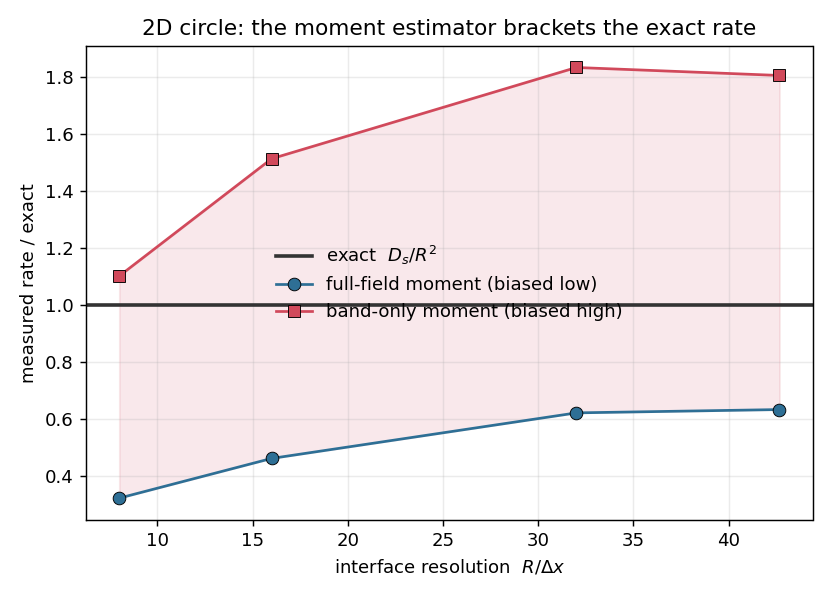

# 2D circle surface diffusion — a curved cross-check that exposes the measurement limit

The cheap 2D companion to the [3D sphere study](../3D_solutocapillary_diffusion). A circle is curved
(so it stresses the operator the same way a sphere does) but 2D, so the interface can be resolved far
more finely than an affordable 3D sphere. That extra resolution is what revealed a problem — **not with
the operator, but with how the decay rate is measured.**

## In plain terms

Same idea as the sphere: coat a circular drop unevenly with surfactant and let it spread; theory gives
the exact fade rate `D_s/R²` for the `m=1` (`cosθ`) pattern. We push the mesh fine (up to ~43 cells
across the radius) and measure the rate.

The catch: there are two natural ways to turn the field into a single "mode amplitude," and **they
disagree** — and neither converges cleanly to the exact rate.

## The finding — the moment brackets the exact rate, it doesn't pin it



| `R/Δx` | full-field moment ÷ exact | band-only moment ÷ exact |
|---|---|---|
| 8 | 0.32 | 1.10 |
| 16 | 0.46 | 1.51 |
| 32 | 0.62 | 1.83 |
| 43 | 0.63 | 1.80 |

- The **whole-field** moment `Σ Γ̃ x` sits *below* exact and **plateaus around 0.63** — it stops
  improving with resolution.
- The **band-only** moment (interface cells only) sits *above* exact and, if anything, drifts *further*
  above (1.10 → 1.83) as the mesh is refined.
- The exact value (`1.0` on the plot) stays **between** them, but the bracket **widens** with
  resolution rather than closing.

So the moment estimator **brackets** the true rate but cannot pin it — and refining the mesh does not
help, because the bias is not a lack of resolution. It comes from the staircased representation of the
circle on a Cartesian grid and tiny interface motion, which the whole-field and band-only masks pick up
with opposite sign. Total surfactant is still conserved to round-off throughout.

## What this means

This is why the **3D sphere convergence numbers are indicative, not tight**: they use the same
whole-field moment. The sphere *looks* cleaner (its mode decays 2× faster, so less bias bleeds in), but
it is the same tool. What is solidly established by these diffusion tests:

- surfactant mass is conserved to round-off;
- the flat, grid-aligned [1D case](../1D_solutocapillary_diffusion) matches the exact rate to −0.1%
  across the eigenvalue spectrum (there the moment is unbiased because the interface is grid-aligned);
- on curved interfaces the exact rate is **bracketed**, consistent with a convergent, correct operator.

What is **not** established: a precise curved-interface convergence *rate*. That needs a proper
interfacial estimator — recover the concentration `Γ = Γ̃/|∇c|` on the band and project it onto the
`cosθ` mode, instead of a whole-field moment. That is future work.

## Details (setup and how to run it)

- **Setup:** passive surfactant (`sigma_model = 0`, constant `σ`, no flow), seeded on a circle with the
  `m=1` mode `Γ = Γ₀(1 + ε x/R)` (`x/R = cosθ`).
- **Exact rate:** a circle's `m`-th mode decays as `exp(−m² D_s/R² · t)`; for `m=1` that is `D_s/R²`
  (the *circle* value `m²D_s/R²`, not the sphere's `l(l+1)D_s/R²`).
- **Run the sweep** (one build serves all resolutions; `measure.py` reports both estimators):
  ```
  examples/2D_solutocapillary_diffusion/run_convergence.sh   # R/Δx = 8, 16, 32, 43 (release, multi-rank)
  ```
