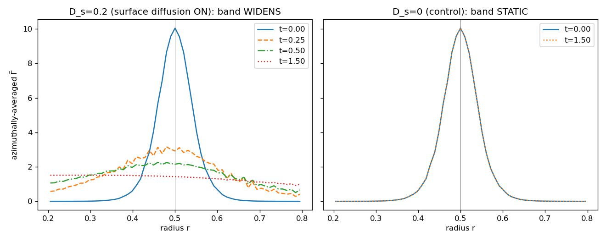

# 2D circle surface diffusion — a curved cross-check that uncovered an operator defect

The cheap 2D companion to the [3D sphere study](../3D_solutocapillary_diffusion). A circle is curved
(so it stresses the operator the same way a sphere does) but 2D, so the interface can be resolved far
more finely than an affordable 3D sphere. That extra resolution, plus a controlled experiment, showed
that the surface-diffusion **operator itself is defective on curved interfaces** — it leaks surfactant
off the interface. (An earlier version of this note blamed the *measurement*; that was wrong. The
evidence below is why.)

## In plain terms

Coat a circular drop unevenly with surfactant and let it spread; theory gives the exact fade rate
`D_s/R²` for the `m=1` (`cosθ`) pattern. On a **flat** interface MFC nails this rate (the
[1D case](../1D_solutocapillary_diffusion), −0.1%). On the **circle** it does not — and not because the
rate is hard to measure, but because the surfactant does not actually stay on the interface.

## The symptom — every way of measuring the rate disagrees

Turn the field into a single "mode amplitude" and fit its decay. Four reasonable estimators of the
*same run* give four different rates, and several move *away* from exact as the mesh is refined:

| estimator of the `m=1` rate ÷ exact | R/Δx = 21 | R/Δx = 43 |
|---|---|---|
| whole-field moment `Σ Γ̃ x` | 0.55× | 0.63× |
| mass-normalized angular `Σ Γ̃ (x/r) / Σ Γ̃` | 0.74× | 0.69× |
| band-only moment | 1.71× | 1.80× |
| interface-contour concentration `Γ̃/|∇c|` | 3.1× | — |

When every weighting of the field extracts a different "rate," the field is **not** undergoing clean
single-mode surface diffusion. That is a symptom, not the disease.

## The diagnosis — the operator leaks surfactant off the interface

Two runs, identical except surface diffusion is on or off, find the cause. The figure is the surfactant
density `Γ̃`, averaged around the circle, versus radius (the interface sits at `r = 0.5`):



- **Right (`D_s = 0`, control):** with diffusion off, the band is perfectly static — the `t=0` and
  `t=1.5` curves lie exactly on top of each other. So there are **no parasitic currents**; nothing is
  moving the interface, and the surfactant advects cleanly.
- **Left (`D_s = 0.2`, diffusion on):** the band, which should stay a thin ring at `r=0.5` and only even
  out *around* the circle, instead **spreads radially** into a broad hump. The peak drops ~8× while the
  total surfactant is conserved to round-off — the surfactant is diffusing **off** the interface into
  the bulk.

Surface diffusion is supposed to act purely *along* the interface; the projection `(I − n⊗n)` in the
operator exists precisely to remove the across-interface part. On the flat, grid-aligned 1D interface
that projection is trivial and the operator is exact. On a **curved** interface the discrete projection
does not fully remove the normal component, so surfactant leaks off — which is why no measured
"along-interface" rate matches `D_s/R²`.

## What this means

- **Solid:** surfactant **mass is conserved to round-off**, and the flat, grid-aligned
  [1D operator](../1D_solutocapillary_diffusion) matches the exact rate to −0.1% across the spectrum.
- **Broken:** the surface-diffusion operator (`surf_diff > 0`) on a **curved** interface leaks
  surfactant normally and does **not** reproduce the exact rate. The earlier "3D convergence toward the
  exact rate" was a measurement artifact of this leaking field, not real convergence — see the corrected
  [3D note](../3D_solutocapillary_diffusion).
- **Unaffected:** `surf_diff` defaults to `0` (infinite Péclet). The core surfactant **advection** and
  the **σ(Γ) Marangoni coupling** never use surface diffusion, and the `D_s = 0` control above confirms
  the surfactant advects with no leakage. This defect is confined to the optional surface-diffusion
  feature on curved interfaces.

Fixing it needs a curvature-aware surface-diffusion formulation (normal stabilization / a proper surface
delta, as in Teigen et al. 2011 and Rätz & Voigt 2006) so `Γ̃` stays pinned to the band — future work.

## Details (setup and how to run it)

- **Setup:** passive surfactant (`sigma_model = 0`, constant `σ`, no flow), seeded on a circle with the
  `m=1` mode `Γ = Γ₀(1 + ε x/R)` (`x/R = cosθ`).
- **Exact rate:** a circle's `m`-th mode decays as `exp(−m² D_s/R² · t)`; for `m=1` that is `D_s/R²`
  (the *circle* value `m²D_s/R²`, not the sphere's `l(l+1)D_s/R²`).
- **Reproduce the diagnosis** — run diffusion-on and the diffusion-off control (same case, `MFC_DS`
  sets `surf_diff`), then plot the radial profiles:
  ```
  MFC_NX=128 MFC_DS=0.2 ./mfc.sh run examples/2D_solutocapillary_diffusion/case.py --no-debug -n 4 -t pre_process simulation
  #   move that run's restart_data/ into on_dir/, then run the control into off_dir/:
  MFC_NX=128 MFC_DS=0   ./mfc.sh run examples/2D_solutocapillary_diffusion/case.py --no-debug -n 4 -t pre_process simulation
  python3 examples/2D_solutocapillary_diffusion/radial_profile.py <on_dir> <off_dir>
  ```
- **The estimator sweep** (`run_convergence.sh`, `measure.py`) records the whole-field and band moments
  across `R/Δx = 8…43` — the symptom table above.

## References

The prior work backing the surfactant model and the eigenmode-decay validation is listed in the
[1D README](../1D_solutocapillary_diffusion#references). Most relevant here: the circle `cos mθ` mode
decaying at `m²D_s/R²` is the 2D instance of the standard Laplace–Beltrami eigenmode-decay test
(Dziuk & Elliott 2013; Macdonald, Brandman & Ruuth 2011).
