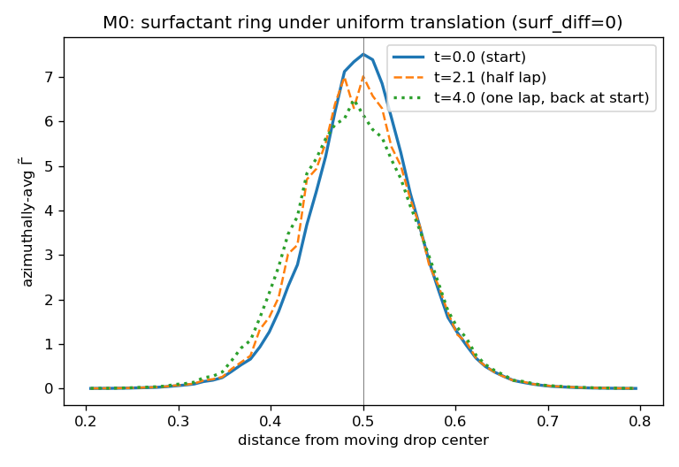
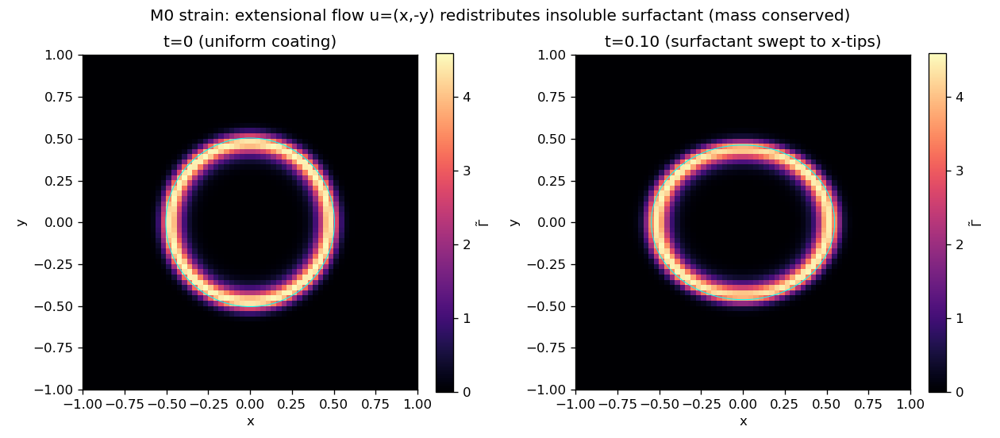

# 2D surfactant transport under flow (M0) — what it establishes, and what it does not

**Read this first: these are consistency and characterization checks, not a benchmark validation.**
Nothing here is compared against a published result or an exact solution. That is a real limitation, it is
not fixable in MFC, and the reason is explained below. The one surfactant test that *does* have an exact
analytic reference is the [surface-diffusion validation](../2D_solutocapillary_diffusion) (Laplace–Beltrami
decay rate, 0.986× exact) — that is where the quantitative evidence for the operator lives.

## Why there is no reference solution here

The guide's M0 rung points at Xu & Zhao (2003) and Jain (2024, §6.2). Those come from codes that **impose an
arbitrary velocity field and solve only the transport PDE**. MFC cannot do that: it is a full compressible
flow solver, so the velocity is always a *solution* of the momentum equations, never something you script.
Their error tables therefore cannot be reproduced here — it is a different problem, not a harder one.

That leaves only flows MFC actually holds:

| flow | exact solution exists? | does MFC hold it? |
|---|---|---|
| Uniform translation | yes (Galilean) | **yes** — but trivial: no interface stretching |
| Static equilibrium | yes (Γ must not move) | **yes** — but only tests parasitic currents |
| Solid-body rotation | yes, Γ(θ−ωt) | **no** — flow-limited; measured below |
| Extensional strain | — | no — relaxes (see Test 2) |
| LeVeque reversal, uniform expansion | yes | no — require a scripted velocity |

## Test 1 — confinement under translation

A drop with a `cosθ` surfactant pattern translates one full lap around the periodic domain
(`surf_diff=0`, `sigma_model=0`: pure passive advection). Translation is the one flow MFC reproduces
exactly, so the surfactant should ride rigidly with the interface.



| metric | result | what it is worth |
|---|---|---|
| interfacial mass | 1.00000 | **self-consistency** — the scheme is conservative by construction; this confirms the implementation, not the physics |
| `cosθ` amplitude | 0.51 → 0.54 | preserved |
| band width | 0.058 → 0.065 (+11% per lap, 8 drop-diameters) | **a measurement, not a pass/fail** — no reference value exists to compare it to |
| off-band leakage | ~2.4% → 3% | mostly the initial tanh tail |

The ring stays a well-defined ring. The +11% broadening is numerical diffusion; it is *characterized* here,
not validated. A Jain-style advection sharpening flux would reduce it, at the cost of artificial surface
diffusion (positivity needs `Pe_c = Δx|u|/D ≤ 1`) — undesirable in the high-Péclet regime this model targets.

## Test 2 — stretching under extensional strain

A drop with a uniform coating sits in `u=(εx,−εy)` (`ε=1`, `Ca=μεR/σ=0.5`). The surfactant redistributes
toward the elongation tips.



The `m=2` amplitude `a₂` rises to ~0.10 and interfacial mass is conserved to machine precision. **This is a
qualitative trend only** — it reproduces the *direction* Stone & Leal (1990) predict, and no number from
them. MFC does not sustain the imposed strain (it relaxes; deformation plateaus at `D≈0.065`), which is
exactly why a quantitative stretching check is not possible here.

**The stretching term has no exact reference in MFC at all** — every flow that stretches an interface is one
MFC will not hold. Its real evidence is the coupled benchmarks ([M1](../2D_Xu2006_surfactant_shear),
[M3](../2D_PimentaOliveira_rheology)), where the drop deforms under its *own* flow.

## Test 3 — solid-body rotation: a documented negative result

Rotation looked like the one chance at an exact reference: `Γ(θ,t) = Γ₀(θ−ωt)`, returning to the initial
condition after one period. It is a steady Euler solution if the pressure balances the centrifugal force
(`p = p₀ + ½ρω²r²`), with matched density so the drop feels no differential centrifugal force, and inviscid
because rigid rotation has *zero strain rate* — viscosity cannot damp it. **It does not work.**

One full period, `Nx=128`, `R=0.6`, box `[−1.5,1.5]²`, 15,216 steps:

| quantity | result |
|---|---|
| flow rate `ω_flow` | 1.000 → **0.865** (decays 13.5% per rotation) |
| pattern rate `ω_pattern` | **0.868** — tracks `ω_flow`, *not* ω=1 |
| L₂ vs exact `Γ(θ−ωt)` | 0.214 — but this is ~entirely the phase deficit |
| velocity error | 0.185 at `r>1.2` → 0.159 at `r<0.7` (boundary-driven, propagating inward) |
| drop circularity `D` | **0.0000** after a full rotation |
| interfacial mass | **1.00000** over 15,216 steps |
| `m=1` amplitude | decays 10.3% per rotation at `R/dx≈26` |

The decisive line is `ω_pattern` tracking `ω_flow` rather than ω: **the surfactant rides the computed flow
faithfully; the flow is what is wrong.** So the L₂ = 0.214 measures MFC's failure to hold rotation, not the
transport scheme — reporting it as a transport error would be meaningless.

**This is fundamental, not a tuning problem.** The rotation period (6.28) is ~100× the acoustic crossing
time (~0.06), and a square box has no boundary condition that supports rotation — fluid crosses it. The
boundary therefore gets ~100 acoustic transits to corrupt the interior before one rotation completes, which
the radial error profile confirms. Enlarging the domain makes it *worse*: rotational velocity grows with `r`,
so the boundary Mach number rises.

```
MFC_NX=128 MFC_TFRAC=1.0 ./mfc.sh run examples/2D_solutocapillary_transport/case_rotation.py --no-debug -n 8 -t pre_process simulation
python3 examples/2D_solutocapillary_transport/measure_rotation.py examples/2D_solutocapillary_transport
```

## What this establishes

- **The conservative `Γ̃ = Γ|∇c|` form works.** Mass is exact (1.00000) under translation, strain, and 15,216
  steps of rotation.
- **No spurious interface deformation** — `D = 0.0000` through a full rotation.
- **Transport is consistent with the computed flow**, to ~1%. Momentum and surfactant are independently
  evolved fields, and Γ rotates at exactly the rate the velocity field says it should. This is a genuine
  cross-check — just not an analytic one.
- **Numerical diffusion is quantified**: +11% band broadening per lap; 10.3% `m=1` amplitude decay per
  rotation at `R/dx≈26`.

## What this does not establish

- That the transport matches **any** analytic or published solution. There is no reference here.
- The stretching term **quantitatively** — only its direction.
- Any convergence order for the transport operator.

## References

See the [1D README](../1D_solutocapillary_diffusion#references). Extensional redistribution trend: Stone &
Leal (1990), *J. Fluid Mech.* 220, 161. Interface-confined transport formulation: Jain (2024), *J. Comput.
Phys.* 515, 113277. The imposed-velocity M0 benchmarks that MFC cannot reproduce: Xu & Zhao (2003); Jain
(2024) §6.2.
