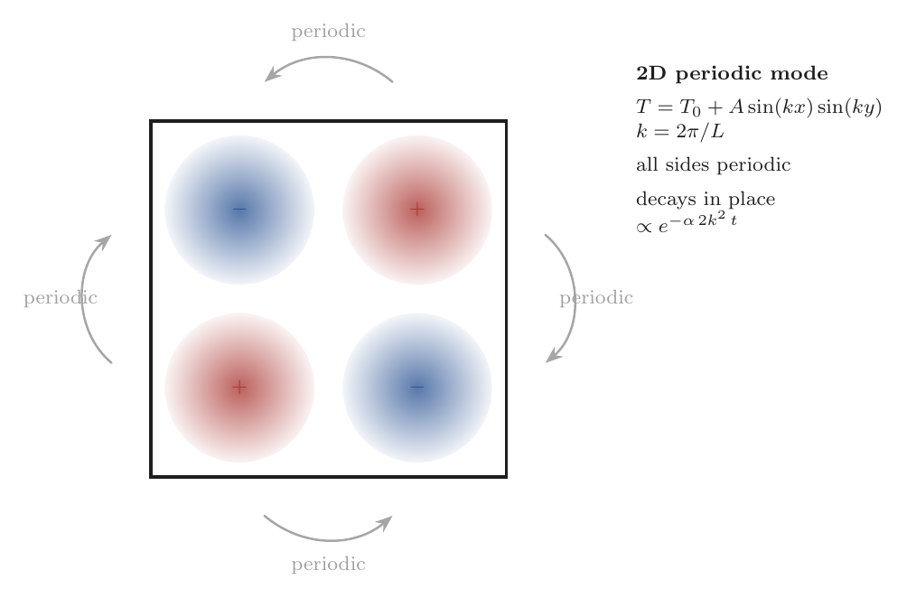
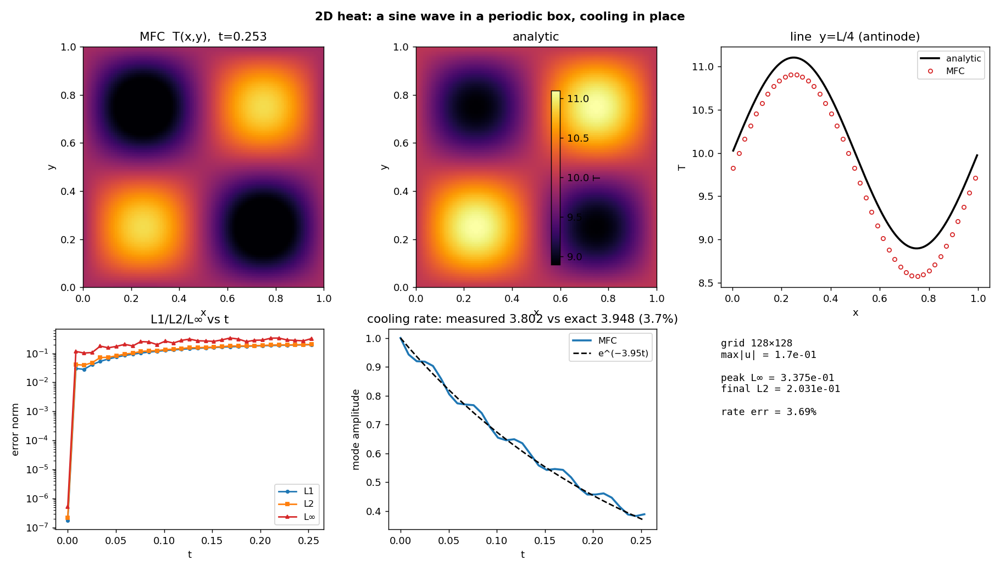

# Thermal Conduction — 2D periodic Fourier mode

Verifies MFC's bulk Fourier heat-conduction operator
(`src/simulation/m_thermal_conduction.fpp`) against the exact 2D heat-equation
solution: a single Fourier mode on a doubly-periodic square, decaying in place.

$$T(x,y,0) = T_0 + A\sin(kx)\sin(ky),\quad k=2\pi/L
\;\Rightarrow\; T = T_0 + A\sin(kx)\sin(ky)\,e^{-2\alpha k^2 t}.$$

A smooth periodic mode (no wall step) stays quiescent, so it exercises the
conduction operator cleanly in the compressible energy path — unlike a
strong-Dirichlet plate, whose hot wall collapses the local density and drives a
**sustained near-sonic flow** that never settles to the Laplace solution (and runs
the acoustic CFL away at fine resolution). This is the same isotropic-decay check
as the 3D mode, one dimension down.

## How temperature is set and recovered

Temperature is **not a stored field**; it is recovered from the stiffened-gas EOS,
$T = (p + p_\infty)/((\gamma-1)\rho c_v)$. The mode is imposed through the
**density at uniform pressure**, $\rho = \rho_0 T_0/T$, so the operator runs in its
full **production setting** (temperature coupled to the flow). The resulting
**few-percent physics floor** — spatially varying $\alpha = k/(\rho c_p)$ and weak
$p\,\mathrm dV$ acoustics — is real physics, not a discretization defect; the formal
order (2nd in space, 3rd in time) is masked by this floor.

## Run

```bash
./mfc.sh run examples/2D_thermal_conduction_mode/case.py -n 8
python3 examples/2D_thermal_conduction_mode/validate.py
```

`validate.py` reads the in-place `restart_data/`, recovers $T$, compares to the
exact field, fits the in-place cooling rate from the mode amplitude's exponential
decay, and writes `figures/heat_2d_mode.png` + `summary.json`.

## Result

| Grid | Error vs exact | `max\|u\|` | Notes |
|------|----------------|-----------|-------|
| 128² | peak $L_\infty$ **0.34**, $L_2$ 0.20 | 0.17 | isotropic decay rate matches to **3.7 %** |

*(Numbers predate the cv-based diffusive-`dt` retune; rerunning `case.py` +
`validate.py` regenerates them along with `summary.json` and `figures/`.)*



