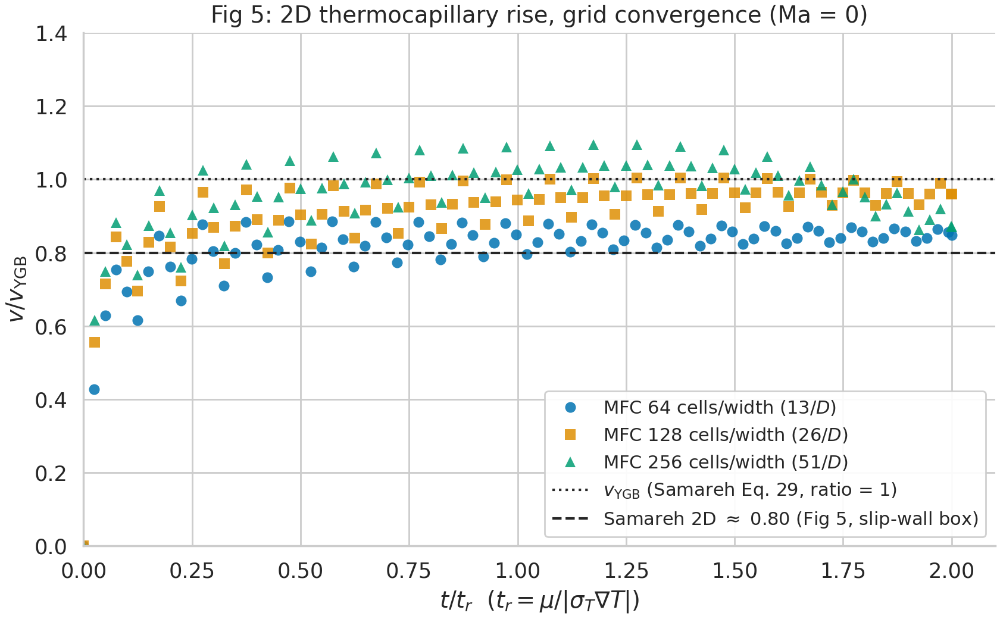
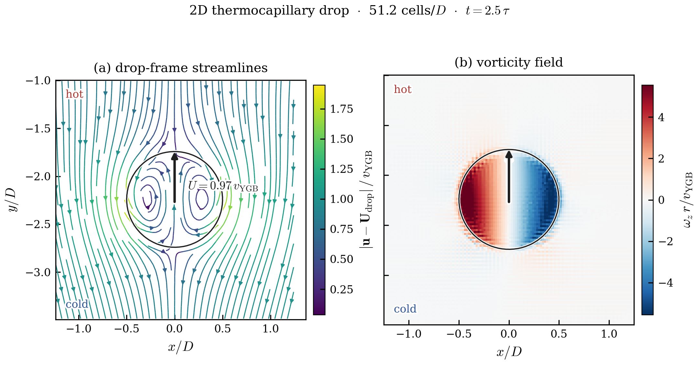

# Thermocapillary droplet migration — validation against Samareh et al. (2014)

This example validates MFC's temperature-dependent surface-tension closure `sigma(T)`
(`sigma_model = 1`, the *thermal-Marangoni* feature) against

> B. Samareh, J. Mostaghimi, C. Moreau, **"Thermocapillary migration of a deformable
> droplet"**, *Int. J. Heat Mass Transfer* **73** (2014) 616–626.

A neutrally-buoyant drop in an imposed linear temperature field develops a surface-tension gradient
along its interface (tension falls as temperature rises, `sigma_T = dsigma/dT < 0`). The resulting
tangential **Marangoni stress** drags interfacial fluid hot→cold and, by reaction, the drop migrates
toward the **hot** wall.


## Samareh's three scenarios — and where MFC stands

Samareh §4 studies the drop in three Marangoni-number regimes. This example reproduces the **2D**
parts of the two validation scenarios; the 3D sphere and the large-Ma application are out of scope,
and that is called out explicitly below rather than left missing.

| | Samareh scenario | Regime | Their figures | MFC here |
|---|---|---|---|---|
| **TC1** | Drop at zero Marangoni number (§4.1.1) | `Ma = 0` (invariant `T`) | **Fig 5** (planar 2D → 0.80), **Fig 6** (3D sphere → 0.95) | **2D ✅** · 3D ❌ |
| **TC2** | Low Marangoni number, Nas & Tryggvason (§4.1.2) | `Re=5, Ma=20, Ca=0.0167` | **Fig 7** | **✅** |
| **TC3** | Large Marangoni number, LMS flight experiment (§4.2) | large `Ma`, `mu(T)` | Figs 8, 10–13 | **❌** (needs `mu(T)`) |

## How MFC realizes the temperature field (shared by both 2D cases)

MFC has **no transport equation for temperature and no thermal wall BC**. `T` is recovered from the
stiffened-gas EOS, `T = (p + p_inf)/((gamma−1)·rho·cv)`, and the linear profile is imposed by encoding
it in the *density* IC, `rho(y) = rho_coeff/(T_0 + gradT·y)`. So Samareh's "isothermal walls at T=0/T=1"
have **no direct analogue** in the default case — instead the linear `T` is a frozen density IC. This
is the *opposite* diffusivity limit from Samareh's `Ma = 0` (their infinite diffusivity holds `T`
invariant; the **default case** here (`SAMAREH_MA = 0`) uses *zero* conduction, so the flow advects the
frozen profile), and the two agree only at **early times** — hence every quoted ratio comes from a
stated measurement window. Bulk Fourier
conduction with a true isothermal Dirichlet wall BC (`bc_y%isothermal_*`, `T_wall_*`) switches on only
when conduction is enabled (`SAMAREH_MA > 0`), which TC2 uses.

**Numerics that affect appearance, not the migration.** MFC is compressible, and the closed slip-wall
box rings: the unbalanced Laplace jump at `t=0` excites the box's **fundamental vertical acoustic
standing wave** (FFT of the drop velocity peaks at `f ≈ 1.37`, matching `c/(2·Ly) ≈ 1.33`; the drop
sits 1.5D off the floor, in that mode's *antinode*, so it carries a ±~6% `v_YGB` ripple). This is a
real, *resolved* oscillation (~4 samples/period, above Nyquist) — **not** aliasing — but connecting
~4 points/period of a sinusoid with lines looks like a sawtooth, so the curve figures use **dots** and
the migration is read as the *mean of the cloud*. Samareh's incompressible solver has no acoustics.
(See `results/oscillation_investigation.png`.)

---

## TC1 — Drop at zero Marangoni number (§4.1.1)

**Samareh's setup.** A drop of `D=1` in a `5D × 5D × 7.5D` box, slip walls all sides, centered
horizontally and 1.5D above the bottom wall; an invariant linear `T` (T=0 floor, T=1 ceiling,
`|gradT| = 1/7.5 = 0.133`); `rho_d = rho_b = 0.2`, `mu_d = mu_b = 0.1`, `sigma_0 = 0.1`,
`sigma_T = −0.1` → `v_YGB = |sigma_T·gradT|·D/(6·mu_b + 9·mu_d) = 8.88×10⁻³`. They run it two ways:

- **Fig 5 — planar 2D** (a 2D grid; the drop is an infinite **cylinder**). The grid-converged value
  of three of their four methods is `v_t/v_YGB ≈ 0.80`.
- **Fig 6 — fully 3D** (the full `5D×5D×7.5D` box; the drop is a **sphere**) → `≈ 0.95`.

**What MFC builds = Samareh's Fig 5 plane**, exactly: a 2D `5D × 7.5D` domain
(`x∈[−2.5,2.5]`, `y∈[−3.75,3.75]`), slip walls (`bc = −2`), a 2D circle (`r=0.5`) at `(0, −2.25)`.
The one deviation is the absolute temperature baseline — the density proxy diverges as `T→0`, so `T`
is shifted up by `T_0 = 10`; the gradient and the slope `sigma_T` (all that `v_YGB` and the Marangoni
stress depend on) are exact. Viscous time `tau = rho·r²/mu = 0.5`, capillary-thermal time
`t_r = mu/|sigma_T·gradT| = 7.5`.



| cells/`D` (`SAMAREH_NX`) | plateau `v_t/v_YGB` |
|---|---|
| 12.8 (64) | **0.81** — lands on Samareh's `≈ 0.80` |
| 25.6 (128) | 0.89 |
| 51.2 (256) | 0.87 |

A 2D cylinder **cannot** reach `v/v_YGB = 1` (that is the *sphere* value): the unbounded-cylinder
analytic is `15/16 = 0.938`, and the finite slip-wall box costs the rest → `≈ 0.80`. This is *not* an
MFC defect — Samareh's own Fig 5 is the same cylinder-in-a-box, and 0.80 is the value their four 2D
methods agree on. The internal Marangoni recirculation (the data analogue of the schematic) is real
and localized at the drop:



**Fig 6 (3D sphere, → 0.95) is NOT reproduced here — but only by dimensionality, not physics.** With
the *default* zero-conduction setting the 3D frozen-`T` rise drifts unboundedly (finer grid → faster,
no quasi-steady plateau); now that **bulk conduction is implemented** (`SAMAREH_MA > 0`), that runaway
is tamed and a steady 3D plateau is recoverable. So Fig 6 is feasible — it just belongs in a separate
`3D_thermocapillary_migration` example, since this one is 2D.

## TC2 — Low Marangoni number, Nas & Tryggvason (§4.1.2)

**Samareh's setup.** A *real* two-fluid drop (all properties 0.5× the bulk) in a `2D × 4D` box,
`Re = 5`, `Ma = 20`, `Ca = 0.01666`, drop 1D above the bottom wall. A non-zero `Ma` couples the energy
equation, so this needs bulk conduction. **Fig 7** plots `U* = U/U_r` vs `t* = t/t_r` against Nas &
Tryggvason: ramp from rest, overshoot to `U* ≈ 0.13`, relax.

**What MFC builds** (`case_fig7.py`): the `2×4D` box with isothermal Dirichlet walls + bulk conduction
of an independent temperature scalar (`thermal_conduction` + `thermal_scalar`). The overshoot brackets
the published peak:


| cells/`D` | peak `U*` (at `t*`) | Nas & Tryggvason |
|---|---|---|
| 32 (64) | 0.138 (2.5) | 0.13 |
| 64 (128) | 0.154 (2.1) | 0.13 |

## TC3 — Large Marangoni number, LMS flight experiment (§4.2)

**Samareh's setup.** A Fluorinert FC-75 drop (`D = 10.7 mm`) in Dow-Corning silicon oil, matched to the
Life and Microgravity Science Space Shuttle experiment: a `60 mm × 45 × 45 mm` cell, cold wall
`T_c = 283 K`, hot wall `T_h = 343 K`, side walls linear, `|gradT| = 1000 K/m`,
`sigma_0 = 0.007 N/m`, `sigma_T = −3.6×10⁻⁵ N/m·K`, and crucially a **temperature-dependent viscosity**
`mu(T) = exp(C + D/T)` (Figs 8, 10–13).

**Where `mu(T)` bites.** TC3 needs two pieces of physics: bulk conduction (now **implemented**) *and*
temperature-dependent viscosity (still **missing**). The viscosity is the load-bearing one here. The
real silicon oil's viscosity varies substantially across the 60 K cell (Samareh: density and `cp`
variations are negligible — *only* `mu` changes appreciably, "which can affect the droplet
acceleration"). Because both the migration and the Stokes drag scale as `1/mu_b`, as the drop rises
into warmer, less-viscous oil it speeds up — this is what produces the **non-monotonic** rise-velocity
profile (the accelerate–decelerate–reaccelerate "loop" in Fig 8 / Fig 13) that the experiment shows.
A constant-`mu` run (as in TC1/TC2) gives a smooth monotonic approach to a single terminal velocity and
cannot reproduce that signature. So with conduction in hand, **`mu(T)` is the sole remaining blocker**
for TC3 — not the dimensionality.

---

## Reproducing the figures

```bash
# Run from the repo root; the python scripts need numpy, matplotlib, and seaborn.

# TC1 headline (slip-wall box, 25.6 cells/D):
./mfc.sh run examples/2D_thermocapillary_migration/case.py -n 16
python3 examples/2D_thermocapillary_migration/measure.py examples/2D_thermocapillary_migration

# Full TC1 grid sweep + TC2 (launch MPI jobs, so run from an interactive shell):
python3 examples/2D_thermocapillary_migration/run_validation.py   # TC1 Fig 5 grids
python3 examples/2D_thermocapillary_migration/run_fig7.py         # TC2 Fig 7

# Rebuild the curated figures/ from existing runs/ (no simulation):
python3 examples/2D_thermocapillary_migration/plot_curves.py            # TC1 Fig 5 + TC2 Fig 7
python3 examples/2D_thermocapillary_migration/plot_recirculation.py runs/fig5_2D_w256
```

## Files

| File | Purpose |
|---|---|
| `case.py` | TC1 — parameterized Samareh §4.1.1 case (`SAMAREH_NX/DSDT/TR/WALL/MA/TS`) |
| `case_fig7.py` | TC2 — finite-Ma Nas & Tryggvason case (bulk conduction + independent `T` scalar) |
| `measure.py` / `measure_fig7.py` | window-honest migration-velocity measurement; per-run JSON |
| `run_validation.py` / `run_fig7.py` | grid sweeps; aggregate `results/summary.json` / `fig7_summary.json` |
| `plot_curves.py` / `plot_recirculation.py` | build the curated `figures/` (TC1 + TC2) |
| `verify_1d_*.py` | standalone 1D analytic checks (diffusion / conduction / thermal scalar) |
| `figures/` | curated figures, prefixed by test case (`tc1_*`, `tc2_*`) + the mechanism schematic |
| `results/` | working summaries + diagnostics; `runs/` is gitignored output |
