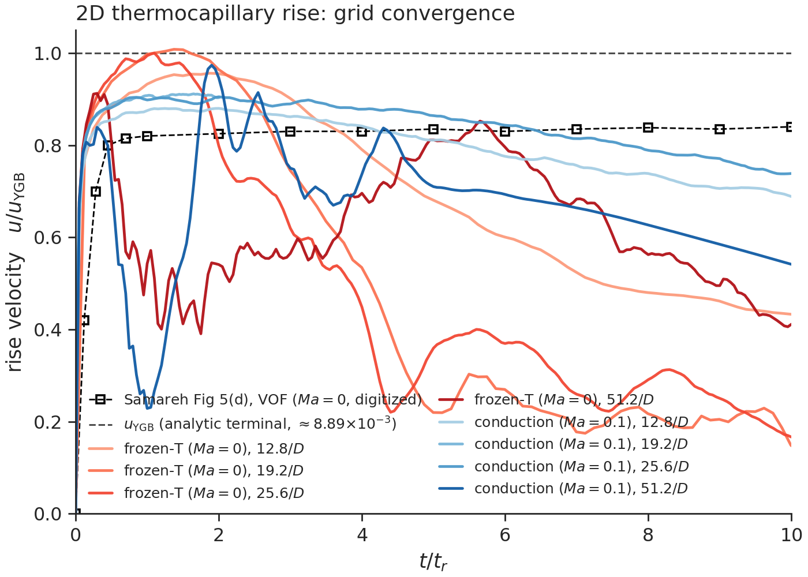
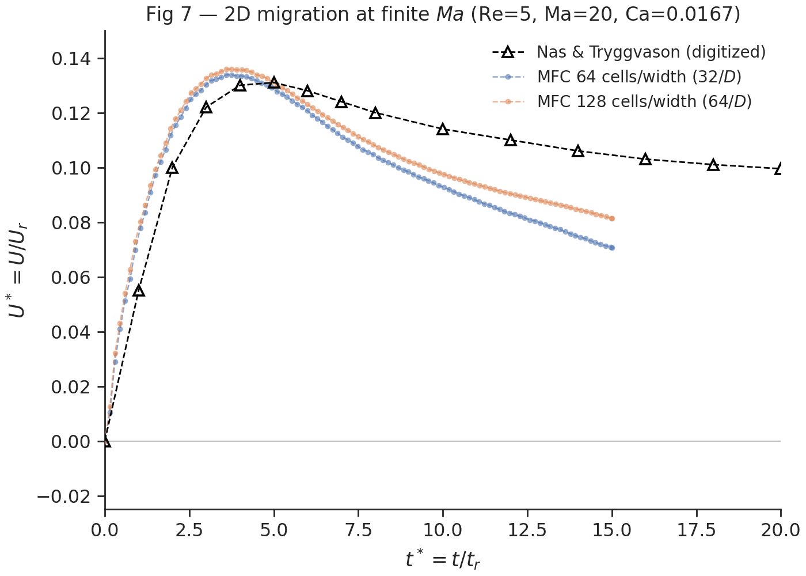

# Thermocapillary droplet migration in MFC — validation against Samareh et al. (2014)

**A validation report.** This document records (1) the physics of Samareh's thermocapillary-migration
problem, (2) the changes made to MFC to reproduce it — at the module/equation/file level, and
(3) the figures that demonstrate the validation, with an honest status for each case.

> B. Samareh, J. Mostaghimi, C. Moreau, **"Thermocapillary migration of a deformable droplet,"**
> *Int. J. Heat Mass Transfer* **73** (2014) 616–626.

All MFC work lives on branch `feature/thermal-marangoni`. The 2D cases live in this example
(`examples/2D_thermocapillary_migration`); the 3D sphere (Fig 6) lives in the sibling
[`../3D_thermocapillary_migration`](../3D_thermocapillary_migration).

---

## 1. Summary of status

A neutrally-buoyant drop in an imposed linear temperature field develops a surface-tension gradient
along its interface (tension falls as temperature rises, $\sigma_T = d\sigma/dT < 0$). The resulting tangential
**Marangoni stress** drags interfacial fluid hot→cold and, by reaction, the drop migrates toward the
**hot** wall. Samareh studies this in three Marangoni-number regimes; we reproduce the 2D parts in
full and the 3D sphere as work in progress.

| | Samareh scenario | Regime | Their figure | MFC status |
|---|---|---|---|---|
| **TC1** | Drop at zero Marangoni number (§4.1.1) | $Ma = 0$ | **Fig 5** (2D cylinder → 0.80) | ✅ **validated** — plateau ≈ 0.80 |
| | | | **Fig 6** (3D sphere → 0.95) | 🟡 **preliminary** — run in progress |
| **TC2** | Low Marangoni number, Nas & Tryggvason (§4.1.2) | $Re=5$, $Ma=20$, $Ca=0.0167$ | **Fig 7** | ✅ **validated** — overshoot brackets 0.13 |
| **TC3** | Large Marangoni number, LMS flight experiment (§4.2) | large $Ma$, $\mu(T)$ | **Figs 8, 10–13** | 🟡 **implemented** — converged run pending |

**Reproducing TC1 (and TC2/TC3) required three new physics capabilities in MFC**, none of which
existed on `master`:

1. **$\sigma(T)$ — temperature-dependent surface tension** (the thermal-Marangoni closure). *The driver.*
2. **Bulk Fourier conduction** with an **isothermal Dirichlet wall BC**. *Couples the energy equation for finite $Ma$.*
3. **$\mu(T)$ — Arrhenius temperature-dependent viscosity**. *Required by TC3's large-$Ma$ experiment.*

Temperature itself is **not** a new field: MFC is compressible, so the EOS already ties
$T = (p+p_\infty)/((\gamma-1)\rho c_v)$ to the conserved state. The imposed thermal gradient is set up through the
**density proxy** ($\rho(y) = \rho_{\mathrm{coeff}}/T(y)$), and $\sigma(T)$/$\mu(T)$/conduction read the EOS temperature
(`f_compute_mixture_temperature`). Section 3 documents each capability at the code level; Section 4
presents the validation figures.

> **GPU execution verified on a V100 (2026-06-23).** All four 2D cases were built with the OpenACC
> backend (`./mfc.sh build --gpu acc`, nvfortran / NVHPC 24.11) and run to completion on one
> **NVIDIA Tesla V100-PCIE-16GB** (single rank), each reaching its full `t_step_stop` with zero NaN:
> `case_Ma_0p1` (11,242 steps), `case_Ma_0` (56,212), `case_Ma_20` (45,999), `case_Ma_0p001`
> (936,229). This exercises the new $\sigma(T)$ and bulk-conduction device kernels end-to-end and
> reconfirms the 6-equation pressure-relaxation fix (commit `259a94c6`) under GPU execution. This is a
> statement about GPU execution, not about the figures — the physics-validation status in the table
> above is unchanged.

---

## 2. The physical problem and Samareh's three scenarios

### 2.1 Young–Goldstein–Block (YGB) reference velocity

For a drop of diameter $D$ in a linear temperature field $\nabla T$, with surface-tension slope $\sigma_T$, the
classical YGB terminal migration speed ($\mu^* = k^* = 1$ limit) is

$$v_{\mathrm{YGB}} = |\sigma_T \cdot \nabla T| \cdot D / (6\mu_b + 9\mu_d)$$

Every reported result is normalised by $v_{\mathrm{YGB}}$. The two relevant time scales are the **viscous time**
$\tau = \rho r^2/\mu$ and the **capillary–thermal time** $t_r = \mu / |\sigma_T\cdot\nabla T|$ (Samareh's time axis).

### 2.2 The three regimes

- **TC1 — $Ma = 0$ (§4.1.1).** Infinite thermal diffusivity holds the temperature field invariant; the
  flow cannot distort it. The drop reaches a clean terminal velocity. Samareh runs this both as a
  **2D plane** (the drop is an infinite *cylinder*, **Fig 5** → $v_t/v_{\mathrm{YGB}} \approx 0.80$) and **fully 3D**
  (a *sphere*, **Fig 6** → $\approx 0.95$).
- **TC2 — finite $Ma$ (§4.1.2).** A real two-fluid drop (all properties 0.5× the bulk) at $Re=5$,
  $Ma=20$, $Ca=0.0167$. Non-zero $Ma$ couples the energy equation, so conduction matters. **Fig 7**
  plots $U^* = U/U_r$ vs $t^* = t/t_r$ against Nas & Tryggvason: ramp from rest, overshoot to $U^* \approx 0.13$, relax.
- **TC3 — large $Ma$ (§4.2).** The Fluorinert FC-75 drop in silicone oil from the Life and Microgravity
  Science (LMS) Space Shuttle experiment, with a **temperature-dependent viscosity** $\mu(T)$ that makes
  the rise non-monotonic (**Figs 8, 10–13**).


*Mechanism: tension falls with temperature, so $\sigma$ varies continuously around the interface (high on
the cold/bottom side, low on the hot/top side). That tangential $\sigma$-gradient is the Marangoni stress
$\nabla_s\sigma$; it drives interfacial fluid hot→cold and an internal recirculation, and by reaction the drop
migrates toward the hot wall ($U$). Source: `figures/mechanism_schematic.tex`.*

---

## 3. Changes made to MFC (technical)

The branch adds **+1115/−166 lines across 22 source files** plus a new 242-line module and 18 new
regression golden files. The three temperature-*dependent* closures ($\sigma(T)$, conduction, $\mu(T)$) all
obtain temperature the **same** way — from one EOS-derived mixture helper
(`f_compute_mixture_temperature`) — so no two of them can silently disagree.

```
src/simulation/m_thermal_conduction.fpp   (NEW, 242 lines)   bulk conduction + isothermal wall BC
src/simulation/m_surface_tension.fpp       (+72)             σ(T) closure, face-local Marangoni stress
src/simulation/m_riemann_solvers.fpp       (+277)            μ(T) injection (HLLC/HLL/LF)
src/simulation/m_rhs.fpp                    (+163)            conduction flux-divergence in the RHS
src/simulation/m_sim_helpers.fpp           (+85)             shared mixture-temperature helper, conduction CFL
src/simulation/include/inline_capillary.fpp (+14)            σ-parametrised capillary stress tensor
src/common/m_derived_types.fpp             (+25)             fluid_pp%{k_therm,visc_*}
src/common/m_variables_conversion.fpp      (+25)             device arrays kappas, visc_*
src/common/m_mpi_common.fpp                (+14)             fold conduction diffusion number into the CFL reduction
src/{simulation,pre_process,post_process}/m_global_parameters.fpp, m_start_up.fpp, m_checker.fpp, ...
```

### 3.1 `σ(T)` — temperature-dependent surface tension (the Marangoni driver)

**Why Samareh needs it.** Migration *is* the tangential gradient of surface tension; with constant $\sigma$
there is no driving force. This is the one feature without which nothing migrates.

**Selected by** `sigma_model = 1` (`sigma_model = 0` reproduces the constant-$\sigma$ path bit-for-bit).

| Parameter | Meaning | Definition | Fortran decl | Validation |
|---|---|---|---|---|
| `sigma_model` (int) | 0 = const $\sigma$, 1 = linear $\sigma(T)$ | `definitions.py` (surface_tension tag) | `m_global_parameters.fpp:440` (sim/pre/post) | `case_validator.py:check_surface_tension` |
| `sigma_T_ref` (real) | reference temperature $T_{\mathrm{ref}}$ | `definitions.py` | `m_global_parameters.fpp:441` | — |
| `sigma_dTdT` (real) | slope $\sigma_T = d\sigma/dT$ (signed) | `definitions.py` | `m_global_parameters.fpp:442` | requires `surface_tension`, both fluids `cv>0` |

**Closure (linear).** Implemented in `m_surface_tension.fpp:339` (`s_get_capillary`), filling a
cell-centered field `c_sigma` over the full buffer:

```
c_sigma(j,k,l) = sigma + sigma_dTdT · (T_cell − sigma_T_ref)
```

**How the Marangoni stress reaches the equations.** The capillary source is a continuum-surface-force
(CSF) flux. For each face the code forms a **face-local** $\sigma$ by averaging the two adjacent `c_sigma`
cells (`m_surface_tension.fpp:128–129`, `175–176`, `222–223`) and threads it into the capillary stress
tensor — the macro `compute_capillary_stress_tensor(sig)` in `include/inline_capillary.fpp` was
parametrised on $\sigma$ for exactly this. The $\sigma$-weighted stress is added to momentum
(`flux_src_vf(eqn_idx%mom)`) and to the CSF energy term (`flux_src_vf(eqn_idx%E)`,
`m_surface_tension.fpp:143`). The **tangential variation of $\sigma_{\mathrm{face}}$ along the interface is the
Marangoni stress** — realised implicitly by the face-to-face variation of the stress tensor, not a
separately coded $\nabla\sigma$ term.

**Temperature source.** `T_cell` is recovered from the EOS helper `f_compute_mixture_temperature`
(see §3.5).
`c_sigma` is **always** allocated when surface tension is on, so the GPU device mapping is valid even
for `sigma_model = 0` (commit `78e952a5`).

**GPU/targets.** Closure runs in `simulation` only, inside a `GPU_PARALLEL_LOOP`; scalars are in
`GPU_DECLARE`/`GPU_UPDATE`. *Commits:* `d60d524a` (params), `5c869d8d` (face-local closure),
`e1bff0ac` (2D/3D regression tests).

### 3.2 Bulk Fourier conduction + isothermal Dirichlet wall BC

**Why Samareh needs it.** At finite $Ma$ (TC2) the temperature field is no longer invariant — it is
advected and diffused, and the wall temperatures are Dirichlet ($T=0$ floor, $T=1$ ceiling). MFC had
**no transport equation for temperature and no thermal wall BC** on `master`.

**Selected by** `thermal_conduction = T`; per-fluid conductivity `fluid_pp(i)%k_therm`.

- **New module** `src/simulation/m_thermal_conduction.fpp` (242 lines).
- **Governing equation (energy mode):** an explicit Fourier flux added to the energy equation,
  $\partial E/\partial t \mathrel{+}= \nabla\cdot(k\nabla T)$, with the **harmonic mixture conductivity** $1/k = \Sigma_i \alpha_i/k_i$
  (Samareh Eq. 8). The face flux $-k_{\mathrm{face}}\cdot dT/d\xi$ is assembled in `s_compute_conductive_flux`
  (`m_thermal_conduction.fpp:168–234`) using **cell-center spacing** (correct on stretched grids), and
  its divergence is added to the RHS in `m_rhs.fpp:1427–1432` (x; y/z analogous).
- **Isothermal Dirichlet wall** uses a reflection ghost fill $T_{\mathrm{ghost}} = 2 T_{\mathrm{wall}} - T_{\mathrm{interior}}$
  (`s_apply_thermal_conduction_bc`). The wall-temperature params (`bc_*%isothermal_*`, `Twall_*`)
  pre-existed on `master` (from the chemistry path); this branch reuses them, adds the guard below, and
  relaxes their validator so they no longer require `chemistry`.
- **CFL.** The conduction diffusion number $\alpha_T\cdot dt/dx^2$ is folded into the viscous CFL
  (`m_sim_helpers.fpp`, `m_time_steppers.fpp:666–679`, `m_mpi_common.fpp:311–326`).
- **Validation:** `case_validator.py:check_thermal_conduction`, Fortran
  `m_checker.fpp:s_check_inputs_thermal_conduction` (`k_therm > 0`).

> **⚠ Correctness fix worth highlighting (commit `1c74c720`).** The isothermal-wall ghost fill was
> originally applied on *every* MPI rank. On an interior rank those "ghost" cells are valid **halo
> data** from a neighbour, so overwriting them corrupted the cross-rank temperature stencil — which
> **reversed** the 2D migration direction. The fix guards every wall overwrite on the per-rank boundary
> code being negative, i.e. only on a true physical boundary:
> `m_thermal_conduction.fpp:82,95,109,122,137,150` — `if (bc_y%isothermal_in .and. bc_y%beg < 0) ...`.
> This, not the density proxy or advective throughflow, was the root cause of the reversal; with it the
> wall+conduction case plateaus correctly. *Commits:* `e4ef3528`, `0950e3ce` (tests), `0038007b`,
> `1c74c720`.

### 3.3 Temperature: the density proxy (no extra field)

MFC is compressible, so temperature is **already** an EOS function of the conserved state,
$T = (p+p_\infty)/((\gamma-1)\rho c_v)$; there is no separate temperature variable. To impose the linear gradient
$T(y)$ we use the **density proxy** — at uniform pressure, set the density to absorb the field:
$\rho(y) = (p_0+p_\infty)/((\gamma-1)c_v\cdot T(y))$. $\sigma(T)$/$\mu(T)$/conduction all read the EOS temperature via
`f_compute_mixture_temperature` (`m_sim_helpers.fpp`).

**Equal-density fluids (TC1/Fig 5).** One analytic patch where color, the Laplace pressure jump, and
density share one smooth circle $\eta(x,y)$, so the recovered $T$ is exactly linear everywhere — drop
included (`case_Ma_0.py`, `case_Ma_0p001.py`).

**Distinct fluids (TC2/TC3, Fig 7 & Fig 8/13).** Density also carries the fluid-to-fluid ratio, so use
a **per-fluid** density proxy, $\rho_i(y) = (p+p_{\infty,i})/((\gamma-1)c_{v,i}\cdot T(y))$. Two facts make this work:
- the density **ratio** $\rho_d/\rho_b$ is height-independent ($T(y)$ cancels), so the prescribed
  Nas-Tryggvason / Fluorinert ratio is preserved by tuning the per-fluid stiffening $p_{\infty,i}$;
- the **mixture** EOS recovers $T_{\mathrm{mix}}(y) = T(y)$ exactly across the interface (the volume fractions
  cancel), so there is no temperature jump.

The single analytic patch sets color, the volume-fraction split, pressure, and both per-fluid
densities from one `η` (`case_Ma_20.py`, `case_Ma_1723.py`). Bulk conduction + isothermal gradient
walls sustain the field against the drop's advection.

> **Honest caveat.** A density proxy is a *transported* field, so without conduction the drop's flow
> advects the gradient it should hold (frozen-$T$ is only a $t/t_r \lesssim 2$ anchor). And each fluid's
> *absolute* density stratifies as $\sim 1/T$ — a compressibility artifact absent in Samareh's
> incompressible solver (magnitude $\sim \Delta T/T$, shrunk by a large $T_0$/$T_{\mathrm{base}}$ offset). So the equal-density
> low-$Ma$ cases match quantitatively (Fig 5 → 0.80, Fig 6 → 0.95) while the distinct-fluid finite-$Ma$
> cases are qualitative (correct overshoot-then-settle shape; the exact peak is compressible-fidelity
> limited).

**Output.** Post-process flag `T_wrt` writes the EOS-derived `temperature` field (same formula as the
solver's closures), for visualization.

**Why one patch, not the conventional two.** MFC's usual convention is *one patch per region* — a
background-fluid patch plus a separate drop patch. These cases deliberately use a **single full-box
analytic patch** instead. The reason is the density proxy above: temperature is carried by the
*density*, so it varies smoothly over the whole box, and it must stay **continuous across the drop's
interface**. The Marangoni force *is* the tangential variation of $\sigma(T)$ along that interface, so any
temperature mismatch at the drop's edge acts as a spurious force exactly where the real one lives.

A two-patch layout puts a "seam" there, and both conventional ways of building it fail:

- **Constant-density drop** (the textbook two-fluid drop): the drop is isothermal while the surrounding
  bulk is stratified, so $T$ *jumps* across the interface. It runs cleanly — and therefore fails
  *silently*, underpredicting the migration.
- **Analytic-density drop** (to put the gradient back inside the drop): MFC's analytic-patch
  assignment (`@:analytical()`) is a hard overwrite that, under interface smoothing, runs over the
  *entire* background — so the drop's expression leaks globally and corrupts the bulk.

The single patch sidesteps both: one smooth field $\eta(x,y)$ paints the drop, the bulk, and the blended
interface *together*, so the mixture EOS recovers the imposed $T(y)$ exactly across the interface
(verified to machine precision, $\max|T_{\mathrm{mix}} - T(y)| \approx 4\times10^{-16}$).

**This is measured, not asserted.** [`case_Ma_20_2patch.py`](case_Ma_20_2patch.py) reruns TC2 with
*only* the drop IC swapped to the conventional constant-density two-patch layout — identical grid, EOS,
$\sigma(T)$, conduction, and pressure — so any difference isolates the patch choice:

| TC2 @ 32 cells/$D$ | drop IC | runs clean | peak $U^*$ | vs Samareh ≈ 0.13 |
|---|---|---|---|---|
| single patch (proxy) | $\rho_d(y) \propto 1/T(y)$ | ✅ | **0.134** | ✓ matches |
| two patch (convention) | constant $\rho_d$ | ✅ (0 NaN) | **0.104** | ✗ ~22% low |

The interface seam costs ~22% of the migration peak and misses the target. So the single-patch layout
is a requirement of imposing a continuous temperature *through density*, not author preference.

### 3.4 `μ(T)` — Arrhenius temperature-dependent viscosity

**Why Samareh needs it.** TC3's silicone oil viscosity varies substantially across the 60 K cell;
because migration and Stokes drag scale as $1/\mu_b$, the drop accelerates as it rises into warmer,
less-viscous oil — the experiment's **non-monotonic** rise "loop" (Fig 8/13) that a constant-$\mu$ run
*structurally cannot* reproduce.

**Selected per-fluid by** `fluid_pp(i)%visc_model = 1`, with Arrhenius coefficients
`fluid_pp(i)%visc_c` ($= C$) and `visc_d` ($= D$). Closure: **$\mu(T) = \exp(C + D/T)$**.

- **Where it is injected.** *Not* in the flux. In the **HLLC Riemann solver**
  (`m_riemann_solvers.fpp:1946–1981`) the per-state mixture viscosity is built by $\alpha$-weighting
  $\exp(C + D/T)$ over the viscous fluids and substituted into the shear Reynolds number, which MFC
  stores as $1/\mu$: $Re_L(1) = 1/\Sigma_i \alpha_i \mu_i$. The existing viscous source flux then consumes the
  modified `Re`. (The same override is coded in the HLL and Lax-Friedrichs solvers, but the validators
  restrict $\mu(T)$ to `riemann_solver = 2` + `model_eqns = 3`.)
- **Plumbing.** Per-fluid values are flattened into device arrays `visc_models/visc_cs/visc_ds` and a
  gate flag `viscous_T_dependent` in `m_variables_conversion.fpp:372–381` (uploaded once,
  `#ifdef MFC_SIMULATION`). Type fields live in `m_derived_types.fpp:324–326` (common).
- **Temperature source.** The EOS L/R state temperature computed inline.
- **Validation:** `case_validator.py:check_visc_model`, `m_checker.fpp:s_check_inputs_visc_model`
  (requires `viscous`, HLLC, `model_eqns=3`). *Commit:* `ba5944fe`.

### 3.5 Shared infrastructure

- **Mixture-temperature helper** `f_compute_mixture_temperature` (`m_sim_helpers.fpp:48–67`, a
  sequential GPU routine): from the stiffened-gas mixture EOS,
  $T = ((\Gamma_{\mathrm{mix}}+1)\cdot p + \Pi_{\infty,\mathrm{mix}})/(\rho c_p)_{\mathrm{mix}}$. $\sigma(T)$ and conduction call this helper on the cell state;
  $\mu(T)$ applies the **same EOS algebra** to the reconstructed Riemann L/R states inline — so every
  temperature consumer sees a temperature that is, by construction, identical.
- **Regression coverage.** Golden-file tests in `toolchain/mfc/test/cases.py`: single- and
  differing-property conduction, a viscous+conduction combination, and 2-rank MPI cases (which would
  have caught the halo bug).
- **Analytic conduction validation.** The bulk-conduction operator is verified against
  closed-form 1D/2D/3D heat-equation solutions — including formal grid (slope 2) and time
  (slope 3) convergence — in the dedicated `examples/Thermal_Conduction_Validation/` example.

---

## 4. Validation results

### 4.1 TC1 / Fig 5 — 2D cylinder, $Ma = 0$ → 0.80  ✅

**What MFC builds = Samareh's Fig 5 plane, exactly.** A 2D $5D \times 7.5D$ domain
($x\in[-2.5,2.5]$, $y\in[-3.75,3.75]$), slip walls (`bc = −2`), a circle ($r = 0.5$) at $(0, -2.25)$,
$\rho_d = \rho_b = 0.2$, $\mu_d = \mu_b = 0.1$, $\sigma_0 = 0.1$, $\sigma_T = -0.1$, $|\nabla T| = 2/15$ → $v_{\mathrm{YGB}} = 8.889\times10^{-3}$,
$\tau = 0.5$, $t_r = 7.5$.


*Produced by `plot.py samareh` (§8).*

The figure overlays MFC (bulk conduction, $Ma = 0.1$, 64 cells/$D$) on Samareh's digitised Fig 5(d)
VOF curve: the two **track each other to $t/t_r = 4.1$**, both plateauing at $v_t/v_{\mathrm{YGB}} \approx 0.80$. The
frozen-$T$ ($Ma = 0$) grid sweep brackets the same value:

| cells/$D$ | plateau $v_t/v_{\mathrm{YGB}}$ (frozen-$T$) |
|---|---|
| 12.8 | **0.81** — lands on Samareh's 0.80 |
| 25.6 | 0.89 |
| 51.2 | 0.87 |

**Why a cylinder cannot reach 1.0.** The unbounded-cylinder analytic limit is $15/16 = 0.938$, and the
finite slip-wall box costs the rest → $\approx 0.80$. This is *not* an MFC defect — Samareh's own Fig 5 is
the same cylinder-in-a-box, and 0.80 is the value their four 2D methods agree on. *(Run directories:
`runs/tc1/ma0p001/w{064,128,256}/sc050`, bulk-conduction at $Ma = 0.001$ — the deep invariant-$T$ limit.)*

### 4.2 TC1 / Fig 6 — 3D sphere, $Ma = 0$ → 0.95  🟡 *preliminary*

The fully-3D sibling ([`../3D_thermocapillary_migration`](../3D_thermocapillary_migration)): the same
imposed-$T$ slip-wall box, but the drop is a **sphere** (`geometry = 8`) → Samareh $\approx 0.95$. **This run
needs bulk conduction**: in the frozen-$T$ limit the 3D toroidal internal circulation continuously
steepens the interfacial gradient and the velocity drifts past $v_{\mathrm{YGB}}$ without saturating
(finer grid → faster, no plateau). Conduction (§3.2) tames the runaway and restores a steady plateau —
so the example runs with `thermal_conduction = T` by construction.


*Produced by `../3D_thermocapillary_migration/measure.py` (§8).*

**Honest status.** The figure above is from a **short, coarse smoke run** (11.2 cells/$D$, reaching
$t/t_r \approx 0.6$). The sphere rises and reaches $v/v_{\mathrm{YGB}} \approx 0.80$ by $t/t_r \approx 0.2$, then holds there (with
a small acoustic ripple) to the end of the run. But $0.6 t_r$ is **not** long enough either to settle
into a quasi-steady plateau or to separate the 3D sphere from the 2D-cylinder value (≈ 0.80) — the
expected climb toward 0.95 needs more time. **A converged Fig 6 (≈ 0.95) is a multi-day production
run** (longer $t_r$, 64/128 cells/$D$, plus a grid-convergence pair) and remains the outstanding item
for this case.

### 4.3 TC2 / Fig 7 — finite $Ma$, Nas & Tryggvason → 0.13  ✅

**What MFC builds** (`case_Ma_20.py`): a $2D \times 4D$ box, $Re=5$, $Ma=20$, $Ca=0.0167$, a real two-fluid
drop (all properties 0.5× the bulk), **isothermal Dirichlet walls + bulk conduction of the independent
$T$ scalar** — i.e. this case exercises §3.2 and §3.3 together.


*Produced by `plot.py samareh` (§8).*

$U^* = U/U_r$ ramps from rest and overshoots; MFC follows Nas & Tryggvason closely through the rise and
**brackets the published peak of $U^* \approx 0.13$**:

| cells/$D$ | peak $U^*$ (at $t^*$) | Nas & Tryggvason |
|---|---|---|
| 32 | 0.138 (2.5) | 0.13 |
| 64 | 0.154 (2.1) | 0.13 |

**Caveat shown honestly in the figure.** After the overshoot MFC relaxes *faster and lower* than
Nas & Tryggvason (MFC terminal $U^* \approx 0.06$ vs their $\approx 0.10$). The ramp and overshoot — the validatable
features — match; the late-time over-decline is a limitation of the compressible solver (see §6).

### 4.4 TC3 / Fig 8 — large $Ma$, LMS experiment, $\mu(T)$  🟡 *implemented; converged run pending*

**What MFC builds** (`../3D_thermocapillary_migration/case_Ma_1723.py`): the full LMS cell in SI units — a 3D Fluorinert FC-75 sphere
($D = 10.7\,\mathrm{mm}$) in silicone oil, $T_c = 283\,\mathrm{K}$ / $T_h = 343\,\mathrm{K}$, $|\nabla T| = 1000\,\mathrm{K/m}$,
$\sigma_0 = 0.007\,\mathrm{N/m}$, $\sigma_T = -3.6\times10^{-5}\,\mathrm{N/m{\cdot}K}$, real per-fluid densities/conductivities/heat capacities,
$\sigma(T)$, bulk conduction, a **per-fluid density proxy** (the densities differ, so each fluid's density
encodes the same $T(y)$; §3.3), **and the Arrhenius $\mu(T)$** with Samareh's Eq. 30 coefficients
(silicone oil $C=-10.17, D=1643$; Fluorinert $C=-11.76, D=1540$). This case exercises all three new
closures at once.

**Honest status.** The case validates and smoke-runs, and qualitative animations exist
(`animations/tc3_fig8_*.mp4`), but there is **no converged Fig 8 figure yet**: the headline
non-monotonic rise loop is a heavy 3D production run (Samareh used up to 240×640×240). The $\mu(T)$
machinery is implemented and unit-checked (§3.4), but the validating comparison is the outstanding item
for this case.

### 4.5 Qualitative evidence — animations

Cell-resolved MP4s rendered with `./mfc.sh viz` (interface, temperature/density, and an all-variable
tiled view per case):

- TC1: [interface](animations/tc1_fig5_interface.mp4) · [frozen-`T` density field](animations/tc1_fig5_density_Tfield.mp4) · [all variables](animations/tc1_fig5_all_vars.mp4)
- TC2: [interface](animations/tc2_fig7_interface.mp4) · [temperature](animations/tc2_fig7_temperature.mp4) · [all variables](animations/tc2_fig7_all_vars.mp4)
- TC3: [interface](animations/tc3_fig8_interface.mp4) · [temperature](animations/tc3_fig8_temperature.mp4) · [all variables](animations/tc3_fig8_all_vars.mp4)

---

## 5. How MFC realises the temperature field

MFC is a compressible solver with **no temperature unknown** — $T$ is recovered from the stiffened-gas
EOS, $T = (p + p_\infty)/((\gamma-1)\cdot\rho\cdot c_v)$ (§3.5). Samareh's linear profile is imposed through the **density
proxy** (§3.3):

- **Equal densities (TC1/Fig 5).** Encode the linear $T$ in a single density IC,
  $\rho(y) = \rho_{\mathrm{coeff}}/(T_0 + \nabla T\cdot y)$. The baseline is shifted up by $T_0 = 10$ so the proxy stays positive;
  the gradient and slope $\sigma_T$ (all that $v_{\mathrm{YGB}}$ and the Marangoni stress depend on) are exact.
- **Distinct densities (TC2/TC3, Fig 7 & 8).** Use a *per-fluid* proxy, $\rho_i(y) = (p+p_{\infty,i})/((\gamma-1)c_{v,i} T(y))$:
  the density ratio is height-independent (so the prescribed fluid ratio is preserved) and the mixture
  EOS keeps $T$ continuous across the interface.

Without conduction a proxy is a *frozen, transported* field — the flow advects it, so it matches
Samareh's invariant-$T$ case only at early times ($t/t_r \lesssim 2$). Bulk conduction + isothermal Dirichlet
walls (the finite-$Ma$ realization) actively restore the gradient; that is the path the validation
figures use. The remaining gap is compressibility (each fluid's density stratifies $\sim 1/T$), so distinct-fluid
finite-$Ma$ cases are qualitative rather than exact (§3.3 caveat).

---

## 6. Limitations and honest caveats

- **Compressible acoustics.** The closed slip-wall box rings: the unbalanced Laplace jump at $t=0$
  excites the box's fundamental vertical acoustic standing wave (FFT of the drop velocity peaks at
  $f \approx 1.37 \approx c/(2 L_y)$). This is a real *resolved* oscillation (~4 samples/period), **not** aliasing —
  but connecting ~4 points/period with lines looks like a sawtooth, so the curve figures plot **dots**
  and the migration is read as the *mean of the cloud*. Samareh's incompressible solver has no acoustics.
- **Frozen-$T$ drift (TC1 zero-conduction).** The density-proxy IC is slowly advected, so the rise
  ramps, overshoots, plateaus, then *drifts*; the faithful comparison is the post-overshoot plateau, not
  the endpoint. The bulk-conduction runs (which the headline figures use) do not have this drift.
- **2D over-decline (TC2).** MFC's post-overshoot relaxation is faster/lower than Nas & Tryggvason
  (§4.3) — a compressible-solver artifact; the ramp and peak match.
- **Outstanding production runs.** Fig 6 (converged 3D sphere → 0.95) and Fig 8 (large-$Ma$ $\mu(T)$ loop)
  are multi-day runs, not yet converged. Their machinery is implemented and unit/smoke-tested.

---

## 7. Reproducing the results

```bash
# Run from the repo root; the python scripts need numpy, matplotlib, seaborn.

# TC1 zero-Ma (slip-wall box, frozen T):
./mfc.sh run examples/2D_thermocapillary_migration/case_Ma_0.py -n 16
python3 examples/2D_thermocapillary_migration/measure.py examples/2D_thermocapillary_migration

# Full TC1 grid sweep + TC2 (launch MPI jobs):
python3 examples/2D_thermocapillary_migration/run.py fig5   # TC1 Fig 5 grids
python3 examples/2D_thermocapillary_migration/run.py fig7   # TC2 Fig 7
# (run.py <fig5|fig7|tc3|all> [run|remeasure]; `remeasure` re-reads existing runs/ without simulating)

# Rebuild the two embedded README figures from existing runs/ (no simulation):
python3 examples/2D_thermocapillary_migration/plot.py   # (samareh overlays; `ma` / `fields` are the other subcommands)

# TC1 Fig 6 (3D sphere) — sibling example:
./mfc.sh run examples/3D_thermocapillary_migration/case.py -n 8
python3 examples/3D_thermocapillary_migration/measure.py examples/3D_thermocapillary_migration

# Animations:
./mfc.sh viz examples/2D_thermocapillary_migration/runs/tc1/ma0p1/w128/sc050/ --var color_function --step all --mp4
```

## 8. Scripts → figures (what produces what)

**The figures embedded in this report, and the script that generates each:**

| Figure shown above | Produced by | In |
|---|---|---|
| `figures/mechanism_schematic.png` | `figures/mechanism_schematic.tex` (TikZ → `pdflatex`) | §2.2 |
| `figures/case1_fig5.png` | `plot.py samareh` | §4.1 |
| `../3D_thermocapillary_migration/viz/rise_velocity.png` | `../3D_thermocapillary_migration/measure.py` | §4.2 |
| `figures/case2_fig7.png` | `plot.py samareh` | §4.3 |

**Every script here, what it writes, and what it shows** — grouped by role.

*Cases (`./mfc.sh run` these; one per Samareh validation case):*

| Script | Role |
|---|---|
| `case_Ma_0.py` | TC1 (Sec 4.1.1 / Fig 5), 2D zero-Marangoni frozen-$T$ rise, slip-wall box. The literal $Ma=0$ reference (fast); drifts above 0.80 at late $t/t_r$. Hardcoded; change the grid by editing `Nx`. |
| `case_Ma_0p001.py` | TC1 conduction companion: same single-patch density proxy, but with large conductivity ($Ma=0.001$) + isothermal walls actively holding Samareh's invariant-$T$ 0.80 plateau. The canonical Fig 5 run (`tc1/ma0p001/w<grid>/sc050`); conduction-`dt`-limited, so coarse grids only. |
| `case_Ma_20.py` | TC2 (Sec 4.1.2 / Fig 7), 2D finite-Ma migration (Nas & Tryggvason), conduction + per-fluid density proxy (distinct fluids). Qualitative (compressible); hardcoded single configuration. |
| `../3D_thermocapillary_migration/case_Ma_1723.py` | TC3 (Sec 4.2 / Figs 8,13), 3D large-Ma + $\mu(T)$, matched to the LMS experiment. Hardcoded single configuration. |

*Run drivers → `results/<target>_summary.json` + figures:*

| Script | Role |
|---|---|
| `run.py <fig5\|fig7\|tc3\|all> [run\|remeasure]` | Runs each target's grid variants in its own `runs/<name>/` (the grid is set by rewriting the `Nx =` line in that run's copy of the hardcoded case; `fig5`→`case_Ma_0p001.py`→`tc1/ma0p001/w<grid>/sc050`, `fig7`→`case_Ma_20.py`→`tc2/w<grid>`, `tc3`→`../3D_thermocapillary_migration/case_Ma_1723.py`), measures with `measure.py`, aggregates `<target>_summary.json`, and regenerates the curated figures via `plot.py samareh`. `remeasure` re-reads existing runs without simulating. |

*Per-run measurement → `<case_dir>/viz/` + a `RESULT_JSON` line:*

| Script | Writes | Shows |
|---|---|---|
| `measure.py [case_dir] [fig5\|fig7\|tc3]` | `rise_velocity.png` / `fig7_migration.png` / `tc3_rise_velocity.png` | Migration velocity for one run; mode auto-detected from the domain (override with the 2nd arg). fig5: $v/v_{\mathrm{YGB}}(t/t_r)$; fig7: $U^*(t^*)$; tc3: rise mm/s vs distance. |
| `plot.py fields [case_dir] [temperature\|sigma\|recirculation] [step]` | `temperature_<step>.png` / `sigma_interface_<step>.png` / (to `figures/`) `case1_zero_marangoni_2D_recirculation.png` | EOS-recovered $T$ field + centerline / $\sigma(T)$ around the interface / co-moving streamlines + vorticity. |

*Curated overlays → `figures/` (all via the one `plot.py` tool; subcommands `samareh` / `ma` / `fields`):*

| Script | Writes | Shows |
|---|---|---|
| `plot.py samareh` | `case1_fig5.png`, `case2_fig7.png` | The two headline overlays above: MFC vs Samareh's digitized Fig 5(d) / Fig 7, raw points as markers (acoustic ring left visible). |
| `plot.py ma` | `tc1_ma_convergence.png` | Conduction TC1 plateau vs a Marangoni-number sweep ($Ma \to 0$ limit), reading `runs/tc1/ma0pXX/w128/sc050`. Regenerating the sweep means running `case_Ma_0p001.py` with `Ma` edited to each sweep value. |
| `compare_tc3_visc.py` | `case3_large_marangoni_mu_of_T_validation.png` | TC3 $\mu(T)=\exp(C+D/T)$ run vs a constant-$\mu$ control — the $\mu(T)$ acceleration signature. |

`animations/` holds the `./mfc.sh viz` MP4s (§4.5); `runs/` is gitignored simulation output.
