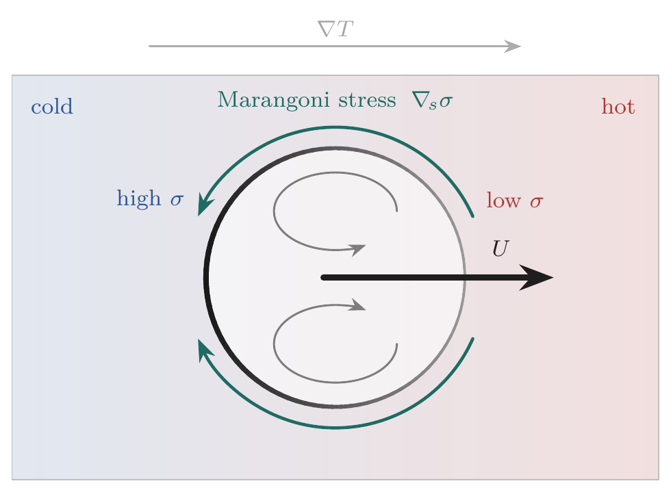
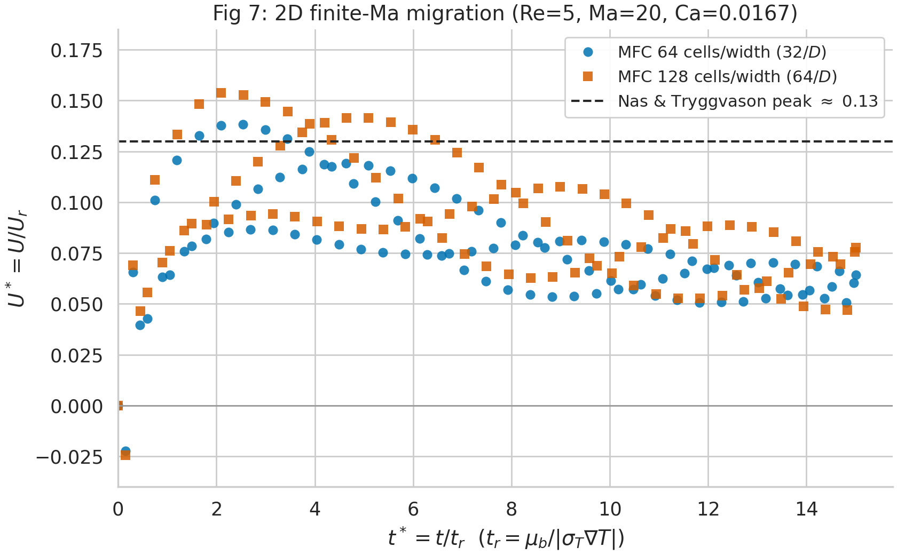

# Thermocapillary droplet migration — validation against Samareh et al. (2014)

This example validates MFC's temperature-dependent surface-tension closure `sigma(T)`
(`sigma_model = 1`, the *thermal-Marangoni* feature) against

> B. Samareh, J. Mostaghimi, C. Moreau, **"Thermocapillary migration of a deformable
> droplet"**, *Int. J. Heat Mass Transfer* **73** (2014) 616–626.

A neutrally-buoyant drop sits in an imposed linear temperature field. Surface tension falls as
temperature rises (`sigma_T = dsigma/dT < 0`), so the interface carries a tension gradient; the
resulting tangential **Marangoni stress** drags interfacial fluid from the hot side to the cold
side and, by reaction, the drop migrates toward the **hot** wall. In the creeping-flow,
zero-Marangoni-number limit this has a closed-form answer — the Young–Goldstein–Block (YGB)
terminal velocity (Samareh Eq. 29).



The drop-frame data analogue (real MFC fields: internal recirculation + the two counter-rotating
Marangoni cells) is in [`figures/recirculation_2D_w256.png`](figures/recirculation_2D_w256.png).

## What this reproduces

| Samareh case | Here | Status |
|---|---|---|
| **§4.1.1 / Fig 5** — 2D drop, zero Marangoni number (`Ma = 0`) | headline `case.py` | ✅ converges to their plateau |
| **§4.1.2 / Fig 7** — 2D finite-Ma (Nas & Tryggvason, `Re = 5`, `Ma = 20`, `Ca = 0.01666`) | `case_fig7.py` (bulk conduction) | ✅ peak brackets theirs |
| §4.1 / Fig 6 — fully-3D sphere (`≈ 0.95`) | **out of scope** | 3D frozen-`T` rise drifts unboundedly (no plateau) |
| §4.2 / Figs 8, 13 — large-Ma flight experiment | **out of scope** | needs temperature-dependent viscosity `mu(T)`, which MFC lacks |

This example is **2D only**.

## Case setup (Samareh §4.1.1)

| Quantity | Samareh | Here |
|---|---|---|
| Droplet diameter `D` | 1.0 | 1.0 (`r = 0.5`) |
| Box (width × gradient axis) | 5D × 7.5D | same; gradient along **+y** |
| Drop position | 1.5D above the cold (bottom) wall | `y = −2.25` |
| Densities `rho_d = rho_b` | 0.2 | **0.2** (matched) |
| Viscosities `mu_d = mu_b` | 0.1 | 0.1 (`fluid_pp(i)%Re(1) = 1/mu`) |
| `sigma_0` | 0.1 | 0.1 |
| `sigma_T = dsigma/dT` | −0.1 | −0.1 |
| `\|gradT\|` | 0.13 | 2/15 = 0.1333 |
| `v_YGB` (Eq. 29) | 8.88×10⁻³ | **8.889×10⁻³** |

With these matched, the viscous time `tau = rho·r²/mu = 0.5` and the capillary-thermal time
`t_r = mu/\|sigma_T·gradT\| = 7.5` are Samareh's, so the time axes are directly comparable.

**The one deviation** is the absolute temperature baseline. MFC is a *compressible* solver with no
transport equation for `T` — temperature is recovered from the stiffened-gas EOS,
`T = (p + p_inf)/((gamma−1)·rho·cv)`. To impose a linear `T(y)` at uniform pressure we let the
*density* carry the profile, `rho(y) = rho_coeff/(T_0 + gradT·y)`. That proxy diverges as `T → 0`,
so the whole field is shifted up by `T_0 = 10` (Samareh use `T = 0` at the cold wall). Only the
absolute level changes — `\|gradT\|` and the slope `sigma_T`, the only things `v_YGB` and the
Marangoni stress depend on, are exact. The flow is deeply incompressible (`Mach ~ 4×10⁻⁴`), so the
EOS stiffness knobs (`pi_inf`, `cv`, `p_0`) set only the acoustic CFL, not the migration.

## How variants are selected (one build serves the whole sweep)

| Env var | Meaning | Default |
|---|---|---|
| `SAMAREH_NX` | cells per box **width** (Samareh used 64/128/256 → 12.8/25.6/51.2 cells per `D`) | 128 |
| `SAMAREH_DSDT` | `dsigma/dT` (Marangoni strength) | −0.1 |
| `SAMAREH_TR` | run length in capillary-thermal times `t_r` | 4 |
| `SAMAREH_WALL` | `1` = Samareh's slip-wall box (anchor **0.80**), `0` = open box (anchor **15/16**) | 1 |
| `SAMAREH_MA` | thermal Marangoni number; `> 0` enables bulk Fourier conduction | 0 (frozen-`T`) |
| `SAMAREH_TS` | `1` = carry `T` as an independent advected scalar, decoupled from density | 0 |

**Geometry modes.** `SAMAREH_WALL=1` (default) is Samareh's actual Fig 5/6 box — slip walls on all
sides, drop 1.5D off the cold floor — measured in the lab frame, comparing against **their 0.80**.
`SAMAREH_WALL=0` centers the drop in an open box approximating the unbounded domain; the 2D anchor
is then the unbounded-cylinder analytic **15/16 = 0.938**, and `measure.py` subtracts the small
open-box return drift.

## Results

### Fig 5 — 2D rise velocity, zero Marangoni number (grid convergence)


Lab-frame `v/v_YGB` in the slip-wall box. At Samareh's coarse grid MFC lands on their value; finer
grids sit in the 0.80–0.90 spread of the four methods compared in their Fig 5.

| cells/`D` (`SAMAREH_NX`) | quasi-steady plateau `v_t/v_YGB` |
|---|---|
| 12.8 (64) | **0.81** — lands on Samareh's `≈ 0.80` |
| 25.6 (128) | 0.89 |
| 51.2 (256) | 0.87 |

### Fig 7 — 2D finite-Ma migration (Nas & Tryggvason)



`case_fig7.py` runs the `Re = 5`, `Ma = 20`, `Ca = 0.01666` test with bulk conduction of an
independent temperature scalar in the closed isothermal-wall box. The migration `U* = U/U_r` ramps
from rest, overshoots, and relaxes — bracketing the Nas & Tryggvason peak:

| cells/`D` | peak `U*` (at `t*`) | N&T peak |
|---|---|---|
| 32 (64) | 0.138 (2.5) | 0.13 |
| 64 (128) | 0.154 (2.1) | 0.13 |

### Why the curves are plotted as dots, not lines

MFC is compressible, and the closed slip-wall box **reverberates acoustically**: the initial
condition is not in capillary equilibrium (uniform pressure across a curved interface leaves the
Laplace jump `sigma/r` unbalanced at `t = 0`), which launches standing waves that ring for a long
time, only weakly damped by `mu`. The color-weighted drop velocity picks this up as a ±~8% `v_YGB`
ripple. Because only ~80–100 snapshots are saved — about 2.6 per acoustic period, right at the
Nyquist limit — connecting samples with lines would **alias** the oscillation into a spurious
sawtooth. Plotting each snapshot as an unconnected marker shows the data honestly; the migration
signal is the *mean of the cloud*. The ripple is set by sound speed and box size, not by `dx`, so
it does not shrink with grid refinement (Samareh's incompressible solver has no such acoustics).

## Reproducing the figures

```bash
# Run from the repo root; the python scripts need numpy, matplotlib, and seaborn.

# Headline 2D Fig 5 case (slip-wall box, 25.6 cells/D):
./mfc.sh run examples/2D_thermocapillary_migration/case.py -n 16
python3 examples/2D_thermocapillary_migration/measure.py examples/2D_thermocapillary_migration

# Full sweeps (launch MPI jobs via ./mfc.sh run, so run from an interactive shell):
python3 examples/2D_thermocapillary_migration/run_validation.py   # Fig 5 grids + finite-Ma modes
python3 examples/2D_thermocapillary_migration/run_fig7.py         # Fig 7 (Nas & Tryggvason)

# Rebuild the curated figures/ from existing runs/ (no simulation):
python3 examples/2D_thermocapillary_migration/plot_curves.py            # Fig 5 + Fig 7 dot plots
python3 examples/2D_thermocapillary_migration/plot_recirculation.py runs/fig5_2D_w256
```

`run_validation.py remeasure` / `run_fig7.py remeasure` rebuild `results/` from existing runs
without re-simulating.

## Scope and limitations

- **Frozen-`T` by default.** Samareh's `Ma = 0` comes from *infinite* thermal diffusivity (`T` held
  invariant). MFC's default is the opposite limit — *zero* bulk conduction, so the linear `T` is a
  frozen initial condition the flow advects. The two agree at early times, before interfacial
  parcels reshape the gradient; all quoted ratios come from a stated quasi-steady window. Bulk
  Fourier conduction is available (`SAMAREH_MA > 0`) for the finite-Ma cases.
- **No `mu(T)`.** Samareh's large-Marangoni flight experiment (Figs 8/13) needs
  temperature-dependent viscosity, which MFC does not provide — out of scope here.
- **Compressible acoustics** add the ripple discussed above; compare windowed means, not endpoints.

## Files

| File | Purpose |
|---|---|
| `case.py` | Parameterized Samareh §4.1.1 case (env vars above); the headline Fig 5 setup |
| `case_fig7.py` | Finite-Ma Nas & Tryggvason case (Fig 7) — bulk conduction + independent `T` scalar |
| `measure.py` / `measure_fig7.py` | Window-honest migration-velocity measurement; per-run JSON summary |
| `run_validation.py` | Fig 5 grid sweep + finite-Ma modes; aggregates `results/summary.json` |
| `run_fig7.py` | Fig 7 grid sweep; aggregates `results/fig7_summary.json` |
| `plot_curves.py` | Builds the Fig 5 + Fig 7 dot-plot figures into `figures/` |
| `plot_recirculation.py` | Builds the drop-frame recirculation figure into `figures/` |
| `verify_1d_*.py` | Standalone 1D analytic checks (diffusion / conduction / thermal scalar) |
| `figures/` | Curated figures (committed); `results/` holds working summaries; `runs/` is gitignored output |
