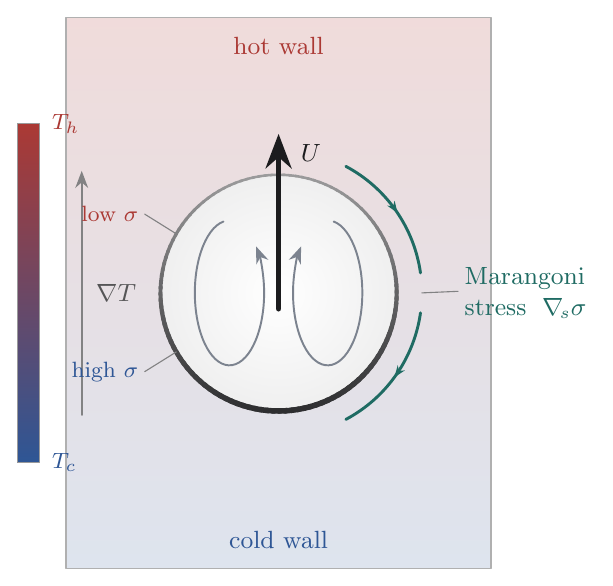

# Thermocapillary droplet migration in MFC — validation against Samareh et al. (2014)

**A validation report.** This document records (1) the physics of Samareh's thermocapillary-migration
problem, (2) the changes made to MFC to reproduce it — at the module/equation/file level, and
(3) the figures that demonstrate the validation, with an honest status for each case.

> B. Samareh, J. Mostaghimi, C. Moreau, **"Thermocapillary migration of a deformable droplet,"**
> *Int. J. Heat Mass Transfer* **73** (2014) 616–626.

All MFC work lives on branch `feature/thermal-marangoni`. The 2D cases live in this example
(`examples/2D_thermocapillary_migration`); the 3D sphere (Fig 6) lives in the sibling
[`../3D_thermocapillary_migration`](../3D_thermocapillary_migration).

---

## 1. Summary of status

A neutrally-buoyant drop in an imposed linear temperature field develops a surface-tension gradient
along its interface (tension falls as temperature rises, `σ_T = dσ/dT < 0`). The resulting tangential
**Marangoni stress** drags interfacial fluid hot→cold and, by reaction, the drop migrates toward the
**hot** wall. Samareh studies this in three Marangoni-number regimes; we reproduce the 2D parts in
full and the 3D sphere as work in progress.

| | Samareh scenario | Regime | Their figure | MFC status |
|---|---|---|---|---|
| **TC1** | Drop at zero Marangoni number (§4.1.1) | `Ma = 0` | **Fig 5** (2D cylinder → 0.80) | ✅ **validated** — plateau ≈ 0.80 |
| | | | **Fig 6** (3D sphere → 0.95) | 🟡 **preliminary** — run in progress |
| **TC2** | Low Marangoni number, Nas & Tryggvason (§4.1.2) | `Re=5, Ma=20, Ca=0.0167` | **Fig 7** | ✅ **validated** — overshoot brackets 0.13 |
| **TC3** | Large Marangoni number, LMS flight experiment (§4.2) | large `Ma`, `μ(T)` | **Figs 8, 10–13** | 🟡 **implemented** — converged run pending |

**Reproducing TC1 (and TC2) required four new physics capabilities in MFC**, none of which existed
on `master`:

1. **`σ(T)` — temperature-dependent surface tension** (the thermal-Marangoni closure). *The driver.*
2. **Bulk Fourier conduction** with an **isothermal Dirichlet wall BC**. *Couples the energy equation for finite `Ma`.*
3. **An independent temperature scalar `T_s`**. *Decouples `T` from density when the two fluids differ.*
4. **`μ(T)` — Arrhenius temperature-dependent viscosity**. *Required by TC3's large-`Ma` experiment.*

Section 3 documents each at the code level; Section 4 presents the validation figures.

---

## 2. The physical problem and Samareh's three scenarios

### 2.1 Young–Goldstein–Block (YGB) reference velocity

For a drop of diameter `D` in a linear temperature field `∇T`, with surface-tension slope `σ_T`, the
classical YGB terminal migration speed (μ\* = k\* = 1 limit) is

```
v_YGB = |σ_T · ∇T| · D / (6·μ_b + 9·μ_d)
```

Every reported result is normalised by `v_YGB`. The two relevant time scales are the **viscous time**
`τ = ρ·r²/μ` and the **capillary–thermal time** `t_r = μ / |σ_T·∇T|` (Samareh's time axis).

### 2.2 The three regimes

- **TC1 — `Ma = 0` (§4.1.1).** Infinite thermal diffusivity holds the temperature field invariant; the
  flow cannot distort it. The drop reaches a clean terminal velocity. Samareh runs this both as a
  **2D plane** (the drop is an infinite *cylinder*, **Fig 5** → `v_t/v_YGB ≈ 0.80`) and **fully 3D**
  (a *sphere*, **Fig 6** → `≈ 0.95`).
- **TC2 — finite `Ma` (§4.1.2).** A real two-fluid drop (all properties 0.5× the bulk) at `Re=5`,
  `Ma=20`, `Ca=0.0167`. Non-zero `Ma` couples the energy equation, so conduction matters. **Fig 7**
  plots `U* = U/U_r` vs `t* = t/t_r` against Nas & Tryggvason: ramp from rest, overshoot to `U* ≈ 0.13`, relax.
- **TC3 — large `Ma` (§4.2).** The Fluorinert FC-75 drop in silicone oil from the Life and Microgravity
  Science (LMS) Space Shuttle experiment, with a **temperature-dependent viscosity** `μ(T)` that makes
  the rise non-monotonic (**Figs 8, 10–13**).


*Mechanism: tension falls with temperature, so `σ` varies continuously around the interface (high on
the cold/bottom side, low on the hot/top side). That tangential `σ`-gradient is the Marangoni stress
`∇ₛσ`; it drives interfacial fluid hot→cold and an internal recirculation, and by reaction the drop
migrates toward the hot wall (`U`). Source: `figures/mechanism_schematic.tex`.*

---

## 3. Changes made to MFC (technical)

The branch adds **+1115/−166 lines across 22 source files** plus a new 242-line module and 18 new
regression golden files. The four features layer together: the three temperature-*dependent* closures
(σ(T), conduction, μ(T)) all obtain temperature the **same** way — from one EOS-derived mixture helper,
or, when it is active, from the temperature *carrier* `T_s` — so no two of them can silently disagree.

```
src/simulation/m_thermal_conduction.fpp   (NEW, 242 lines)   bulk conduction + isothermal wall BC
src/simulation/m_surface_tension.fpp       (+72)             σ(T) closure, face-local Marangoni stress
src/simulation/m_riemann_solvers.fpp       (+277)            μ(T) injection (HLLC/HLL/LF)
src/simulation/m_rhs.fpp                    (+163)            conduction / T_s flux-divergence in the RHS
src/simulation/m_sim_helpers.fpp           (+85)             shared mixture-temperature helper, conduction CFL
src/simulation/include/inline_capillary.fpp (+14)            σ-parametrised capillary stress tensor
src/common/m_derived_types.fpp             (+25)             eqn_idx%T_s, fluid_pp%{k_therm,visc_*}, patch%T_temp_val
src/common/m_variables_conversion.fpp      (+25)             device arrays kappas, visc_*; T_s pass-through
src/common/m_mpi_common.fpp                (+14)             fold conduction diffusion number into the CFL reduction
src/{simulation,pre_process,post_process}/m_global_parameters.fpp, m_start_up.fpp, m_checker.fpp, ...
```

### 3.1 `σ(T)` — temperature-dependent surface tension (the Marangoni driver)

**Why Samareh needs it.** Migration *is* the tangential gradient of surface tension; with constant `σ`
there is no driving force. This is the one feature without which nothing migrates.

**Selected by** `sigma_model = 1` (`sigma_model = 0` reproduces the constant-`σ` path bit-for-bit).

| Parameter | Meaning | Definition | Fortran decl | Validation |
|---|---|---|---|---|
| `sigma_model` (int) | 0 = const `σ`, 1 = linear `σ(T)` | `definitions.py` (surface_tension tag) | `m_global_parameters.fpp:440` (sim/pre/post) | `case_validator.py:check_surface_tension` |
| `sigma_T_ref` (real) | reference temperature `T_ref` | `definitions.py` | `m_global_parameters.fpp:441` | — |
| `sigma_dTdT` (real) | slope `σ_T = dσ/dT` (signed) | `definitions.py` | `m_global_parameters.fpp:442` | requires `surface_tension`, both fluids `cv>0` |

**Closure (linear).** Implemented in `m_surface_tension.fpp:339` (`s_get_capillary`), filling a
cell-centered field `c_sigma` over the full buffer:

```
c_sigma(j,k,l) = sigma + sigma_dTdT · (T_cell − sigma_T_ref)
```

**How the Marangoni stress reaches the equations.** The capillary source is a continuum-surface-force
(CSF) flux. For each face the code forms a **face-local** `σ` by averaging the two adjacent `c_sigma`
cells (`m_surface_tension.fpp:128–129`, `175–176`, `222–223`) and threads it into the capillary stress
tensor — the macro `compute_capillary_stress_tensor(sig)` in `include/inline_capillary.fpp` was
parametrised on `σ` for exactly this. The σ-weighted stress is added to momentum
(`flux_src_vf(eqn_idx%mom)`) and to the CSF energy term (`flux_src_vf(eqn_idx%E)`,
`m_surface_tension.fpp:143`). The **tangential variation of `σ_face` along the interface is the
Marangoni stress** — realised implicitly by the face-to-face variation of the stress tensor, not a
separately coded `∇σ` term.

**Temperature source.** `T_cell` is read from the independent scalar `q_prim_vf(eqn_idx%T_s)` when
`thermal_scalar` is on, else from the EOS helper `f_compute_mixture_temperature` (see §3.5).
`c_sigma` is **always** allocated when surface tension is on, so the GPU device mapping is valid even
for `sigma_model = 0` (commit `78e952a5`).

**GPU/targets.** Closure runs in `simulation` only, inside a `GPU_PARALLEL_LOOP`; scalars are in
`GPU_DECLARE`/`GPU_UPDATE`. *Commits:* `d60d524a` (params), `5c869d8d` (face-local closure),
`e1bff0ac` (2D/3D regression tests).

### 3.2 Bulk Fourier conduction + isothermal Dirichlet wall BC

**Why Samareh needs it.** At finite `Ma` (TC2) the temperature field is no longer invariant — it is
advected and diffused, and the wall temperatures are Dirichlet (`T=0` floor, `T=1` ceiling). MFC had
**no transport equation for temperature and no thermal wall BC** on `master`.

**Selected by** `thermal_conduction = T`; per-fluid conductivity `fluid_pp(i)%k_therm`.

- **New module** `src/simulation/m_thermal_conduction.fpp` (242 lines).
- **Governing equation (energy mode):** an explicit Fourier flux added to the energy equation,
  `∂E/∂t += ∇·(k ∇T)`, with the **harmonic mixture conductivity** `1/k = Σ_i α_i/k_i`
  (Samareh Eq. 8). The face flux `−k_face·dT/dξ` is assembled in `s_compute_conductive_flux`
  (`m_thermal_conduction.fpp:168–234`) using **cell-center spacing** (correct on stretched grids), and
  its divergence is added to the RHS in `m_rhs.fpp:1427–1432` (x; y/z analogous).
- **Isothermal Dirichlet wall** uses a reflection ghost fill `T_ghost = 2·T_wall − T_interior`
  (`s_apply_thermal_conduction_bc`). The wall-temperature params (`bc_*%isothermal_*`, `Twall_*`)
  pre-existed on `master` (from the chemistry path); this branch reuses them, adds the guard below, and
  relaxes their validator so they no longer require `chemistry`.
- **CFL.** The conduction diffusion number `α_T·dt/dx²` is folded into the viscous CFL
  (`m_sim_helpers.fpp`, `m_time_steppers.fpp:666–679`, `m_mpi_common.fpp:311–326`).
- **Validation:** `case_validator.py:check_thermal_conduction`, Fortran
  `m_checker.fpp:s_check_inputs_thermal_conduction` (`k_therm > 0`).

> **⚠ Correctness fix worth highlighting (commit `1c74c720`).** The isothermal-wall ghost fill was
> originally applied on *every* MPI rank. On an interior rank those "ghost" cells are valid **halo
> data** from a neighbour, so overwriting them corrupted the cross-rank temperature stencil — which
> **reversed** the 2D migration direction. The fix guards every wall overwrite on the per-rank boundary
> code being negative, i.e. only on a true physical boundary:
> `m_thermal_conduction.fpp:82,95,109,122,137,150` — `if (bc_y%isothermal_in .and. bc_y%beg < 0) ...`.
> This, not the density proxy or advective throughflow, was the root cause of the reversal; with it the
> wall+conduction case plateaus correctly. *Commits:* `e4ef3528`, `0950e3ce` (tests), `0038007b`,
> `1c74c720`.

### 3.3 Independent temperature scalar `T_s`

**Why Samareh needs it.** TC3's two fluids have *different* densities, so temperature can no longer be
encoded in the density field (the trick used for the equal-density TC1; see §5). `T_s` carries
temperature as its own field, decoupled from density.

**Selected by** `thermal_scalar = T`; per-patch IC `patch_icpp(i)%T_temp_val` (analytic-capable);
post-process output flag `T_s_wrt` (written as `temperature_scalar`).

- **Layout.** A new index `eqn_idx%T_s` (`m_derived_types.fpp:155`) is appended **last** to `sys_size`
  in all three targets (`m_global_parameters.fpp` sim `1163–1167`, pre, post), preserving every
  existing index position. It is a conserved variable but **passive/aliased** — copied unchanged in
  cons↔prim (`m_variables_conversion.fpp:790,1038`) and pointer-aliased in the RHS
  (`m_rhs.fpp:182–186`), exactly like the color function. IC assignment (smoothing-blended) at
  `m_assign_variables.fpp:547–549`.
- **Governing equation:** advected passively and, when conduction is on, diffused at the thermal
  diffusivity in **variable-property** form,
  `∂T_s/∂t + u·∇T_s = (1/(ρ c_p))·∇·(k ∇T_s)`.
  The conductive flux is stored conservatively (`−k_face·dT/dξ`,
  `m_thermal_conduction.fpp:217–225`); the RHS divides the flux divergence by the local
  `ρ c_p` (`m_rhs.fpp:1437–1451`).

> **⚠ Second correctness fix (also `1c74c720`).** The diffusion was first written constant-property as
> `∇·(α ∇T)` with `α = k/(ρc_p)` *inside* the divergence. Where `ρc_p` jumps across the interface that
> form injects a spurious `(ρc_p)′` term that again reverses migration. It was corrected to
> `(1/(ρc_p))·∇·(k ∇T)`. (Independent of the MPI guard above, but bundled in the same commit.)

**Targets:** all three (it changes `sys_size`). *Commits:* `42c42fde`, `6e571c2c`.

### 3.4 `μ(T)` — Arrhenius temperature-dependent viscosity

**Why Samareh needs it.** TC3's silicone oil viscosity varies substantially across the 60 K cell;
because migration and Stokes drag scale as `1/μ_b`, the drop accelerates as it rises into warmer,
less-viscous oil — the experiment's **non-monotonic** rise "loop" (Fig 8/13) that a constant-`μ` run
*structurally cannot* reproduce.

**Selected per-fluid by** `fluid_pp(i)%visc_model = 1`, with Arrhenius coefficients
`fluid_pp(i)%visc_c` (= C) and `visc_d` (= D). Closure: **`μ(T) = exp(C + D/T)`**.

- **Where it is injected.** *Not* in the flux. In the **HLLC Riemann solver**
  (`m_riemann_solvers.fpp:1946–1981`) the per-state mixture viscosity is built by α-weighting
  `exp(C + D/T)` over the viscous fluids and substituted into the shear Reynolds number, which MFC
  stores as `1/μ`: `Re_L(1) = 1/Σ_i α_i μ_i`. The existing viscous source flux then consumes the
  modified `Re`. (The same override is coded in the HLL and Lax-Friedrichs solvers, but the validators
  restrict `μ(T)` to `riemann_solver = 2` + `model_eqns = 3`.)
- **Plumbing.** Per-fluid values are flattened into device arrays `visc_models/visc_cs/visc_ds` and a
  gate flag `viscous_T_dependent` in `m_variables_conversion.fpp:372–381` (uploaded once,
  `#ifdef MFC_SIMULATION`). Type fields live in `m_derived_types.fpp:324–326` (common).
- **Temperature source.** `T_s` if `thermal_scalar`, else the EOS L/R state temperature computed inline.
- **Validation:** `case_validator.py:check_visc_model`, `m_checker.fpp:s_check_inputs_visc_model`
  (requires `viscous`, HLLC, `model_eqns=3`). *Commit:* `ba5944fe`.

### 3.5 Shared infrastructure

- **Mixture-temperature helper** `f_compute_mixture_temperature` (`m_sim_helpers.fpp:48–67`, a
  sequential GPU routine): from the stiffened-gas mixture EOS,
  `T = ((Γ_mix+1)·p + Π∞_mix)/(ρ c_p)_mix`. σ(T) and conduction call this helper on the cell state;
  μ(T) applies the **same EOS algebra** to the reconstructed Riemann L/R states inline. Either way,
  when `thermal_scalar` is on all three instead read `T_s` directly — so every temperature consumer
  sees a temperature that is, by construction, identical.
- **Regression coverage.** 18 new golden-file tests in `toolchain/mfc/test/cases.py`: single- and
  differing-property conduction, a viscous+conduction combination, 2-rank MPI cases (which would have
  caught the halo bug), and a `thermal_scalar + thermal_conduction` case.
- **Analytic conduction validation.** The bulk-conduction operator is verified against
  closed-form 1D/2D/3D heat-equation solutions — including formal grid (slope 2) and time
  (slope 3) convergence — in the dedicated `examples/Thermal_Conduction_Validation/` example.

---

## 4. Validation results

### 4.1 TC1 / Fig 5 — 2D cylinder, `Ma = 0` → 0.80  ✅

**What MFC builds = Samareh's Fig 5 plane, exactly.** A 2D `5D × 7.5D` domain
(`x∈[−2.5,2.5]`, `y∈[−3.75,3.75]`), slip walls (`bc = −2`), a circle (`r = 0.5`) at `(0, −2.25)`,
`ρ_d = ρ_b = 0.2`, `μ_d = μ_b = 0.1`, `σ_0 = 0.1`, `σ_T = −0.1`, `|∇T| = 2/15` → `v_YGB = 8.889×10⁻³`,
`τ = 0.5`, `t_r = 7.5`.


*Produced by `plot_samareh_style.py` (§8).*

The figure overlays MFC (bulk conduction, `Ma = 0.1`, 64 cells/`D`) on Samareh's digitised Fig 5(d)
VOF curve: the two **track each other to `t/t_r = 4.1`**, both plateauing at `v_t/v_YGB ≈ 0.80`. The
frozen-`T` (`Ma = 0`) grid sweep brackets the same value:

| cells/`D` | plateau `v_t/v_YGB` (frozen-`T`) |
|---|---|
| 12.8 | **0.81** — lands on Samareh's 0.80 |
| 25.6 | 0.89 |
| 51.2 | 0.87 |

**Why a cylinder cannot reach 1.0.** The unbounded-cylinder analytic limit is `15/16 = 0.938`, and the
finite slip-wall box costs the rest → `≈ 0.80`. This is *not* an MFC defect — Samareh's own Fig 5 is
the same cylinder-in-a-box, and 0.80 is the value their four 2D methods agree on. *(Run directories:
`runs/fig5_2D_w064/128/256`; the bulk-conduction overlay run is the headline.)*

### 4.2 TC1 / Fig 6 — 3D sphere, `Ma = 0` → 0.95  🟡 *preliminary*

The fully-3D sibling ([`../3D_thermocapillary_migration`](../3D_thermocapillary_migration)): the same
imposed-`T` slip-wall box, but the drop is a **sphere** (`geometry = 8`) → Samareh `≈ 0.95`. **This run
needs bulk conduction**: in the frozen-`T` limit the 3D toroidal internal circulation continuously
steepens the interfacial gradient and the velocity drifts past `v_YGB` without saturating
(finer grid → faster, no plateau). Conduction (§3.2) tames the runaway and restores a steady plateau —
so the example runs with `thermal_conduction = T` by construction.


*Produced by `../3D_thermocapillary_migration/measure.py` (§8).*

**Honest status.** The figure above is from a **short, coarse smoke run** (11.2 cells/`D`, reaching
`t/t_r ≈ 0.6`). The sphere rises and reaches `v/v_YGB ≈ 0.80` by `t/t_r ≈ 0.2`, then holds there (with
a small acoustic ripple) to the end of the run. But `0.6 t_r` is **not** long enough either to settle
into a quasi-steady plateau or to separate the 3D sphere from the 2D-cylinder value (≈ 0.80) — the
expected climb toward 0.95 needs more time. **A converged Fig 6 (≈ 0.95) is a multi-day production
run** (longer `t_r`, 64/128 cells/`D`, plus a grid-convergence pair) and remains the outstanding item
for this case.

### 4.3 TC2 / Fig 7 — finite `Ma`, Nas & Tryggvason → 0.13  ✅

**What MFC builds** (`case_fig7.py`): a `2D × 4D` box, `Re=5`, `Ma=20`, `Ca=0.0167`, a real two-fluid
drop (all properties 0.5× the bulk), **isothermal Dirichlet walls + bulk conduction of the independent
`T` scalar** — i.e. this case exercises §3.2 and §3.3 together.


*Produced by `plot_samareh_style.py` (§8).*

`U* = U/U_r` ramps from rest and overshoots; MFC follows Nas & Tryggvason closely through the rise and
**brackets the published peak of `U* ≈ 0.13`**:

| cells/`D` | peak `U*` (at `t*`) | Nas & Tryggvason |
|---|---|---|
| 32 | 0.138 (2.5) | 0.13 |
| 64 | 0.154 (2.1) | 0.13 |

**Caveat shown honestly in the figure.** After the overshoot MFC relaxes *faster and lower* than
Nas & Tryggvason (MFC terminal `U* ≈ 0.06` vs their `≈ 0.10`). The ramp and overshoot — the validatable
features — match; the late-time over-decline is a limitation of the compressible solver (see §6).

### 4.4 TC3 / Fig 8 — large `Ma`, LMS experiment, `μ(T)`  🟡 *implemented; converged run pending*

**What MFC builds** (`case_tc3.py`): the full LMS cell in SI units — a 3D Fluorinert FC-75 sphere
(`D = 10.7 mm`) in silicone oil, `T_c = 283 K` / `T_h = 343 K`, `|∇T| = 1000 K/m`,
`σ_0 = 0.007 N/m`, `σ_T = −3.6×10⁻⁵ N/m·K`, real per-fluid densities/conductivities/heat capacities,
`σ(T)`, bulk conduction, the independent `T_s` (since the densities differ), **and the Arrhenius
`μ(T)`** with Samareh's Eq. 30 coefficients (silicone oil `C=−10.17, D=1643`; Fluorinert
`C=−11.76, D=1540`). This case exercises **all four** new features at once.

**Honest status.** The case validates and smoke-runs, and qualitative animations exist
(`animations/tc3_fig8_*.mp4`), but there is **no converged Fig 8 figure yet**: the headline
non-monotonic rise loop is a heavy 3D production run (Samareh used up to 240×640×240). The `μ(T)`
machinery is implemented and unit-checked (§3.4), but the validating comparison is the outstanding item
for this case.

### 4.5 Qualitative evidence — animations

Cell-resolved MP4s rendered with `./mfc.sh viz` (interface, temperature/density, and an all-variable
tiled view per case):

- TC1: [interface](animations/tc1_fig5_interface.mp4) · [frozen-`T` density field](animations/tc1_fig5_density_Tfield.mp4) · [all variables](animations/tc1_fig5_all_vars.mp4)
- TC2: [interface](animations/tc2_fig7_interface.mp4) · [temperature](animations/tc2_fig7_temperature.mp4) · [all variables](animations/tc2_fig7_all_vars.mp4)
- TC3: [interface](animations/tc3_fig8_interface.mp4) · [temperature](animations/tc3_fig8_temperature.mp4) · [all variables](animations/tc3_fig8_all_vars.mp4)

---

## 5. How MFC realises the temperature field

MFC is a compressible solver with **no temperature unknown** — `T` is recovered from the stiffened-gas
EOS, `T = (p + p∞)/((γ−1)·ρ·c_v)` (§3.5). Two ways to impose Samareh's linear profile:

- **Density proxy (TC1, equal densities).** Encode the linear `T` in the *density* IC,
  `ρ(y) = ρ_coeff/(T_0 + ∇T·y)`, so `T(y)` is linear by construction. The absolute baseline is shifted
  up by `T_0 = 10` so the proxy stays positive as `T → 0`; the gradient and slope `σ_T` (all that
  `v_YGB` and the Marangoni stress depend on) are exact. This is the *zero-conduction* limit: the flow
  advects a frozen profile, so it agrees with Samareh's invariant-`T` case only at early times.
- **Independent scalar `T_s` (TC2/TC3, finite `Ma` or differing densities).** Carry temperature in its
  own field (§3.3) with true Dirichlet walls and bulk conduction. This is the physically faithful path
  and the one the validation figures use.

---

## 6. Limitations and honest caveats

- **Compressible acoustics.** The closed slip-wall box rings: the unbalanced Laplace jump at `t=0`
  excites the box's fundamental vertical acoustic standing wave (FFT of the drop velocity peaks at
  `f ≈ 1.37 ≈ c/(2·L_y)`). This is a real *resolved* oscillation (~4 samples/period), **not** aliasing —
  but connecting ~4 points/period with lines looks like a sawtooth, so the curve figures plot **dots**
  and the migration is read as the *mean of the cloud*. Samareh's incompressible solver has no acoustics.
- **Frozen-`T` drift (TC1 zero-conduction).** The density-proxy IC is slowly advected, so the rise
  ramps, overshoots, plateaus, then *drifts*; the faithful comparison is the post-overshoot plateau, not
  the endpoint. The bulk-conduction runs (which the headline figures use) do not have this drift.
- **2D over-decline (TC2).** MFC's post-overshoot relaxation is faster/lower than Nas & Tryggvason
  (§4.3) — a compressible-solver artifact; the ramp and peak match.
- **Outstanding production runs.** Fig 6 (converged 3D sphere → 0.95) and Fig 8 (large-`Ma` `μ(T)` loop)
  are multi-day runs, not yet converged. Their machinery is implemented and unit/smoke-tested.

---

## 7. Reproducing the results

```bash
# Run from the repo root; the python scripts need numpy, matplotlib, seaborn.

# TC1 headline (slip-wall box, conduction):
./mfc.sh run examples/2D_thermocapillary_migration/case.py -n 16
python3 examples/2D_thermocapillary_migration/measure.py examples/2D_thermocapillary_migration

# Full TC1 grid sweep + TC2 (launch MPI jobs):
python3 examples/2D_thermocapillary_migration/run_validation.py   # TC1 Fig 5 grids
python3 examples/2D_thermocapillary_migration/run_fig7.py         # TC2 Fig 7

# Rebuild the two embedded README figures from existing runs/ (no simulation):
python3 examples/2D_thermocapillary_migration/plot_samareh_style.py
# (plot_curves.py builds the alternate full-window overlays — see §8 for the full script→figure map)

# TC1 Fig 6 (3D sphere) — sibling example:
./mfc.sh run examples/3D_thermocapillary_migration/case.py -n 8
python3 examples/3D_thermocapillary_migration/measure.py examples/3D_thermocapillary_migration

# Animations:
./mfc.sh viz examples/2D_thermocapillary_migration/runs/fig5_2D_w256/ --var color_function --step all --mp4
```

## 8. Scripts → figures (what produces what)

**The figures embedded in this report, and the script that generates each:**

| Figure shown above | Produced by | In |
|---|---|---|
| `figures/mechanism_schematic.png` | `figures/mechanism_schematic.tex` (TikZ → `pdflatex`) | §2.2 |
| `figures/case1_fig5_samareh_style.png` | `plot_samareh_style.py` | §4.1 |
| `../3D_thermocapillary_migration/viz/rise_velocity.png` | `../3D_thermocapillary_migration/measure.py` | §4.2 |
| `figures/case2_fig7_samareh_style.png` | `plot_samareh_style.py` | §4.3 |

**Every script here, what it writes, and what it shows** — grouped by where the output lands.

*Curated overlays → `figures/`:*

| Script | Writes | Shows |
|---|---|---|
| `plot_samareh_style.py` | `case1_fig5_samareh_style.png`, `case2_fig7_samareh_style.png` | The two headline overlays above: MFC vs Samareh's digitized Fig 5(d) / Fig 7, plain published style, raw points as markers (acoustic ring left visible). |
| `plot_curves.py` | `case1_zero_marangoni_2D_fig5_rise_velocity.png`, `case2_low_marangoni_nas_tryggvason_fig7.png` | Alternate Fig 5 / Fig 7 overlays on the paper's full 0–10 / 0–20 window, straight from `runs/`. |
| `digitize_fig5.py` | `case1_fig5_samareh_methods_overlay.png` | Samareh Fig 5's four methods (a–d) digitized onto one axes + MFC's `n_x=256` curve. |
| `compare_tc3_visc.py` | `case3_large_marangoni_mu_of_T_validation.png` | TC3 `μ(T)=exp(C+D/T)` run vs a constant-`μ` control — the `μ(T)` acceleration signature. |
| `plot_recirculation.py` | `tc1_recirculation_2D.png` / `.pdf` | Co-moving streamlines + vorticity of the internal recirculation (data analogue of the §2.2 schematic). |

*Per-run figures → `<case_dir>/viz/`:*

| Script | Writes | Shows |
|---|---|---|
| `measure.py` | `rise_velocity.png` + JSON | TC1 migration velocity `v/v_YGB(t/t_r)` for one run. |
| `measure_fig7.py` | `fig7_migration.png` + JSON | TC2 `U*(t*)` for one run. |
| `measure_tc3.py` | `tc3_rise_velocity.png` + JSON | TC3 rise velocity for one run. |
| `plot_temperature.py` | `temperature_<step>.png` | EOS-recovered `T` field + centerline profile. |
| `plot_sigma_interface.py` | `sigma_interface_<step>.png` | `σ(T)` around the interface — the Marangoni driver. |

*Diagnostics → `results/`:*

| Script | Writes | Shows |
|---|---|---|
| `run_validation.py` | `fig5_rise_velocity_2D.png`, `finite_ma_modes_2D.png` (+ `summary.json`) | TC1 Fig 5 grid sweep (64/128/256). |
| `run_fig7.py` | `fig7_migration_2D.png` (+ `fig7_summary.json`) | TC2 Fig 7 grid sweep (`n_x` 64/128). |
| `run_ringtest.py` | `ringtest.png` | Acoustic-ring before/after diagnostic for the balanced IC. |
| `diag_isobc.py` | `diag_isobc_compare.png` | Isothermal-BC diagnostic. |
| `diag_standing_wave.py` | `diag_standing_wave.png` | Acoustic standing-wave (box-mode) diagnostic. |

*No figure of their own:*

| Script | Role |
|---|---|
| `case.py`, `case_fig7.py`, `case_tc3.py` | TC1 / TC2 / TC3 case definitions (`./mfc.sh run` these). |
| `run_reproduce.py` | Re-runs the 5 production variants behind the curated figures, then calls `plot_curves.py`. |

`animations/` holds the `./mfc.sh viz` MP4s (§4.5); `runs/` is gitignored simulation output.
