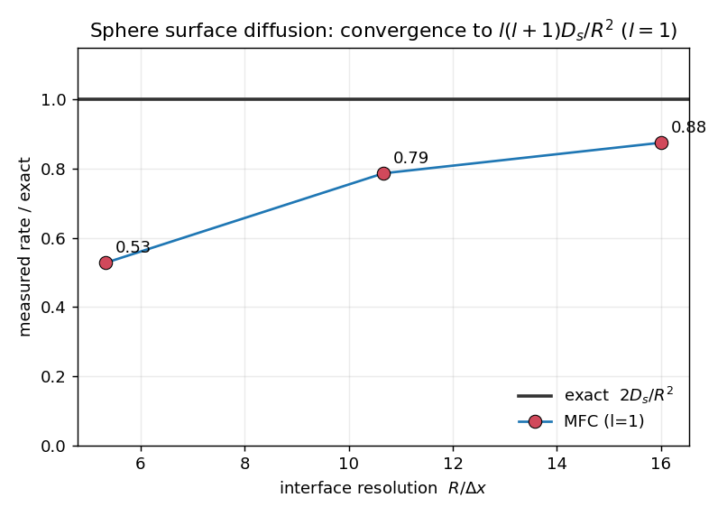

# 3D surfactant surface diffusion — sphere convergence to the Laplace–Beltrami rate

The canonical 3D surface-diffusion benchmark: a surfactant spherical-harmonic mode on a sphere decays
at the exact Laplace–Beltrami eigenvalue rate. Unlike the flat
[1D case](../1D_solutocapillary_diffusion), this exercises the *genuinely 2D* surface Laplacian on a
**curved** interface — so it tests the tangential projection `(I − n⊗n)` and the finite band
thickness, the parts the grid-aligned 1D test cannot reach.

## Problem

A passive insoluble surfactant (`sigma_model = 0` ⇒ constant `σ`, no Marangoni; the drop stays static)
is seeded on a sphere of radius `R` with the `l = 1` mode `Γ = Γ₀(1 + ε z/R)` (`z/R = cos θ ∝ Y₁`).
Under pure surface diffusion an `l`-mode decays exactly as

```
Γ_l(t) = Γ_l(0) · exp(−l(l+1) D_s/R² · t)      ⇒    for l = 1:   rate = 2 D_s/R².
```

The `l = 1` amplitude is measured as `M₁(t) = Σ Γ̃ z` (a clean surface moment because `Γ̃ = Γ·|∇c|`
is band-localized), fit to an exponential, and compared to `2 D_s/R²`.

## Convergence

Because the diffuse interface is a fixed number of cells thick, the *physical* band thickness `w/R`
shrinks as the grid is refined. Sweep resolution (one build serves all — the `z/R` IC is
resolution-independent) and watch the rate approach the exact value:

```
examples/3D_solutocapillary_diffusion/run_convergence.sh   # NX = 32, 64, 96 (release, multi-rank)
```



| `R/Δx` | `w/R` ≈ | measured rate | exact `2 D_s/R²` | rate / exact | surfactant drift |
|---|---|---|---|---|---|
| 5.3 | 0.37 | 0.845 | 1.600 | 0.53 | 0.000 % |
| 10.7 | 0.19 | 1.259 | 1.600 | 0.79 | 0.000 % |
| 16.0 | 0.12 | 1.400 | 1.600 | 0.88 | 0.000 % |

The measured rate **converges monotonically to `2 D_s/R²`** (0.53 → 0.79 → 0.88), with the error
roughly halving as `R/Δx` doubles — first order in the band thickness `w/R`, exactly what diffuse-
interface surface operators give. Total surfactant is conserved to round-off at every resolution.

**This settles the operator's correctness on curved interfaces:** the coarse-sphere underestimate is a
resolution effect that vanishes with refinement, not a discretization bug. It is also first order, so
a few-percent match needs a well-resolved interface (`R/Δx ≳ 30`) — the same requirement that gates
the coupled surfactant-laden-drop benchmarks (Stone & Leal). The `l = 1` eigenvalue here is
`l(l+1)D_s/R² = 2D_s/R²`, the *sphere* value — not the flat/circle `D_s k²`.
