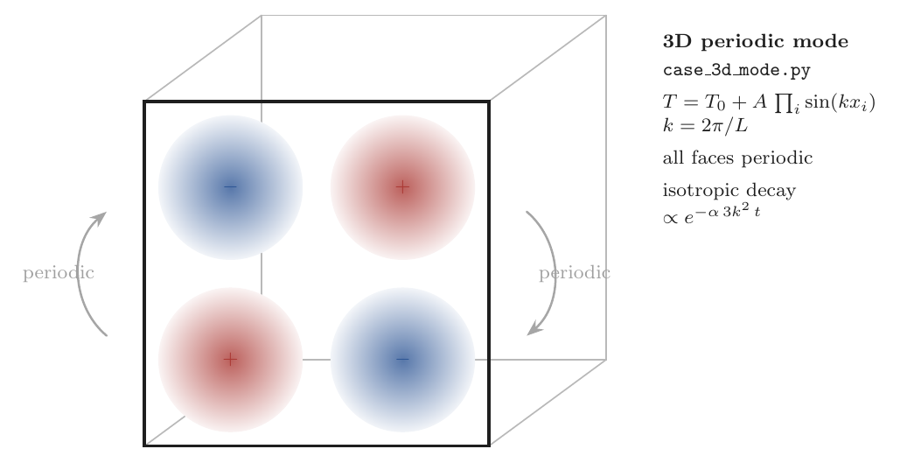
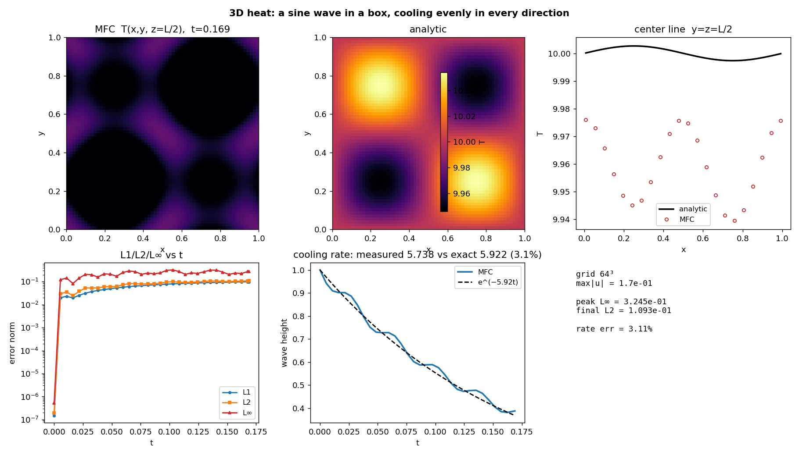

# Thermal Conduction — 3D periodic Fourier mode

Verifies MFC's bulk Fourier heat-conduction operator
(`src/simulation/m_thermal_conduction.fpp`) against the exact 3D heat-equation
solution: a single Fourier mode on a triply-periodic cube, cooling evenly in every
direction (isotropy check).

$$T(\mathbf x,0) = T_0 + A\sin(kx)\sin(ky)\sin(kz),\quad k=2\pi/L
\;\Rightarrow\; T = T_0 + A\sin(kx)\sin(ky)\sin(kz)\,e^{-3\alpha k^2 t}.$$

The $-3\alpha k^2$ decay rate (vs $-2\alpha k^2$ in 2D) checks that all three
spatial directions contribute equally — no directional bias in the operator.

## How temperature is set and recovered

Temperature is **not a stored field**; it is recovered from the stiffened-gas EOS,
$T = (p + p_\infty)/((\gamma-1)\rho c_v)$. The mode is imposed through the
**density at uniform pressure**, $\rho = \rho_0 T_0/T$, so the operator runs in its
full **production setting** (temperature coupled to the flow). The resulting
**few-percent physics floor** — spatially varying $\alpha = k/(\rho c_p)$ and weak
$p\,\mathrm dV$ acoustics — is real physics, not a discretization defect; the formal
order (2nd in space, 3rd in time) is masked by this floor.

## Run

```bash
./mfc.sh run examples/3D_thermal_conduction_mode/case.py -n 16
python3 examples/3D_thermal_conduction_mode/validate.py
```

`validate.py` reads the in-place `restart_data/`, recovers $T$, compares to the
exact field (the figure slices the cube at $z=L/2$), fits the isotropic cooling
rate, and writes `figures/heat_3d_mode.png` + `summary.json`.

## Result

| Grid | Error vs exact | `max\|u\|` | Notes |
|------|----------------|-----------|-------|
| 64³ | peak $L_\infty$ **0.32**, $L_2$ 0.11 | 0.17 | isotropic decay rate matches to **3.1 %** |



