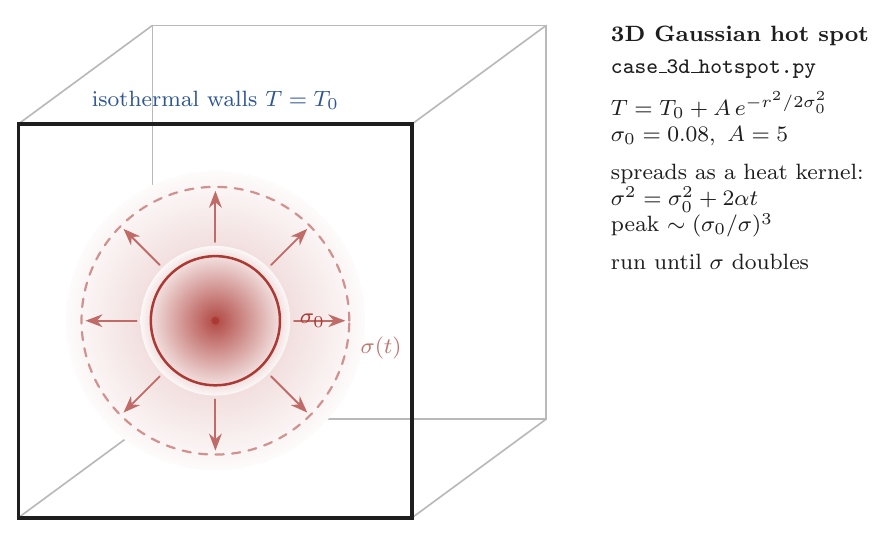
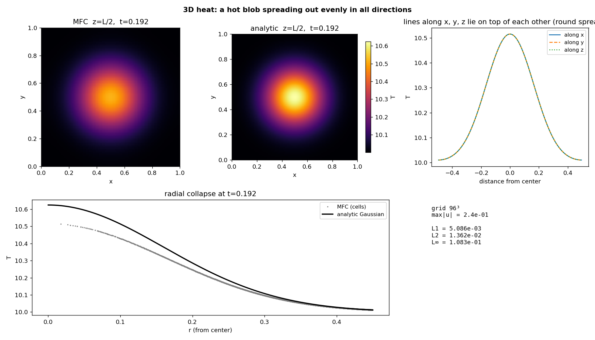

# Thermal Conduction — 3D Gaussian hot spot

Verifies MFC's bulk Fourier heat-conduction operator
(`src/simulation/m_thermal_conduction.fpp`) against the exact 3D heat-equation
Green's function: a Gaussian temperature blob spreading in a cube while staying
spherically symmetric.

$$T(\mathbf x,0) = T_0 + A\,e^{-r^2/2\sigma_0^2}
\;\Rightarrow\; T = T_0 + A\left(\frac{\sigma_0^2}{\sigma^2}\right)^{3/2}
e^{-r^2/2\sigma^2},\qquad \sigma^2 = \sigma_0^2 + 2\alpha t.$$

The run goes until $\sigma$ doubles. The decisive check is the **radial collapse**:
the temperature along the $x$, $y$, and $z$ center lines must lie on top of one
another and on the analytic Gaussian — i.e. no directional bias in the operator.

## How temperature is set and recovered

Temperature is **not a stored field**; it is recovered from the stiffened-gas EOS,
$T = (p + p_\infty)/((\gamma-1)\rho c_v)$. The blob is imposed through the
**density at uniform pressure**, $\rho = \rho_0 T_0/T$, so the operator runs in its
full **production setting** (temperature coupled to the flow). The resulting
**few-percent physics floor** — spatially varying $\alpha = k/(\rho c_p)$ and weak
$p\,\mathrm dV$ acoustics — is real physics, not a discretization defect; the formal
order is isolated in `Thermal_Conduction_Convergence`.

## Run

```bash
./mfc.sh run examples/Thermal_Conduction_3D_hotspot/case.py -n 16
python3 examples/Thermal_Conduction_3D_hotspot/validate.py
```

`validate.py` reads the in-place `restart_data/`, recovers $T$, compares to the
exact Gaussian (the figure slices the cube at $z=L/2$ and overlays the radial
profile), and writes `figures/heat_3d_hotspot.png` + `summary.json`.

## Result

| Grid | Error vs exact | `max\|u\|` | Notes |
|------|----------------|-----------|-------|
| 96³ | $L_2$ **0.014**, $L_\infty$ 0.11 | 0.24 | x/y/z center lines collapse → no directional bias |



