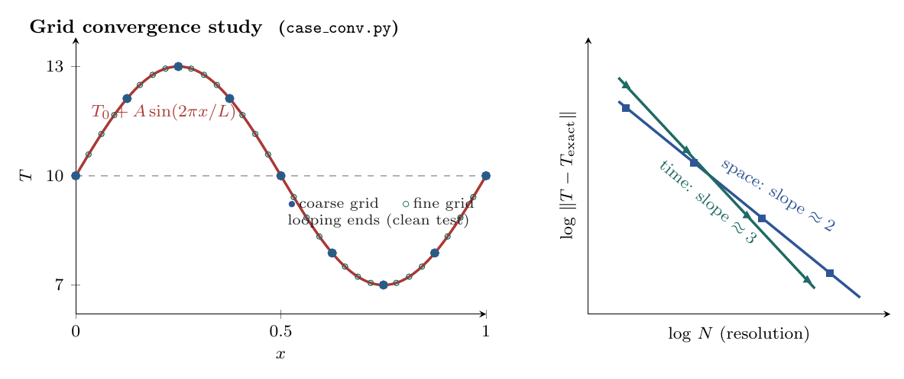
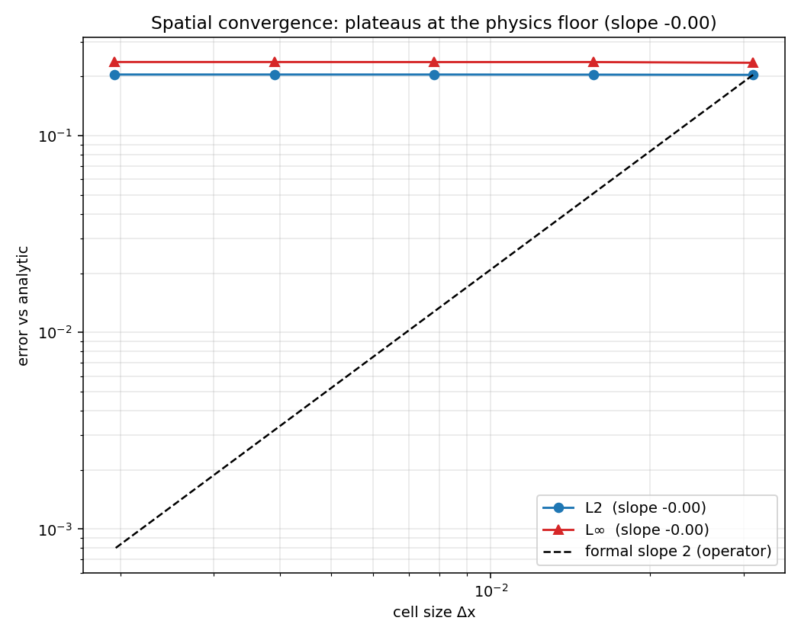
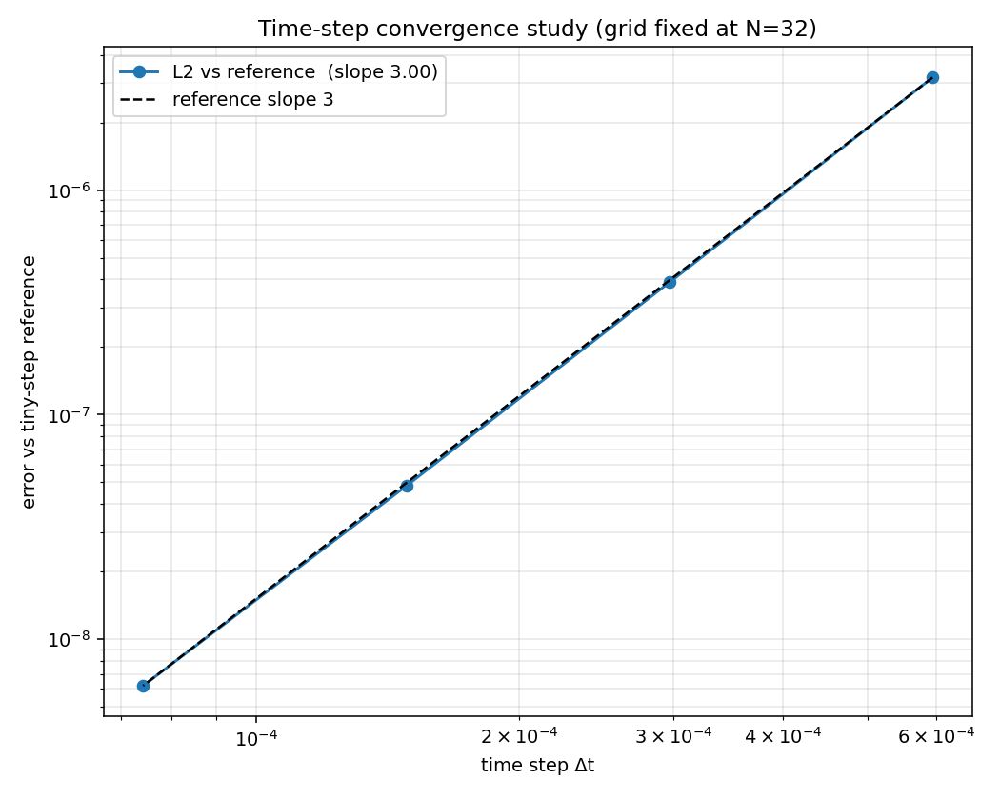

# Thermal Conduction — convergence study

Separates the formal order of MFC's heat-conduction operator
(`src/simulation/m_thermal_conduction.fpp`) from the energy-coupled physics floor,
using a 1D periodic single Fourier mode (no boundary-condition error) so the only
error sources are the discretization and the floor.

$$T(x,0) = T_0 + A\sin(kx),\quad k=2\pi/L
\;\Rightarrow\; T = T_0 + A\sin(kx)\,e^{-\alpha k^2 t}.$$

The operator is a 2-point central difference (formal **2nd order in space**)
advanced with TVD-RK3 (formal **3rd order in time**).

| Study | Sweep | Measured slope | Formal order | What it shows |
|-------|-------|----------------|--------------|---------------|
| **Spatial** ($L_2$ vs $\Delta x$) | `convx_{32..512}`, fixed $t^\*$ | **≈ 0** (flat) | 2 | error saturates at the physics floor — already below the truncation error at the coarsest grid, so refining $\Delta x$ doesn't help |
| **Temporal** ($L_2$ vs $\Delta t$) | `convt_{256..4096}`, fixed $N=32$ | **3.00** | 3 (RK3) | clean 3rd order: each run is differenced against a fine-$\Delta t$ reference *on the same grid*, so the spatial error and the floor cancel and only the time-integration error remains |

The temporal study is the decisive one: by cancelling the floor it confirms the
time integrator is formally 3rd order even in the fully coupled compressible run.
The spatial study plateaus because the floor — spatially varying
$\alpha = k/(\rho c_p)$ ($\rho \propto 1/T$ at uniform pressure) and weak
conduction-driven acoustics — does not vanish under grid refinement.

## Run

`case.py` is parametrized through the environment (`CONV_N`, `CONV_DT`,
`CONV_NSTEPS`); `Allrun` drives both sweeps into `runs/<label>/`:

```bash
examples/Thermal_Conduction_Convergence/Allrun           # both sweeps
examples/Thermal_Conduction_Convergence/Allrun spatial   # grid sweep only
python3 examples/Thermal_Conduction_Convergence/validate.py
```

`validate.py` reads `runs/<label>/`, fits the slopes, and writes
`figures/convergence_{spatial,temporal}.png` + `summary.json`.




