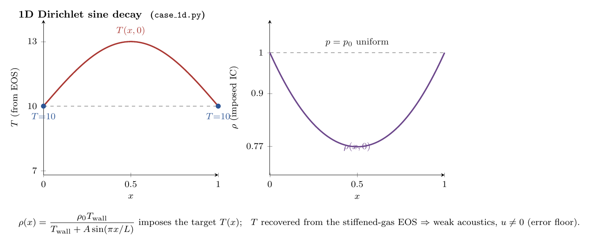
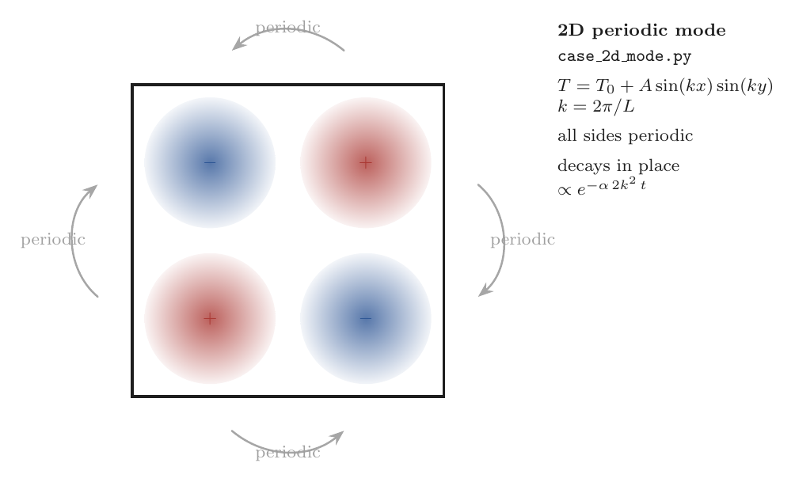
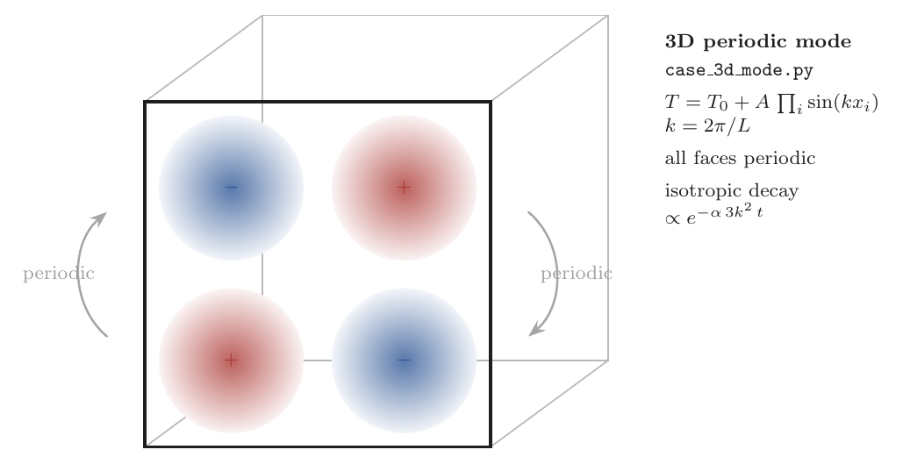
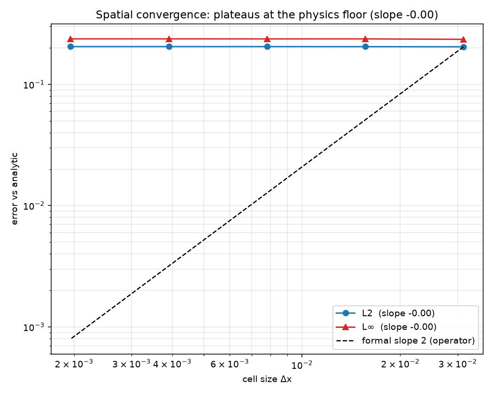
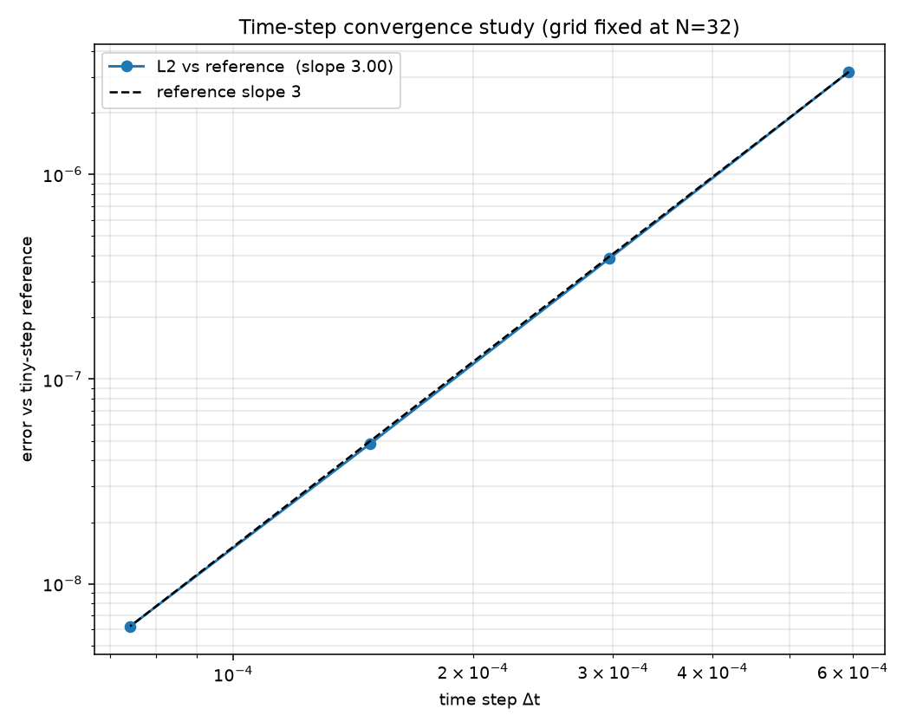
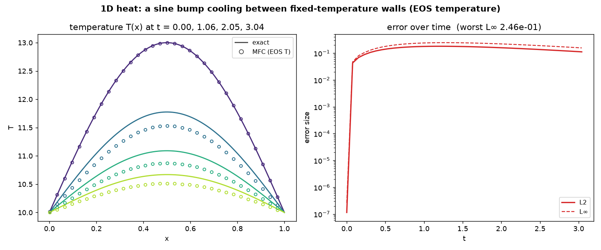
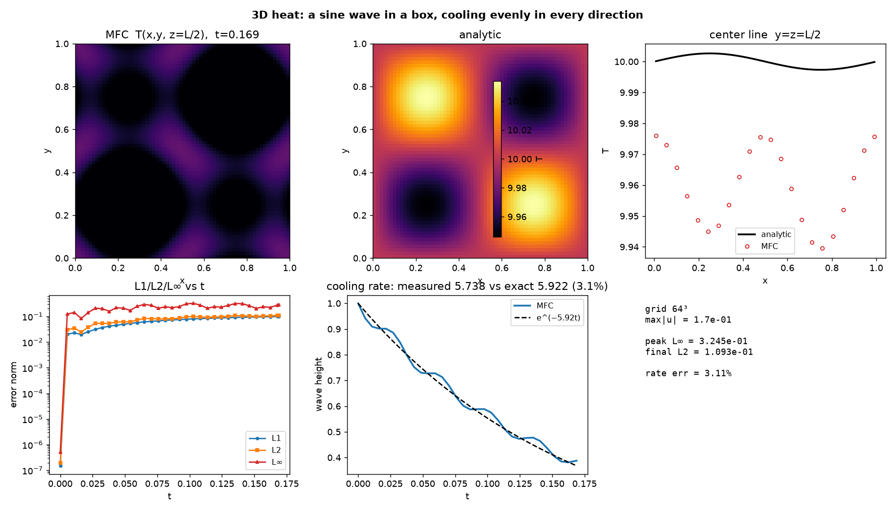
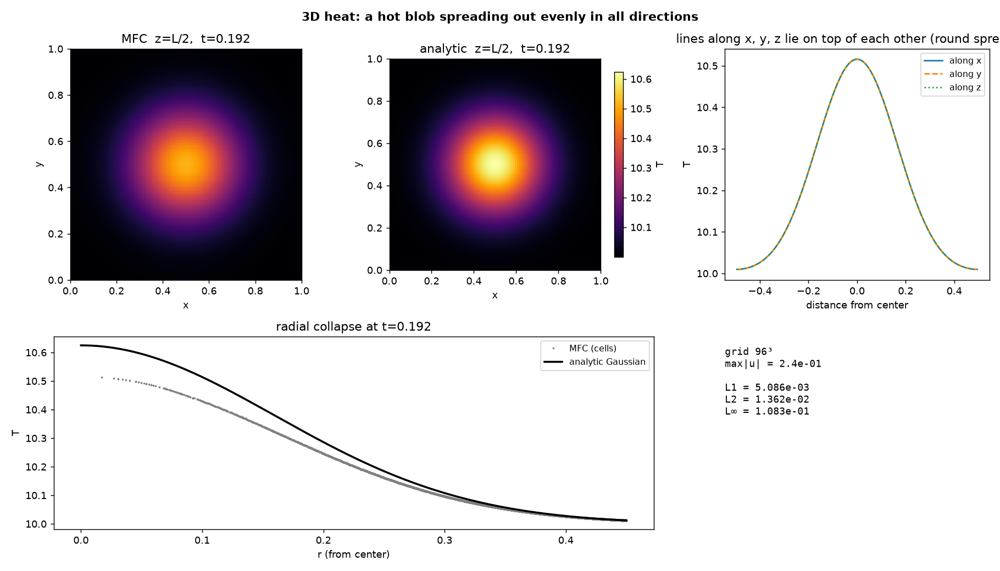

# Thermal Conduction Validation

Formal verification of MFC's bulk Fourier heat-conduction operator
(`src/simulation/m_thermal_conduction.fpp`) against exact solutions of the
1D, 2D, and 3D heat equations, following the standard CFD-verification
methodology: analytic benchmarks, the $L_1$ / $L_2$ / $L_\infty$ error norms, and
a formal grid- and time-convergence study.

## What is being validated

The conduction operator is a **2-point central difference** of cell-center
temperatures forming the face flux $-k_{\text{face}}\,\partial T/\partial x_i$,
accumulated into the energy source term and differenced in `m_rhs`, then advanced
with the **TVD-RK3** time stepper. The formal order is therefore **2nd order in
space** and **3rd order in time**.

Temperature is **not a stored field**; it is recovered at every output from the
stiffened-gas equation of state,

$$T = \frac{p + p_\infty}{(\gamma - 1)\,\rho\,c_v}.$$

To set an initial temperature profile $T(x)$ the cases impose it through the
**density at uniform pressure**,

$$\rho(x) = \frac{p_0 + p_\infty}{(\gamma - 1)\,c_v\,T(x)},\qquad p \equiv p_0,$$

so the conduction operator runs in its full **production setting**: temperature is
coupled to the compressible flow. Two consequences follow, and they set the
accuracy of every benchmark below:

- the **local diffusivity** $\alpha = k/(\rho c_p)$ varies in space because
  $\rho \propto 1/T$, while the closed-form solutions assume a single constant
  $\alpha$; and
- conduction does $p\,\mathrm{d}V$ work, launching **weak acoustics** ($u \neq 0$,
  $\mathrm{Ma}\sim 10^{-3}$), so the pressure is not perfectly uniform.

Together these set a **physics-driven error floor** of a few percent — real
physics of the coupled system, not a defect of the discretization. The
convergence study (below) separates the two: the operator's formal order is intact
in time, while the spatial error saturates at this floor.

## The heat equation and exact solutions

$$\frac{\partial T}{\partial t} = \alpha\,\nabla^2 T,\qquad
\alpha = \frac{k}{\rho\,c_p},\qquad c_p = \gamma\,c_v.$$

| Benchmark | Setup | Exact solution |
|-----------|-------|----------------|
| **1D** Dirichlet sine decay | $[0,L]$, $T=T_w$ both ends, $T(x,0)=T_w + A\sin(\pi x/L)$ | $T_w + A\sin(\pi x/L)\,e^{-\alpha(\pi/L)^2 t}$ |
| **2D** periodic mode | doubly-periodic square, $T_0+A\sin(kx)\sin(ky)$, $k=2\pi/L$ | $T_0 + A\sin(kx)\sin(ky)\,e^{-2\alpha k^2 t}$ |
| **3D** periodic mode | triply-periodic cube, $T_0+A\sin(kx)\sin(ky)\sin(kz)$, $k=2\pi/L$ | $T_0 + A\sin(kx)\sin(ky)\sin(kz)\,e^{-3\alpha k^2 t}$ |
| **3D** hot spot | Gaussian blob diffusing in a cube | $T_0 + A\left(\sigma_0^2/\sigma^2\right)^{3/2}e^{-r^2/2\sigma^2}$, $\sigma^2=\sigma_0^2+2\alpha t$ |

Error norms reported against the closed form at each output:
$L_1 = \overline{|T_{\text{num}}-T_{\text{exact}}|}$, $L_2 = \mathrm{rms}$,
$L_\infty = \max$.

## Setup schematics

Each benchmark's domain, boundary conditions, and initial condition (in `diagrams/`):

| | |
|---|---|
|  |  |
|  |  |
|  | |

> Note on the 2D test: it is a periodic decaying mode, not the classic steady-state
> plate (hot wall vs. three cold edges). In the compressible energy-coupled path a
> strongly heated wall collapses the local density and drives a **sustained
> near-sonic flow** that advects heat, so the plate never settles to the Laplace
> solution (and at fine resolution it runs the acoustic CFL away). A smooth periodic
> mode has no wall step, stays quiescent, and exercises the same conduction operator
> cleanly — the same isotropic-decay check as the 3D mode, one dimension down.

## Layout

```
cases/
  case_1d.py          1D Dirichlet sine decay (energy-coupled, EOS temperature)
  case_2d_mode.py     2D periodic Fourier mode
  case_3d_mode.py     3D periodic Fourier mode
  case_3d_hotspot.py  3D Gaussian hot spot
  case_conv.py        1D periodic mode, convergence driver (CONV_N / CONV_DT / CONV_NSTEPS)
validate.py           harness: reads runs/, computes norms, writes figures/ + summary.json
run_suite.sh          helper: runs the cases with MFC and archives them into runs/
animate.py            harness: post-processes runs/ and renders animations/ MP4s
diagrams/             setup schematics (TikZ source + PDF/PNG)
figures/              output PNGs
animations/           temperature-field MP4s (gitignored)
runs/                 archived restart_data per run
summary.json          machine-readable metrics
```

## Reproduce

`validate.py` does **not** run MFC; it only analyzes the archived `runs/`. Run the
cases with MFC first and copy each one's `restart_data/` + `simulation.inp` into the
matching `runs/<label>/` (see the table at the top of `validate.py` for the
benchmark → label → case mapping). `run_suite.sh` automates exactly that. Then
analyze from the repo root:

```bash
python3 examples/Thermal_Conduction_Validation/validate.py 1d
python3 examples/Thermal_Conduction_Validation/validate.py 2d
python3 examples/Thermal_Conduction_Validation/validate.py 3d-mode
python3 examples/Thermal_Conduction_Validation/validate.py 3d-hotspot
python3 examples/Thermal_Conduction_Validation/validate.py conv-x
python3 examples/Thermal_Conduction_Validation/validate.py conv-t
```

## Results

Temperature is recovered from the EOS in every run; the reported `max|u|` is the
spurious flow set by the weak conduction-driven acoustics.

| Benchmark | Grid | Error vs exact | `max\|u\|` | Notes |
|-----------|------|----------------|----------|-------|
| 1D Dirichlet sine | 256 | peak $L_\infty$ **0.25**, $L_2$ 0.11 | 0.054 | $\approx 3.7\%$ of the amplitude $A=3$ |
| 2D periodic mode | 128² | peak $L_\infty$ **0.34**, $L_2$ 0.20 | 0.17 | isotropic decay rate matches to **3.7 %** |
| 3D periodic mode | 64³ | peak $L_\infty$ **0.32**, $L_2$ 0.11 | 0.17 | isotropic decay rate matches to **3.1 %** |
| 3D Gaussian hot spot | 96³ | $L_2$ **0.014**, $L_\infty$ 0.11 | 0.24 | x/y/z center lines collapse → no directional bias |

All four match the analytic solutions to within the few-percent physics floor set
by the variable local diffusivity and the weak acoustics (see below).

### Convergence

The convergence driver (`case_conv.py`, periodic single mode, no BC error)
separates the operator's formal order from the physics floor:

| Study | Measured slope | Formal order | What it shows |
|-------|----------------|--------------|---------------|
| **Spatial** ($L_2$ vs $\Delta x$) | **≈ 0** (flat) | 2 (central difference) | error saturates at the physics floor — the operator's truncation error is already below it at the coarsest grid, so refining $\Delta x$ does not help |
| **Temporal** ($L_2$ vs $\Delta t$) | **3.00** | 3 (TVD-RK3) | clean 3rd order: each run is differenced against a fine-$\Delta t$ reference *on the same grid*, so the spatial error and the physics floor cancel and only the time-integration error remains |

The temporal study is the decisive one: by cancelling the floor it confirms the
time integrator is formally 3rd order even in the fully coupled compressible run.
The spatial study plateaus because the floor — variable $\alpha$ and acoustics —
does not vanish under grid refinement.

### Error budget

The few-percent error in the benchmarks above is **physics, not a code defect**,
dominated by:

1. **Variable local diffusivity.** The temperature profile is imposed through
   density at uniform pressure ($\rho \propto 1/T$), so $\alpha = k/(\rho c_p)$
   varies across the domain while the analytic comparison uses a single constant
   $\alpha$. The field decays slightly non-uniformly relative to the constant-$\alpha$
   solution. Scales with amplitude.
2. **Finite-Mach compressibility.** Conduction heating does $p\,\mathrm{d}V$ work and
   launches weak acoustic waves ($\max|u|\sim 0.05$–$0.25$, $\mathrm{Ma}\lesssim10^{-2}$);
   the pressure is not perfectly uniform.
3. **Spatial truncation** — below the floor at every tested grid (the flat spatial
   convergence curve), so negligible next to (1)–(2).

The solver correctly lands on the constant-*pressure* $c_p$ diffusivity (isobaric,
low-Mach), not the constant-volume $c_v$ one; a $c_v$ error would be $\sim 100\%$,
not a few percent.

## Animations

`animate.py` turns the archived `runs/` into MP4s of the temperature field. It
post-processes each run's checkpoints into a Silo database and calls `./mfc.sh viz
--mp4` on the EOS-recovered `temperature` field (the cases set `T_wrt`).

```bash
python3 examples/Thermal_Conduction_Validation/animate.py          # all four
python3 examples/Thermal_Conduction_Validation/animate.py 2d_mode  # one run
```

| File | What it shows |
|------|---------------|
| `animations/heat_1d_sine_decay.mp4` | 1D sine profile decaying between fixed-T walls |
| `animations/heat_2d_mode.mp4` | 2D periodic mode decaying in place |
| `animations/heat_3d_hotspot_midplane.mp4` | 3D Gaussian blob spreading (z=L/2 slice) |
| `animations/heat_3d_mode_slice.mp4` | 3D periodic mode decaying (z=L/4 slice; z=L/2 is identically flat) |

Needs the matching `runs/` populated first.

### Figures

**Convergence plots:**




**1D heat equation** — Dirichlet sine decay:



**2D heat equation** — periodic Fourier mode:


**3D heat equation** — periodic Fourier mode and Gaussian hot spot:



